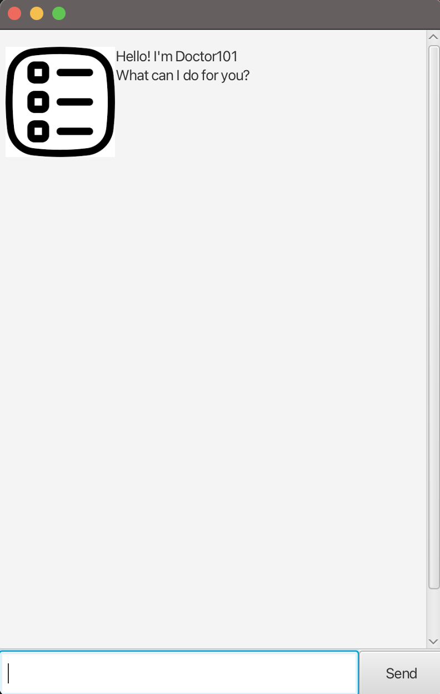

## Introduction
This app is designed to help the user with task management. It allow you to add, delete, mark, unmark, tag, untag, find tasks with keywords/tags and list all the tasks in the task list. It also supports saving the tasks in the task list to a file and loading the tasks from the file when you launch the app again.

## Quick Start
1. Download the latest  **Duke.jar** file from [release page](https://github.com/Yiwen101/ip/releases)
2. Open terminal and go to the directory where you downloaded the **Duke.jar** file.
3. Make sure that when you launch it for the first time, there is not data/duke.txt file in the same directory. If there is, please delete it.
4. In your terminal enter the command:
        ```
        java -jar duke.jar
        ```
5. You should expect to see a window as shown below:



6. Have fun exploring its features!


For more details and use cases please refer to the [user documentation](https://yiwen101.github.io/ip/).


