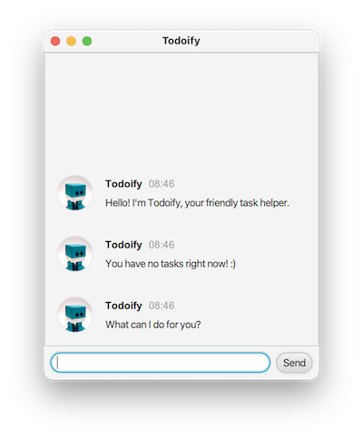

# Todoify

This is a chatbot-style task manager Java project as specified by NUS CS2103T.

Though, the chatbot does not understand natural language - it only understands instructions in a format that's somewhat similar to common POSIX shells like `bash` and `zsh`. Something like... "`deadline project work --by 2023-08-31`".

## Setting up in IntelliJ

Prerequisites: JDK 11, update IntelliJ to the most recent version.

1. Open IntelliJ (if you are not in the welcome screen, click `File` > `Close Project` to close the existing project first)
2. Open the project into IntelliJ as follows:
   1. Click `Open`.
   2. Select the project directory, and click `OK`.
   3. If there are any further prompts, accept the defaults.
2. Configure the project to use **JDK 11** (not other versions) as explained in [here](https://www.jetbrains.com/help/idea/sdk.html#set-up-jdk).<br>
   In the same dialog, set the **Project language level** field to the `SDK default` option.
3. After that, build the project (which should use Gradle automatically), and then execute the `run` Gradle task. If the setup is correct, you will see a GUI (or TUI if you configure it to run with the `-t` or `--text-ui` flag) presenting something resembling a chat interface:

   - GUI

      

   - TUI

      ```
      [Todoify]:
        Hello! I'm Todoify, your friendly task helper.

      [Todoify]:
        You have no tasks right now! :)

      [Todoify]:
        What can I do for you?

      [You]:
       > 
      ```

## Acknowledgements

- [Gson](https://github.com/google/gson) - for saving and loading data
- [JUnit](https://junit.org/) - for Unit Testing
- [SE-EDU JavaFX Guide Part 4](https://se-education.org/guides/tutorials/javaFxPart4.html) - for minor inspirations of GUI and code
- [docsify](https://docsify.js.org/) - for rendering the User Guide
