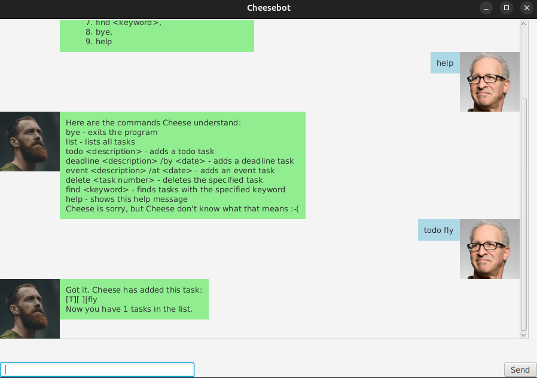

# ChatterBox User Guide

ChatterBox is your friendly neighbourhood task manager! Never forget anything ever again!



## Features 
ChatterBox comes with a bunch of features such as:
- Managing tasks
    - Todos, Events, Deadlines
- Mark and Unmark tasks
- Delete a single task
- Find a task
- Save tasks locally
- Mass delete all tasks (and start afresh!)

### Functionality

ChatterBox's primary interaction method is the keyboard, so you can keep working without having to lift your palms! The currently available primary commands include:
- todo \<task\>
- event /from <start> /to <end>
- deadline /by \<date\> (Note: date must be in this format "YYYY-MM-DD")

Other commands include:
- list
- find \<keyword\>
- delete \<index\>
- mark \<index\>
- unmark \<index\>

And when you wanna start over, there's always:

- delete_all

Once you're done with ChatterBox, simply enter:

- bye

### Considerations

All commands must be in full lowercase (for now).

If you are ever confused, simply type "help" and the start screen will show!

## Usage

You can download the latest release from [here](https://github.com/sp4ce-cowboy/ip/releases/tag/A-Release-3) and then:

1. Navigate into the directory with

```sh
cd <PATH>
```

2. Run Chatterbox

```sh
java -jar duke.jar
```

Note: running the program will create a "data.txt" file in the current directory, this file stores all the tasks such that they persist even after closing the app. 
