# User Guide
### Skye: Task Management Chatbot
Skye is **desktop app for managing tasks**. It is optimized for use via a Command Line Interface (CLI) while still having the benefits of a Graphical User Interface (GUI). If you can type fast, Skye can manage your tasks faster than other GUI apps.

## Quick Start
1. Ensure you have `Java 11` or above installed in your computer.
2. Download the latest release of `skye.jar` from [here](https://github.com/ktzy0305/ip/releases/). 
3. Copy `skye.jar` to an empty folder that you want to use as the home folder for your task management.
4. You can either double-click on `skye.jar` or open a terminal and type `java -jar skye.jar` to run the application. A window should appear in a few seconds with a welcome message as shown below.

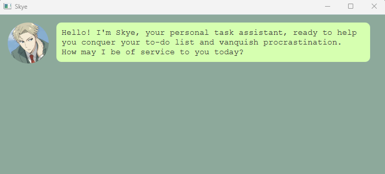

[//]: # (## Features)

[//]: # ()
[//]: # (### Add To-Do)

[//]: # ()
[//]: # (Adds a task that is flexible and not time bound.)

[//]: # ()
[//]: # (### Add Deadline)

[//]: # ()
[//]: # (Adds a task with a due date and time.)

[//]: # ()
[//]: # (### Add Event)

[//]: # ()
[//]: # (Adds a task with a start date / time and end date / time.)

[//]: # ()
[//]: # (### Delete Task)

[//]: # ()
[//]: # (Removes a task from a list of recorded tasks.)

[//]: # ()
[//]: # (### List Tasks)

[//]: # ()
[//]: # (Displays all tasks that were recorded.)

[//]: # ()
[//]: # (### Find Tasks)

[//]: # ()
[//]: # (Search for task descriptions that match a given keyword.)

[//]: # ()
[//]: # (### Mark Task)

[//]: # ()
[//]: # (Set a task as `done` or `not done`)

[//]: # ()
[//]: # (### Check Due Tasks)

[//]: # ()
[//]: # (Search for tasks due on a certain `date`)

[//]: # ()
[//]: # (### Add Venue)

[//]: # ()
[//]: # (Adds a venue name and its details: address, capacity and rent.)

[//]: # ()
[//]: # (### Delete Venue)

[//]: # ()
[//]: # (Removes a venue from a list of recorded venues.)

[//]: # ()
[//]: # (### List Venues)

[//]: # ()
[//]: # (List all venues that were recorded.)

[//]: # ()
[//]: # (### Find Venues)

[//]: # ()
[//]: # (Search for venue names that match a given keyword.)

[//]: # ()
[//]: # (### Save Data)

[//]: # ()
[//]: # (Saves all recorded tasks and venues. Data is automatically saved whenever a new task or venue is added or deleted.)

## Main Features

### Add a new todo: `todo <description>`

Create a ToDo task and adds it into a task list.

**Example of usage:** 

`todo Buy Bread from Supermarket`

> Creates a new ToDo task with description "todo Buy Bread from Supermarket

**Expected outcome:**

### Add a new deadline: `deadline <description> /by <dd-mm-yyyy hh:mm>`

Creates a Deadline task and adds it into a task list.

**Example of usage:**

`deadline Lab Assignment /by 27-09-2023 23:59`

> Creates a Deadline task with the description "Lab Assignment" that is due on "27-09-2023 23:59"

**Expected outcome:**

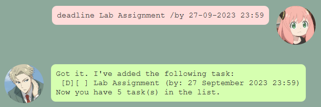

### Add a new event: `event <description> /from <dd-mm-yyyy hh:mm> /to <dd-mm-yyyy hh:mm>`

Creates an Event task and adds it into a task list.

**Example of usage:**

`event Marathon /from 01-10-2023 06:00 /to 01-10-2023 12:00`

> Creates an Event task with the description "Marathon" that starts at "01-10-2023 06:00" and ends at "01-10-2023 12:00".

**Expected outcome:**

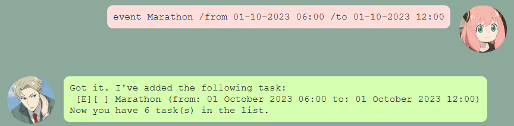

### List all tasks: `list tasks`

Lists all tasks in the task list.

**Expected outcome:**

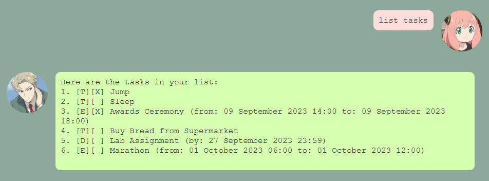

### Delete a task: `delete tasks /index <task number>`

Removes a task from the task list.

**Example of usage:**

`delete tasks /index 4`

> Delete the 4th task shown in the current task list.

**Expected outcome:**

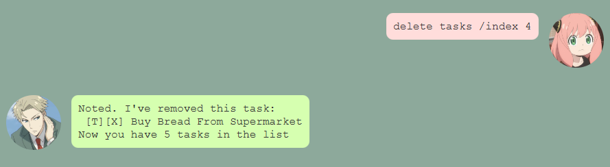

### Find tasks: `find tasks /q <keyword>`

Find task descriptions contains the keyword.

**Example of usage:**

`find tasks /q on`

> Find matching task descriptions containing the keyword "on".

**Expected outcome:**
- If there are matching task descriptions containing the keyword "on".
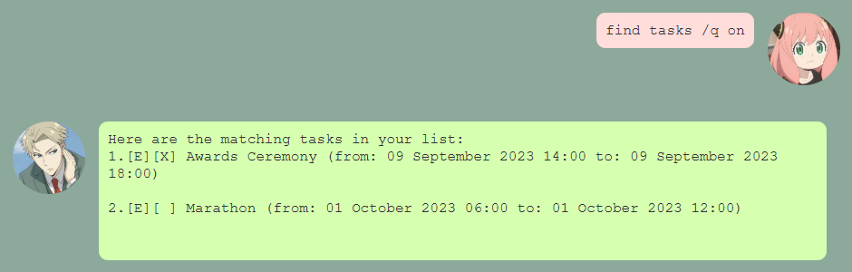
- No results
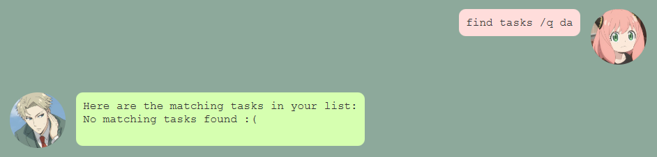

### Mark a task as complete: `mark <task number>`

Marks a task as complete.

**Example of usage:**

`mark 4`

> Mark the 4th task from the current task list as "complete".

**Expected outcome:**

### Unmark a task as incomplete: `unmark <task number>`

Unmark a completed task. Use it when you have accidentally marked a task as "complete".

**Example of usage:**

`unmark 3`

> Unmark the 3rd task (that was originally complete) from the current task list.

**Expected outcome:**

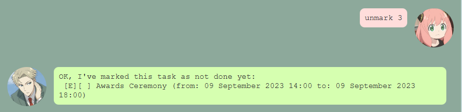

### Check due tasks: `due <DD-MM-YYYY>`

Find and list tasks due on a given date.

**Example of usage:**

`due 27-09-2023`

> Finds tasks that are due on "27-09-2023" 

**Expected outcome:**

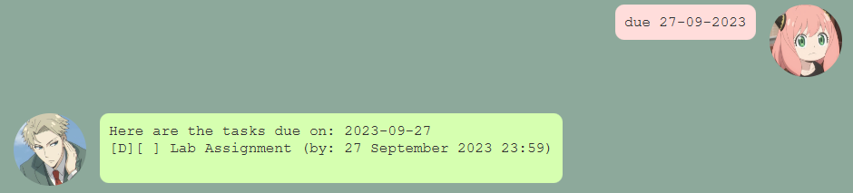

## Extension Features (D-Places)

### Add a new venue: `venue <name> /address <address> /size <capacity> /rent <rent>`

Creates a Venue and adds to a venue list.

**Example of usage:**

`venue LT19 /address Computing Drive /size 250 /rent 10.99`

> Add a venue named "LT19" at "Computing Drive" that can accommodate 250 people and costs 10.99 for renting.

**Expected outcome:**

### List venues: `list venues`

List all venues from the current venue list.

**Expected outcome:**

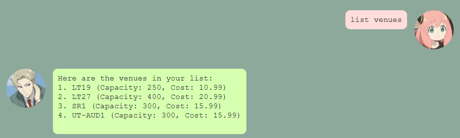

### Delete a venue: `delete venues /index <venue number>`

Removes a venue from the venue list.

**Example of usage:**

`delete venues /index 5`

> Delete the 5th venue from the current venue list.

**Expected outcome:**

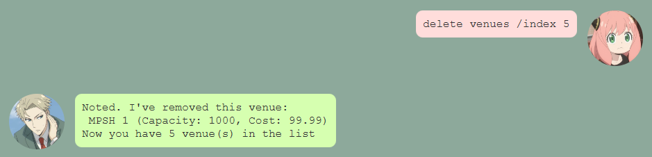

### Find venues: `find venues /q <keyword>`

Finds venues names from the current venue list that contain the keyword.

**Example of usage:**

`find venues /q LT`

> Find matching task names containing the keyword "LT".

**Expected outcome:**

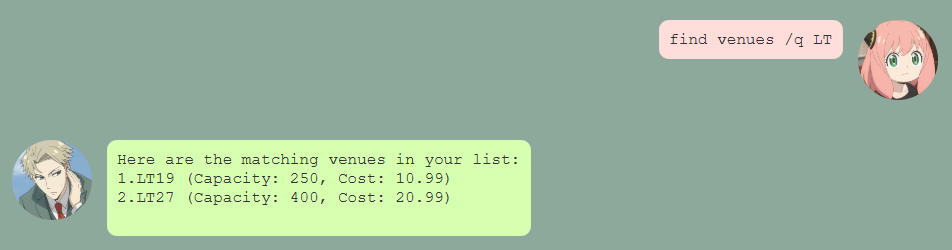

### Help Guide: `help`
In case you ever forget a command just type the `help` keyword and send it to Skye. Skye will respond with the help guide!

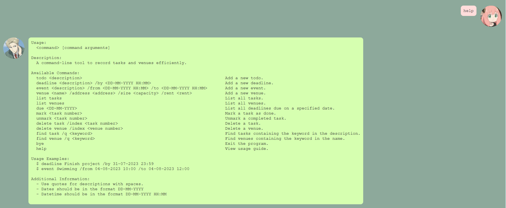