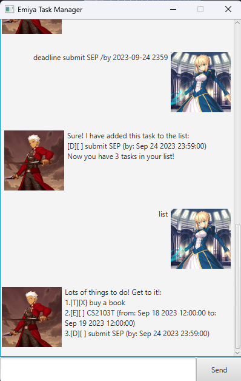

# User Guide

# The Emiya Chatbot: Winning the War, One Task At a Time!

Emiya is here to win the Holy Grail War! Emiya is a chatbot that one can interact with through the **Command-Line Interface (CLI)**.
Emiya also contains a **Graphical-User Interface(GUI)** to make your user experience a more eye-pleasing and interesting one!



## Quick-start Guide

1. Ensure that you have Java 11 installed on your computer.
2. Download the latest `emiya.jar` from this page.
3. Drag and drop the file from your computer's downloads into any folder you want.
4. Open up the Command-Line Interface for your device's operating system
5. Use the `cd` command to change directories to where `emiya.jar` is stored.
6. Use the command `java -jar emiya.jar` to get the application running.

Congratulations! You have just launched Emiya. Trace On!

## Command Summary

For all commands, all parts in upper-case are variables you can change! Try it out for yourself!

| Commands                                               | Description                                                                               |   |   |   |   |   |   |   |   |
|--------------------------------------------------------|-------------------------------------------------------------------------------------------|---|---|---|---|---|---|---|---|
| `help`                                                 | Shows all available commands, as well as their usage.                                     |   |   |   |   |   |   |   |   |
| `todo TASK_DESCRIPTION`                                | Creates a Todo task with a given description.                                             |   |   |   |   |   |   |   |   |
| `deadline TASK_DESCRIPTION /by DEADLINE`               | Creates a Deadline task with a given description and deadline.                            |   |   |   |   |   |   |   |   |
| `event TASK_DESCRIPTION /from START_DATE /to END_DATE` | Creates a Event task with a given description, start date and end date.                   |   |   |   |   |   |   |   |   |
| `list`                                                 | Lists all tasks currently within the list of tasks.                                       |   |   |   |   |   |   |   |   |
| `mark INDEX`                                           | Marks a task at a specified index as completed.                                           |   |   |   |   |   |   |   |   |
| `unmark INDEX`                                         | Remove the completed status from a task.                                                  |   |   |   |   |   |   |   |   |
| `delete INDEX`                                         | Deletes the task at the specified index in the list of tasks.                             |   |   |   |   |   |   |   |   |
| `find WORD`                                            | Searches and displays all tasks within the list of tasks that contain the specified word. |   |   |   |   |   |   |   |   |

## Main Features

* **Creation of Tasks**: Emiya is able to create Tasks, which are separated into 3 different types: `todo`, `deadline`, and `event`.
    * `todo`: Todo tasks help you to keep track of tasks that do not have strict deadlines.
    * `deadline`: Deadline tasks help you to keep track of tasks that have certain specific deadlines.
    * `event`: Event tasks help you to keep track of events that happen within a specific duration.
* **Marking of Tasks**: Emiya is able to keep track of the status of the tasks. Tasks can be marked as either completed or incomplete, which can be displayed when the tasks are listed out with the `list` command.
* **Deleting of Tasks**: Emiya can delete tasks that have been added into the list.
* **Displaying all Tasks**: Emiya can list out all tasks currently within the task list, allowing users to see all tasks they currently have with a simple `list` command.
* **Displaying all available Commands**: Emiya can display all commands that users can use within the application, along with a description of what each method does and how it can be used.

## Usage

### `help`

Displays all available commands to the user.

Example of usage: 

`help`

Expected outcome:

A list of all available commands for the user.

```
expected output
```

### Feature-ABC

Description of the feature.

### Feature-XYZ

Description of the feature.