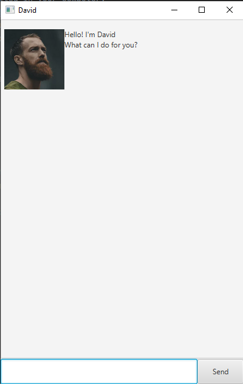
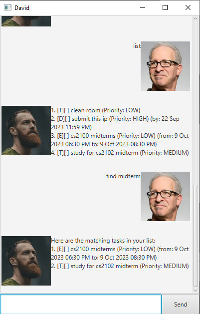

# David User Guide
David is a task management application for keeping track of your tasks, optimised  
for use via a Command Line Interface while still having the benefits   
of a Graphical User Interface.

## Quick Start

1. Ensure you have Java `11` or above installed in your computer. 
2. Download the latest `duke.jar` from [here](https://github.com/aslam341/ip/releases). 
3. Copy the file to the folder you want to use as the home folder for your application. 
4. Open a command terminal, `cd` into the folder you put the jar file in, and use    
   `java -jar duke.jar`     
   command to run the application.    
   A GUI similar to the one below should appear in a few seconds.    
   

## Features

> &#8505;   
> + Words in `UPPER_CASE` are the parameters to be supplied by user  
> e.g. in `deadline NAME /by DATE TIME`, `NAME`, `DATE` and `TIME` are parameters which can be used as
>`deadline submit homework /by 30/09/2023 2359`
> + Items in square brackets are optional.
    e.g `NAME [/p PRIORITY]` can be used as  `clean room /p 3` or as `clean room`.
> + Parameters must be in the order specified, or the command will not work.
> + Extraneous parameters for commands that do not take in parameters (such as `list` and `bye`) will be ignored. 
> e.g. if the command specifies `bye 123`, it will be interpreted as `bye`.

### Listing all the tasks in the list: `list`
Lists all the tasks in the list currently.

Format: `list`

### Adding a task to do: `todo`
Adds a task to do in the list.

Formats: `todo NAME [/p PRIORITY]`
+ `NAME` is the name of task.
+ `PRIORITY` is the priority of task. It is an integer from 1 to 3, with 1 being the highest priority.

Examples:
+ `todo clean room /p 3`
+ `todo clean room`

### Adding a task with deadline: `deadline`
Adds a task with deadline in the list.  
Formats: `deadline NAME /by DATE TIME [/p PRIORITY]`
+ `NAME` is the name of task.
+ `DATE` is the deadline date of task in `dd/MM/yyyy` format.
+ `TIME` is the deadline time of task in `HHmm` format.
+ `PRIORITY` is the priority of task. It is an integer from 1 to 3, with 1 being the highest priority.

Examples:
+ `deadline submit this ip /by 23/09/2023 2359`
+ `deadline submit this ip /by 23/09/2023 2359 /p 1`

### Adding an event: `event`
Adds an event with start and end time in the list.  
Formats: `event NAME /from START_DATE START_TIME /to END_DATE START_TIME [/p PRIORITY]`
+ `NAME` is the name of event.
+ `START_DATE` is the start date of event in `dd/MM/yyyy` format.
+ `START_TIME` is the start time of event in `HHmm` format.
+ `END_DATE` is the end date of event in `dd/MM/yyyy` format.
+ `END_TIME` is the end time of event in `HHmm` format.
+ `PRIORITY` is the priority of event. It is an integer from 1 to 3, with 1 being the highest priority.

Examples:
+ `event cs2100 midterms /from 09/10/2023 1830 /to 09/10/2023 2030`
+ `event cs2100 midterms /from 09/10/2023 1830 /to 09/10/2023 2030 /p 2`

### Marking a task as done: `mark`
Marks a task as done in the list.

Formats: `mark INDEX`
+ `INDEX` is index of the task as shown in the list.

Examples:
+ `mark 1` marks the first task in the list as done.

### Unmarking a task to indicate that it is not done: `unmark`
Unmarks a task as not done in the list.

Formats: `unmark INDEX`
+ `INDEX` is index of the task as shown in the list.

Examples:
+ `unmark 1` unmarks the first task in the list as not done.

### Deleting a task: `delete`
Deletes a task from the list.

Formats: `delete INDEX`
+ `INDEX` is index of the task as shown by `list` command.

Examples:
+ `list` followed by `delete 1` deletes the first task in the list.

### Finding a task: `find`
Finds all task from the list whose name contains given keyword.

Formats: `find KEYWORD`
+ `KEYWORD` is the keyword to search for.

Examples:
+ `find midterm` returns tasks with the names `cs2100 midterm` and `study for cs2102 midterm`

### Changing the priority of an existing task: `priority`
Changes the priority of a task.

Format: `priority INDEX PRIORITY`
+ `INDEX` is index of the task as shown by `list` command.
+ `PRIORITY` is the priority of task. It is an integer from 1 to 3, with 1 being the highest priority.

Examples:
+ `priority 1 2` changes the priority of the first task in the list to 2.

### Exiting the program: `bye`
Exits the program.

### Saving the data
The data is automatically saved in the hard disk after the `bye` command is entered.