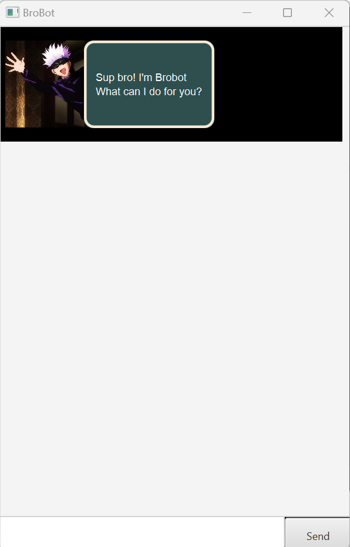

# User Guide

**BroBot** is a desktop app for managing tasks, **optimized for use via a Command
Line Interface (CLI)** while still having the benefits of a Graphical User Interface (GUI).
BroBot supports **3 types of tasks**: todos, deadlines and events.

## Quick start

1. Ensure you have Java `11` or above installed in your Computer.
2. Download the latest `BroBot.jar` from [here]()
3. Copy the file to the folder you want to use as the home folder for your BroBot.

### For Windows users

4. Double-click the file to start the app. The GUI similar to the below should appear in a few seconds.<br>
   

### For macOS users

4. Open `Terminal` and navigate to the folder you copied the file to.
5. Run the command `java -jar BroBot.jar` to start the app. The GUI similar to the above should appear in a few
   seconds.<br>

## Features

❗ **Notes about the command format:**<br>

- First word of the command is the command word.<br>
  e.g. in `todo DESCRIPTION`, `todo` is the command word.
- Words in `UPPER_CASE` are the parameters to be supplied by the user.<br>
  e.g. in `todo DESCRIPTION`, `DESCRIPTION` is a parameter which can be used as `todo read book`.

### Adding a task: `todo`, `deadline`, `event`

Adds a task to the task list.

Formats:
`todo DESCRIPTION`
`deadline DESCRIPTION /by ENDDATE`
`event DESCRIPTION /from STARTDATE /to ENDDATE`

Acceptable formats for `DESCRIPTION`: Any string of characters

Acceptable formats for `STARTDATE`: `YYYY-MM-DD`

Acceptable formats for `ENDDATE`: `YYYY-MM-DD`

Examples of usage:

- `todo read book`
- `deadline return book /by 2023-09-18`
- `event CS2103 Project Meeting /from 2023-08-18 /to 2023-08-18`

Expected output on success:

```
Got it. I've added this task:
[T][ ] read book
Now you have 3 tasks in the list.
```

```
Got it bro! I've added this task:
[D][ ] return book (by: 2023-09-18)
Now you have 4 tasks in the list.
```

```
Got it bro! I've added this task:
[E][ ] Computing FOW (from: 2023-07-18 to: 2023-07-21)
Now you have 5 tasks in the list.
```

Expected output on failure:

```
OOPS!!! The description of a todo cannot be empty.
todo {description}
```

```
Input for deadline doesn't match the expected format.
deadline {description} /by {endDate in YYYY-MM-DD}
```

```
Input for event doesn't match the expected format.
event {description} /from {startDate in YYYY-MM-DD} /to {endDate in YYYY-MM-DD}
```

### Listing all tasks: `list`

Lists all tasks in the task list.

Format: `list`

Expected output on success:

```
Here are the tasks in your list:
1. [T][ ] read book
2. [D][ ] return book (by: 2023-09-18)
3. [E][ ] Computing FOW (from: 2023-07-18 to: 2023-07-21)
4. [T][ ] do homework
5. [D][ ] submit assignment (by: 2023-09-20)
```

### Marking a task as done: `mark`

Marks a task as done.

Format: `mark INDEX`

Acceptable formats for `INDEX`: Any integer between 1 and the number of tasks in the task list (inclusive)

Example of usage: `mark 1`

Expected output on success:

```
Nice! I've marked this task as done:
[T][X] read book
```

Expected output on failure:

```
Invalid task index.
```

### Marking a task as undone: `unmark`

Marks a task as undone.

Format: `unmark INDEX`

Acceptable formats for `INDEX`: Any integer between 1 and the number of tasks in the task list (inclusive)

Example of usage: `unmark 1`

Expected output on success:

```
Nice! I've marked this task as not done yet:
[T][ ] read book
```

Expected output on failure:

```
Invalid task index.
```

### Deleting a task: `delete`

Deletes a task from the task list.

Format: `delete INDEX`

Acceptable formats for `INDEX`: Any integer between 1 and the number of tasks in the task list (inclusive)

Example of usage: `delete 1`

Expected output on success:

```
Noted. I've deleted this task from the list:
[T][ ] read book
Now you have 4 tasks in the list.
```

Expected output on failure:

```
Invalid task index.
```

### Finding a task: `find`

Find tasks in the task list that contain the given keyword.

Format: `find KEYWORD`

Acceptable formats for `KEYWORD`: Any string of characters

Example of usage: `find book`

Expected output on success:

```
Here are the matching tasks in your list:
1. [T][ ] read book
2. [D][ ] return book (by: 2023-09-18)
```

Expected output on failure:

```
OOPS!!! Field after find cannot be empty.
```

### Sorting tasks: `sort`

Sort tasks in the task list by date.

Format: `sort TASKTYPE`

Acceptable formats for `TASKTYPE`: `deadline`, `event`

Example of usage: `sort deadline`

Expected output on success:

```
Here are the sorted deadlines in your list:
1. [D][X] return book (by: 2023-09-18)
2. [D][ ] submit assignment (by: 2023-09-20)
```

Expected output on failure:

```
OOPS!!! Field after sort cannot be empty.
```

```
OOPS!!! Task type for sort can only be deadline or event.
```

### Exiting the program: `bye`

Exits the program.

Format: `bye`

Expected output on success:

```
Bye. Hope to see you again soon bro!
```

### Reading the data

BroBot reads your tasks from the data file at `data/duke.txt` when it starts up.
If the file does not exist, it will create a new file at `data/duke.txt`.
If the file exists, it will load the data from the file.

### Saving the data

BroBot saves your tasks in the data file at `data/duke.txt` whenever the task list changes.