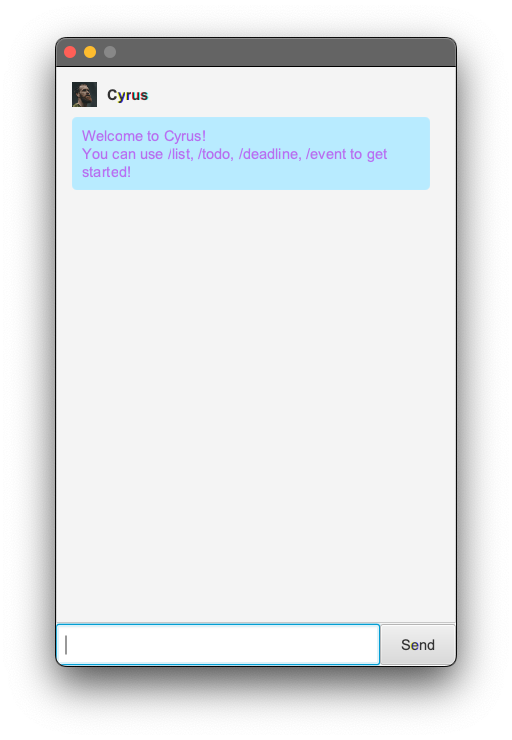
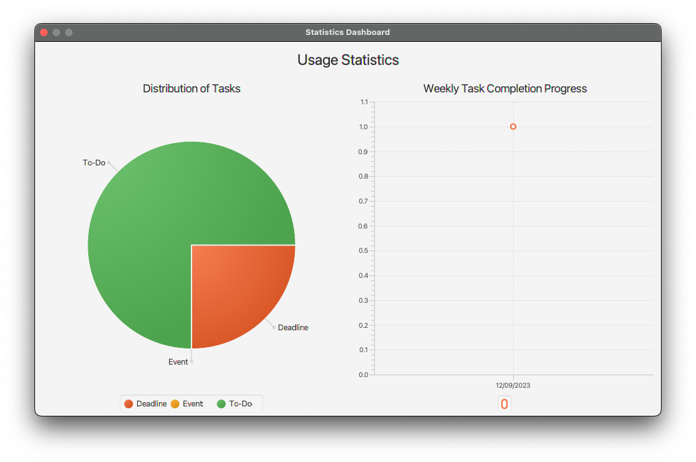
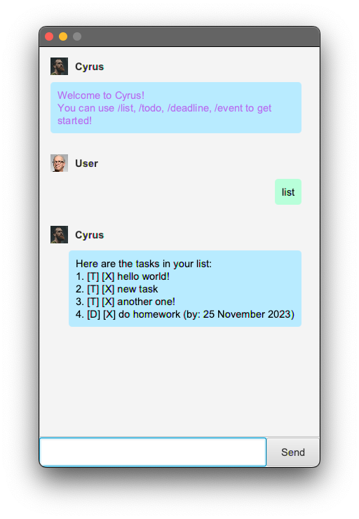

# User Guide

## Features

### Intuitive GUI

Cyrus comes with an intuitive and simple GUI, including a helpful getting started message and a statistics dashboard!



### Add events

Create events and when they start and end.

### Add deadlines

Create deadlines and when they are due.

### Add todos

Create todos to complete.

### Mark tasks

Mark tasks you have completed as done.

### Unmark tasks

Unmark tasks that you have accidentally marked as done.

### Delete tasks

Remove todos/deadlines/events from the task list.

### Save & load tasks on file

Cyrus automatically saves your tasks locally so that you have access the same task list even after closing Cyrus.

### Statistics dashboard

View the usage of Cyrus for task management by viewing the distribution of types of tasks (todo, deadline, and event) and
the number of tasks completed every day within a week.



## Usage

### `list` - List current tasks

Displays a list of tasks, loaded from disk (if any).

Example of usage:

`list`

Expected outcome:

Displayed list of tasks.



### `list` - Describe action

Describe the action and its outcome.

Example of usage:

`keyword (optional arguments)`

Expected outcome:

Description of the outcome.

```
expected output
```
