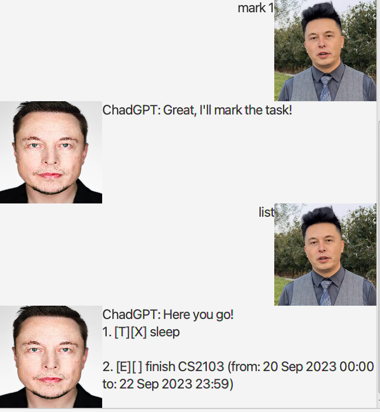
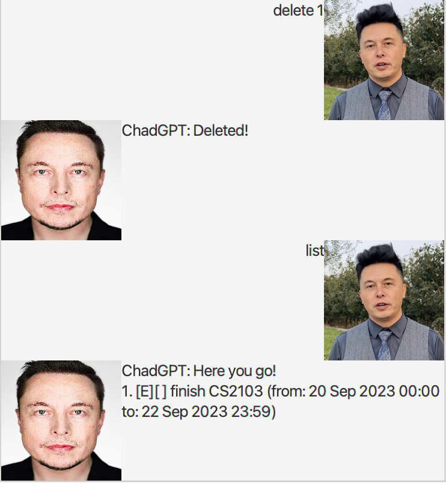
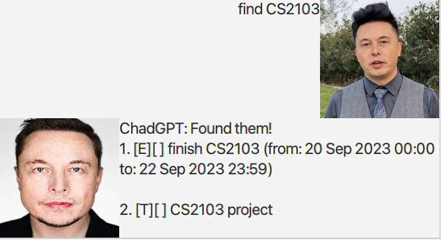
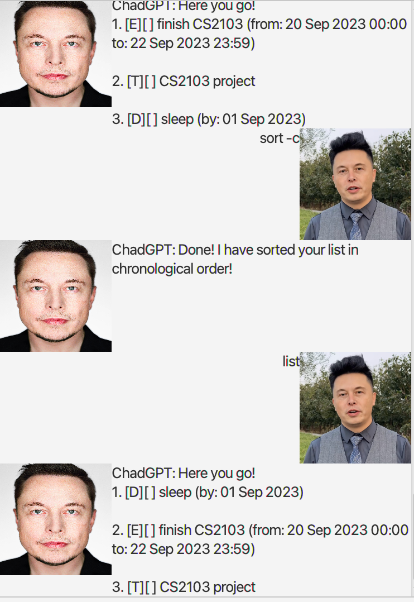

# ChadGPT guide

## Features

### Adding a todo task: `todo`
Adds a **todo** task to the task list

**Format:** 
* `todo <DESCRIPTION>`

>* DESCRIPTION refers to the information of your task

**Examples:**

* `todo sleep`

* `todo dance`

### Adding a deadline task: `deadline`
Adds a deadline task to the task list

**Format:**
* `deadline <DESCRIPTION> /by <DATE>`
* `deadline <DESCRIPTION> /by <DATE> <TIME>`

>* DESCRIPTION refers to the information of your task
>* DATE refers to the date your task is due. It should be in the format YYYY-MM-DD or YYYY/MM/DD
>* TIME is an **optional** parameter. It refers to the time your task is due. It should be in the 24-Hour format HHMM

**Examples:**
* `deadline finish CS2103 /by 2023-09-20`
* `deadline submit CS2103 iP /by 2023/09/22 2359`

### Adding a event task: `event`
Adds a event task to the task list

**Format:**
* `event <DESCRIPTION> /from <START_DATE> /to <END_DATE>`
* `event <DESCRIPTION> /from <START_DATE> <START_TIME> /to <END_DATE> <END_TIME>`

>* DESCRIPTION refers to the information of your task
>* START_DATE refers to the date your event starts. It should be in the format YYYY-MM-DD or YYYY/MM/DD
>* END_DATE refers to the date your event end. It should be in the format YYYY-MM-DD or YYYY/MM/DD
>* START_TIME is an **optional** parameter. It refers to the time your event starts. It should be in the 24-Hour format HHMM
>* END_TIME is an **optional** parameter. It refers to the time your event ends. It should be in the 24-Hour format HHMM

**Examples:**
* `event sleep marathon /from 2023-09-01 /to 2025-09-01`
* `event CS2103 tP grind /from 2023/09/23 0000 /to 2023/09/30 2359`

### Listing tasks: `list`
List out current tasks

**Format:**
* `list`

### Marking task: `mark`
Mark a specific task as done

**Format:**
* `mark <INDEX>`

>* INDEX is the index of the task to mark

**Examples:**
* `mark 1`
* `mark 3`

### Unmark task: `unmark`
Mark a specific task as undone

**Format:**
* `unmark <INDEX>`

>* INDEX is the index of the task to unmark

**Examples:**
* `unmark 1`
* `unmark 3`

### Delete task: `delete`
Delete the task

**Format:**
* `delete <INDEX>`

>* INDEX is the index of the task to delete

**Examples:**
* `delete 1`
* `delete 3`

### Find task: `find`
Find tasks with task descriptions matching the input token

**Format:**
* `find <TOKEN>`

>* TOKEN is the input token to be matched against the tasks

**Examples:**
* `find CS2103`
* `find project`

### Sort tasks: `sort`
Sorts the task list either in chronological (by comparing date due) or 
lexicographical (by comparing task description) order

**Format:**
* `sort <SORT_BY_FLAG> <DESCENDING_FLAG>`

>* SORT_BY_FLAG refers to the attribute in which to sort the list by. Use the -a flag for lexicographical order, or -c for chronological order
>* DESCENDING_FLAG is an **optional** parameter. By default, the sort command sorts the list in ascending order, but adding the -d flag to the command will instead sort it in descending order

**Examples:**
* `sort -a`
* `sort -c -d`

### Exit ChadGPT: `bye`
Exits the chatbot, saving your current tasks in your task list to memory, which will be restored the next time you open the application again

**Format:**
* `bye`

## Command Summary

| Command                                                       | Synatax                                                                                                                 | Example                                                                                                           | 
| ------------------------------------------------------------- | ----------------------------------------------------------------------------------------------------------------------- | ----------------------------------------------------------------------------------------------------------------- |
| Add to-do task to task list                                   | `todo <DESCRIPTION>`                                                                                                    | `todo sleep`                                                                                                      |
| Add deadline task to task list                                | `deadline /by <DATE>`    `deadline /by <DATE> <TIME>`                                                           | `deadline sleep /by 2023-09-20`     `deadline sleep /by 2023-09-20 2359`                                  |
| Add event to task list                                        | `event /from <START_DATE> /to <END_DATE>`    `event /from <START_DATE> <START_TIME> /to <END_DATE> <END_TIME>`  | `event sleep /from 2023-09-20 /to 2023-09-21`     `event sleep /from 2023-09-20 2100 /to 2023-09-21 0800` |
| List all tasks                                                | `list`                                                                                                                  | `list`                                                                                                            |
| Mark task as done                                             | `mark <INDEX>`                                                                                                          | `mark 1`                                                                                                          |
| Mark task as not done                                         | `unmark <INDEX>`                                                                                                        | `unmark 1`                                                                                                        |
| Delete task                                                   | `delete <INDEX>`                                                                                                        | `delete 1`                                                                                                        |
| Find task with description matching token                     | `find <TOKEN>`                                                                                                          | `find CS2103`                                                                                                     |
| Sort the task list by lexicographical or chronological order  | `sort <SORT_BY_FLAG> <DESCENDING_FLAG>`                                                                                 | `sort -a`     `sort -c -d`                                                                                | 

