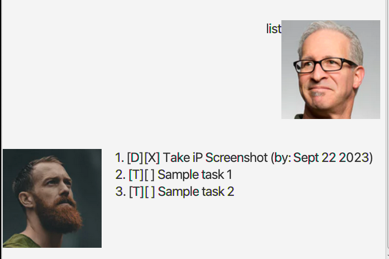

# Koko User Guide

Koko is a chatbot for managing tasks. It has a cute GUI which conveniently allows users to add, remove, and interact with a list of tasks they provide.


## Table of Contents
- Quick Start
- Data Storage
- Commands
    - `bye`: Exiting Koko
    - `list`: Viewing the Task List
    - `mark`: Marking a Task as Done
    - `unmark`: Marking a Task as Not Done
    - Adding Tasks:
      - `todo`: Adding a Todo task
      - `deadline`: Adding a Deadline task
      - `event`: Adding an Event task
    - `delete`: Deleting a Task
    - `find`: Searching for Tasks
- Command Summary


## Quick Start

1. Ensure you have Java 11 or above installed in your computer
2. Download the latest `koko.jar` from [here]() to your computer
3. Copy the file to the folder you want to use as the home folder for your Koko

> Note that the file will create a `data` folder in the same directory it is in, which will store the Task List
4. Double-click the file to start the app. The GUI should appear in a few seconds
5. Type the command in the command box and press Enter to execute it

> e.g. typing `list` and pressing Enter will list all the tasks in your task list.

## Data Storage

Koko stores the task list in the hard disk automatically after any command that changes the task list. There is no need to save manually.

This is saved in the `data` folder created in the same directory as the `koko.jar` file. If no such folder exists, Koko will create one.

## Commands 

### `bye`: Exiting Koko

Closes the GUI and exits the program.

Format: `bye`


### `list`: Viewing the Task List
Shows a list of all tasks in the task list, including their mark/unmark status.



#### Format: 
`list`

#### Example Usage:
`list`
```
Here are the tasks in your list:
    1. [T][ ] read book
    2. [D][ ] return book (by: June 6 2022)
    3. [E][ ] visit book fair (from: June 6 2022 to: June 7 2022)
```

### `mark`: Marking a Task as Done
Marks a task as done.

#### Format: 
`mark INDEX`, where `INDEX` is the index of the task in the task list.

#### Example Usage:
`mark 1`
```
Nice! I've marked this task as done:
  [T][X] read book
```

### `unmark`: Marking a Task as Not Done
Marks a task as not done.

#### Format:
`unmark INDEX`, where `INDEX` is the index of the task in the task list.

#### Example Usage:
`unmark 1`
```
Nice! I've marked this task as not done:
  [T][ ] read book
```

### Adding Tasks

> The next 3 commands outline the process of adding a Task to the Task List. There are 3 types of Tasks: `Todo`, `Deadline`, and `Event`

### `todo`: Adding a Todo task
Adds a Todo task to the task list.

#### Format:
`todo DESCRIPTION`, where `DESCRIPTION` is the description of the task.

#### Example Usage:
`todo read book`
```
Got it. I've added this task:
  [T][ ] read book
Now you have 1 task in the list.
```

### `deadline`: Adding a Deadline task
Adds a Deadline task to the task list.

#### Format:
`deadline DESCRIPTION /by DATE`, where `DESCRIPTION` is the description of the task, and `DATE` is the date of the deadline in `YYYY-MM-DD` format.

#### Example Usage:
`deadline return book /by 2022-06-06`
```
Got it. I've added this task:
  [D][ ] return book (by: June 6 2022)
Now you have 2 tasks in the list.
```

### `event`: Adding an Event task
Adds an Event task to the task list.

#### Format:
`event DESCRIPTION /from START_DATE /to END_DATE`, where `DESCRIPTION` is the description of the task, `START_DATE` is the start date of the event in `YYYY-MM-DD` format, and `END_DATE` is the end date of the event in `YYYY-MM-DD` format.

#### Example Usage:
`event visit book fair /from 2022-06-06 /to 2022-06-07`
```
Got it. I've added this task:
  [E][ ] visit book fair (from: June 6 2022 to: June 7 2022)
Now you have 3 tasks in the list.
```

### `delete`: Deleting a Task
Deletes a task from the task list.

#### Format:
`delete INDEX`, where `INDEX` is the index of the task in the task list.

#### Example Usage:
`delete 1`
```
Noted. I've removed this task:
  [T][ ] read book
Now you have 2 tasks in the list.
```

### `find`: Searching for Tasks
Finds tasks whose descriptions contain the given keyword. They keyword is **case-insensitive**.

#### Format:
`find KEYWORD`, where `KEYWORD` is the keyword to search for.

#### Example Usage:
`find book`
```
Here are the matching tasks in your list:
    1. [D][ ] return book (by: June 6 2022)
    2. [E][ ] visit book fair (from: June 6 2022 to: June 7 2022)
```

## Command Summary

Action | Format, Examples
------ | ----------------
**Exit** | `bye`
**List** | `list`
**Mark** | `mark INDEX` <br> e.g., `mark 1`
**Unmark** | `unmark INDEX` <br> e.g., `unmark 1`
**Todo** | `todo DESCRIPTION` <br> e.g., `todo read book`
**Deadline** | `deadline DESCRIPTION /by DATE` <br> e.g., `deadline return book /by 2022-06-06`
**Event** | `event DESCRIPTION /from START_DATE /to END_DATE` <br> e.g., `event visit book fair /from 2022-06-06 /to 2022-06-07`
**Delete** | `delete INDEX` <br> e.g., `delete 1`
**Find** | `find KEYWORD` <br> e.g., `find book`

