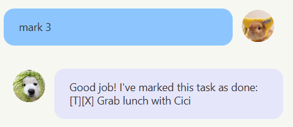
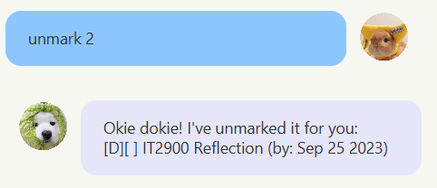

# Cheems
Your all-in-one task manager!
## Highlights
### Better Search with Fuzzy Matching
When you input a keyword, we will find all tasks with description in high similarity to your input, ranked by relevance. Don't worry if you input slightly wrongly!
  
Example Usage
```shell
# All of the commands below find tasks with "project" in their description
find project
find prrjeco
find projecst
```
If you have more than one keyword to find, simply input them consecutively, separated by a space. We will find you all tasks you want to find!
  
Example Usage
```shell
# The command below finds tasks with "icecream", "project", and "hackers" in their description
find icecream project hackers
```
## Usage

### Listing all tasks: `list`
Shows a list of all current tasks stored.

Format: `list`

Example:


### Find tasks using keywords: `find`
Find all tasks with a corresponding keyword.

Format: `find [keywords separated by one space]`

Example:


### Add todo task: `todo`
Add task of type todo.
- A todo task is represented with `[T]`

Format: `todo [task description]`

Example:


### Add deadline task: `deadline`
Add task of type deadline.
- A deadline must have a due date following `/by`
- A deadline task is represented with `[D]`

Format: `deadline [task description] /by [yyyy-mm-dd]`

Example:


### Add event task: `event`
Add task of type event.
- An event must have a start date following `/from` and an end date following `/to`
- An event task is represented with `[E]`

Format: `event [task description] /from [yyyy-mm-dd] /to [yyyy-mm-dd]`

Example:


### Delete a task: `delete`
Delete the task with corresponding index shown in the list.
- Before you select a task, remember to use `list` to check the list of available tasks, and choose from the range given

Format: `delete [index]`

Example:


### Mark a task as done: `mark`
Mark the task with corresponding index shown in the list as done.
- Before you select a task, remember to use `list` to check the list of available tasks, and choose from the range given
- Status of an undone task is reflected as `[X]`

Format: `mark [index]`

Example:



### Mark a task as undone: `unmark`
Mark the task with corresponding index shown in the list as undone.
- Before you select a task, remember to use `list` to check the list of available tasks, and choose from the range given
- Status of an undone task is reflected as `[ ]`

Format: `unmark [index]`

Example:

