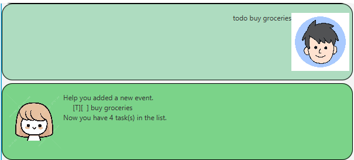
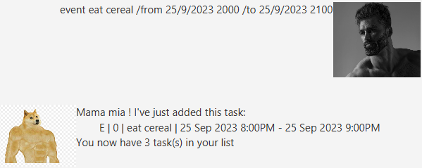
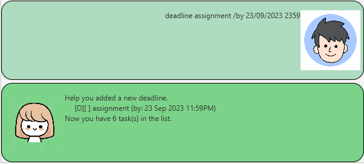
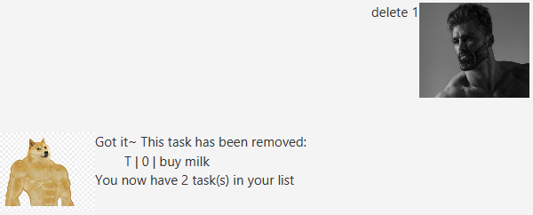
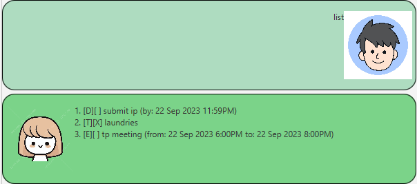
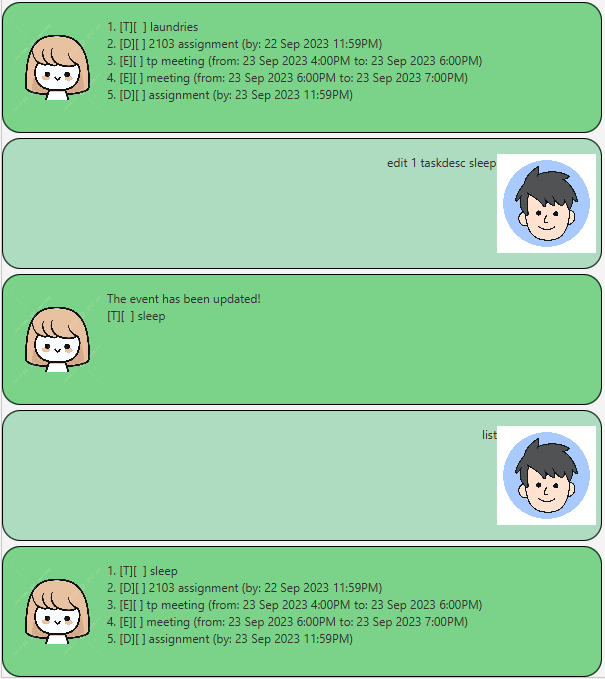
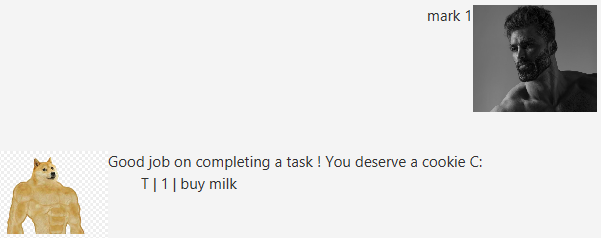
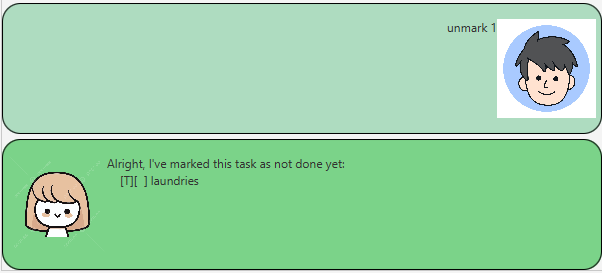

# "YOURS" User Guide
Welcome to "YOURS"! This guide will help you get started with using our chatbot effectively for various tasks and interactions.

## Quick Start

1. Ensure you have Java 11 or above installed on your Computer.
2. Download the latest duke.jar
3. Copy the file to the folder you want to use as the home folder for your Duke.
4. Run the jar file.
5. Type the command in the command box and press Enter to execute it.
6. Refer to the Features below for details of each command.

## Features 

Notes about command format :
- All commands are lower-case, e.g. `todo` buy groceries, `find` gym
- Words in `UPPER_CASE` are the parameters to be supplied by the user.
  
  - e.g. `deadline /by DUEDATE`, `DUEDATE` is a parameter which can be used as `deadline /by 23/08/2023 0800`.
- The format for all Dates and Time (FROMDATE, TODATE & DUEDATE) is `DD/MM/YYYY HHmm`.

  - e.g `23/08/2023 1800`
  

### Create a task: `todo`, `event`, `deadline`

The feature allows you to add new to-do tasks to your task list. YOURS supports three types of tasks todo, event, and deadline.

1. `todo`: Manage your everyday tasks and chores.
   
      - Format: `todo TASKDESC`
      - Example: `todo buy groceries`
        
   
2. `event`: Schedule and organize upcoming events and activities.
   
      - Format: `event TASKDESC /from FROMDATE /to TODATE`
      - Example: `event meeting /from 23/08/2023 1800 /to 23/08/2023 1900`
        
   
3. `deadline`: Keep track of important deadlines.
  
      - Format: `deadline TASKDESC /by DUEDATE`
      - Example: `deadline assignment /by 23/08/2023 2359`
        
        

### Delete a task: `delete`

Removes tasks from your task list when they are no longer relevant or needed.

- Format: `delete INDEX`
   - The INDEX must be a positive integer 1,2,3 ...
   
- Example:
   - `delete 1` Delete the first task of the list.
 

### Listing all tasks - `list`

Displays all the tasks in the task list.

- Format: `list`

- Example:
  

  - The task display in this format: [Type][Completeness] Task description
      - **Type**:
        - `[T]` = `todo`
        - `[E]` = `event`
        - `[D]` = `deadline`
      - **Completeness**:
         - `[X]` = `done`
         - `[ ]` = `not done`

### Edit a task: `edit`

Edits a task field to a new input

- Format: `edit INDEX FIELD NEWINPUT`
   - The INDEX must be a positive integer 1,2,3 ...
   - FIELD must be provided in lowercase.
   - Here are the respective FIELDs for each type of task:
        - `todo`: `taskdesc`
        - `event`: `taskdesc`, `fromdate`, `todate`
        - `deadline`: `taskdesc`, `duedate`
   - The provided NEWINPUT must match the format for the provided FIELD.

     e.g If FIELD = `fromdate`, then NEWINPUT = `23/08/2023 1800`
     
- Example:
  
  - `edit 1 taskdesc fetch John` Edits the task description of the first task to `fetch John`.
  
  - `edit 2 fromdate 23/08/2023 1900` Edits the from date for the second task (an Events) to 23/08/2023 1900
 
    

:bulb: **Tip:** Use the list command to check the list for the task's index and its type to ease your edit process.

### Mark done - `mark`

Marks a task as completed.

- Format: `mark INDEX`
  - The INDEX must be a positive integer 1,2,3 ...
   
- Example:
   - `mark 1`, Mark the first task of the list as done.
 

### Mark not done -`unmark`

Marks a task as not complete.

- Format: `unmark INDEX`
   - The INDEX must be a positive integer 1,2,3 ...
     
- Example:
   - `unmark 1` Mark the first task of the list as not done.
 

  
### Find a task - `find`

Finds tasks that match the given keyword.

- Format: `find KEYWORD`
   
- Example: `find fetch` Find tasks with a description contained fetch.

  
### Exiting the program - `bye`

Exits the program.

- Format: `bye`

### Saving the data

All data will be saved in the hard disk automatically after any command that changes the data. There is no need to save manually.

### Editing the data

All data will be saved on the hard disk automatically as text file `[JAR file location]/data/TaskList.txt`. Advanced users are welcome to update data directly by editing that data file.

## Command Summary

| Command | Format |  Example |
|----------|----------|----------|
| todo | `todo TASKDESC` | `todo buy groceries` |
| event | `event TASKDESC /from FROMDATE /to TODATE` | `event meeting /from 23/08/2023 1800 /to 23/08/2023 1900` |
| deadline | `deadline TASKDESC /by DUEDATE` | `deadline assignment /by 23/08/2023 2359` |
| delete | `delete INDEX` | `delete 1` |
| edit | `edit INDEX FIELD NEWINPUT` | `edit 1 taskdesc fetch John`   `edit 2 fromdate 23/08/2023 1900`|
| list | `list` | `list` |
| mark| `mark INDEX` | `mark 1` |
| unmark | `unmark INDEX` | `unmark 1` |
| find | `find KEYWORD`| `find fetch` |
| bye | `bye`| `bye` |

