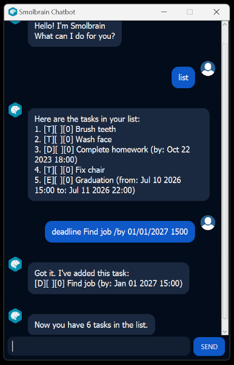

# Smolbrain Chatbot: User Guide

Smolbrain is a **chatbot for tracking of tasks, optimised for use via a Command Line Interface** (CLI) while still having the benefits of a Graphical User Interface (GUI). With a strong mastery of typing commands, tasks management can be much more efficient than conventional GUI apps.

Screenshot of Smolbrain Chatbot:

 
<br><br>
## Quick start
1. Ensure that Java `11` or above installed in your Computer.
2. Download the latest `smolbrain.jar` from [here](https://github.com/pzl111/ip/releases/tag/v0.3-Release).
3. Copy the file to the folder you want to use as the _home folder_ for your Smolbrain Chatbot.
4. To run the application, open a command terminal, `cd` into the folder you put the jar file in, and use the `java -jar smolbrain.jar` command to run the application.
5. Type the command in the command box and press Enter or click the SEND button to execute it. e.g. typing `list` and pressing Enter will list out all the current tasks saved.
   <br>Some example commands you can try:
   * `list` : Lists all current saved tasks.
   * `todo NewTodo` : Adds a new task of type **Todo** with the title `NewTodo` to the chatbot.
   * `delete 3` : Deletes the 3rd task shown in the current task list.
   * `mark 1` : Marks the 1st task shown in the current task list.
   * `bye` : Exits the app.
6. Refer to the Features below for details of each command.

> ⚠️ **Important:** Running the jar file by double-clicking and opening via `Java(TM) Platform SE binary` might cause an exception displayed `OOPS!!! java.io.IOException: Access is denied`. Run the application through the command terminal as shown above instead.

<br><br>

## Key Features 

### Creation of tasks

There are 3 different types of tasks available: **Todo**, **Deadline** and **Event**.
* **Todo** : A task with only a description.
* **Deadline** : A task with a description with the associated due date and time.
* **Event** : A task with a description with the starting and ending date and times.
* Displayed tasks are prefixed by `[TYPE][MARKED][PRIORITY_LEVEL]`.
  * `TYPE` refers to the task type: `T` for **Todo**, `D` for **Deadline**, `E` for **Event**.
  * `MARKED` refers to marked state of task: `X` for marked, `0` for unmarked.
  * `PRIORITY_LEVEL` refers to the assigned priority level of the task, with possible values 0, 1, 2 and 3.

### Marking of tasks

Tasks can be marked when completed, or unmarked when required, allowing to track which tasks are done.

### Prioritising tasks

Tasks can be set with a priority level to indicate how urgent they are.
<br><br>
## Features List

> ℹ️ Notes about the command format:
> 
> * Words in `[UPPER_CASE]` are the parameters to be supplied by the user.
> * Task descriptions (indicated as `[DESCRIPTION]`), can have spaces in between them.
>   * Typing `todo This is a todo` will create a new **Todo** task with the description `This is a todo`.
> * Date and time must be given in this **exact format**: `DD/MM/YYYY HHmm`, otherwise there will be an error displayed.
>   * Single digit days or months should have 2 numbers such as `03`, `09`.
>   * Time must not have semicolon characters `:` and should be in 24-hour format.

<br>

### Adding a **Todo** task: `todo`

Adds a new **Todo** task to the chatbot. 

Format: `todo [DESCRIPTION]`

* `[DESCRIPTION]` can have multiple spaces for separating words. 
* By default, the task is unmarked and has a priority level of 0.

Examples: 
* `todo Housework` : Creates a new **Todo** task with the description `Housework`.
* `todo Create a new recipe` : Creates a new **Todo** task with the description `Create a new recipe`.

Expected Output:
```
Got it. I've added this task:
[T][ ][0] Housework
Now you have 3 tasks in the list.
```

<br>

### Adding a **Deadline** task: `deadline`

Adds a new **Deadline** task to the chatbot with the due date and time. 

Format: `deadline [DESCRIPTION] /by [DUE_DATETIME]`

* `[DESCRIPTION]` can have multiple spaces for separating words. 
* By default, the task is unmarked and has a priority level of 0.
* `[DUE_DATETIME]` must be given in the exact format `DD/MM/YYYY HHmm`, as described above in the notes.

Examples: 
* `deadline Homework assignment /by 20/12/2023 1800` : Creates a new **Deadline** task with the description `Homework assignment`, with due date and time set to 20 Dec 2023 at 18:00.
* `deadline Cleaning /by 03/08/2023 0900` : Creates a new **Deadline** task with the description `Cleaning`, with due date and time set to 03 Aug 2023 at 09:00.

Expected Output:
```
Got it. I've added this task:
[D][ ][0] Homework assignment (by: Dec 20 2023 18:00)
Now you have 2 tasks in the list.
```

<br>

### Adding an **Event** task: `Event`

Adds a new **Event** task to the chatbot with the starting and ending date and times.

Format: `event [DESCRIPTION] /from [START_DATETIME] /to [END_DATETIME]`

* `[DESCRIPTION]` can have multiple spaces for separating words. 
* By default, the task is unmarked and has a priority level of 0.
* `[START_DATETIME]` and `[END_DATETIME]` must be given in the exact format `DD/MM/YYYY HHmm`, as described above in the notes.

Examples: 
* `event Swimming /from 04/01/2023 0900 /to 04/01/2023 1100` : Creates a new **Event** task with the description `Swimming`, with starting date and time set to 04 Jan 2023 at 09:00, ending date and time set to 04 Jan 2023 at 11:00.
* `event Birthday party /from 11/10/2023 1800 /to 11/10/2023 2200` : Creates a new **Event** task with the description `Birthday party`, with starting date and time set to 11 Oct 2023 at 18:00, ending date and time set to 11 Oct 2023 at 22:00.

Expected Output:
```
Got it. I've added this task:
[E][ ][0] Swimming (from: Jan 04 2023 09:00 to: Jan 04 2023 11:00)
Now you have 3 tasks in the list.
```

<br>

### Marking a task: `mark`

Marks the specified task as complete.

Format: `mark [INDEX]`

* Marks the task at the specified `[INDEX]`. The index refers to the index number shown in the displayed task list. The index **must be a positive integer** 1, 2, 3, ...
* Providing a non-positive index or index that is greater than the number of tasks will result in an error displayed.
* Marking tasks will overwrite the current marked state of a task (marked tasks will remain marked)

Examples: 
* `mark 1` : Marks the task indexed at 1.
* `mark -1` : Error message displayed saying `OOPS!!! Please provide a valid number within the range.`.
* `mark 11` : If there are less than 11 tasks, an error message is displayed saying `OOPS!!! Please provide a valid number within the range.`.

Expected Output:
```
Nice! I've marked this task as done:
[T][X][0] Housework
```

<br>

### Unmarking a task: `unmark`

Unmarks the specified task as incomplete.

Format: `unmark [INDEX]`

* Unmarks the task at the specified `[INDEX]`. The index refers to the index number shown in the displayed task list. The index **must be a positive integer** 1, 2, 3, ...
* Providing a non-positive index or index that is greater than the number of tasks will result in an error displayed.
* Unmarking tasks will overwrite the current marked state of a task (unmarked tasks will remain unmarked)

Examples: 
* `unmark 3` : Unmarks the task indexed at 3.
* `unmark -3` : Error message displayed saying `OOPS!!! Please provide a valid number within the range.`.
* `unmark 15` : If there are less than 15 tasks, an error message is displayed saying `OOPS!!! Please provide a valid number within the range.`.

Expected Output:
```
OK, I've marked this task as not done yet:
[E][ ][0] Swimming (from: Jan 04 2023 09:00 to: Jan 04 2023 11:00)
```

<br>

### Deleting a task: `delete`

Deletes the specified task.

Format: `delete [INDEX]`

* Deletes the task at the specified `[INDEX]`. The index refers to the index number shown in the displayed task list. The index **must be a positive integer** 1, 2, 3, ...
* Providing a non-positive index or index that is greater than the number of tasks will result in an error displayed.
* Deleting tasks will re-order the indexing of remaining tasks.

Examples: 
* `delete 2` : Deletes the task indexed at 2.
* `delete -6` : Error message displayed saying `OOPS!!! Please provide a valid number within the range.`.
* `delete 8` : If there are less than 8 tasks, an error message is displayed saying `OOPS!!! Please provide a valid number within the range.`.

Expected Output:
```
Noted. I've removed this task:
[D][ ][0] Homework assignment (by: Dec 20 2023 18:00)
Now you have 2 tasks in the list.
```

<br>

### Setting priority level : `priority`

Sets the priority level for the specified task.

Format: `priority [INDEX] [PRIORITY_LEVEL]`

* Sets the priority level of the task at the specified `[INDEX]` with priority level `[PRIORITY_LEVEL]`. The index refers to the index number shown in the displayed task list. The index **must be a positive integer** 1, 2, 3, ...
* Priority level should only have the possible values 0, 1, 2 and 3. Otherwise, an error is displayed.
* Providing a non-positive index or index that is greater than the number of tasks will result in an error displayed.
* Deleting tasks will re-order the indexing of remaining tasks.

> ⚠️ The **task index comes first**, before the priority level.

Examples: 
* `priority 2 0` : Sets the task indexed at 2 to priority level 0.
* `priority 5 3` : Sets the task indexed at 5 to priority level 3.
* `priority 1 6` : Error message displayed saying `OOPS!!! Please provide a valid priotity level from 0 to 3.`.
* `priority 5 -3` : Error message displayed saying `OOPS!!! Please provide a valid priotity level from 0 to 3.`.

Expected Output:
```
OK, I've marked this task with priority level 0:
[E][ ][0] Swimming (from: Jan 04 2023 09:00 to: Jan 04 2023 11:00)
```

<br>

### Finding task by keyword: `find`

Finds tasks whose descriptions contains the keyword.

Format: `find [KEYWORD]`

* The search is **case-sensitive**. e.g `book` will **not** match `Book`.
* Only the task description is searched, not the date and times nor the task type.
* Descriptions containing the keyword but not the entire word are still matched e.g. `din` will match `Finding`.
* Keyword with spaces are included e.g. `ck ba` will match `Pack bags`.

Examples: 
* `find Book` : Returns `Book reading` and `Booking`.
* `find Birthday Par` : Returns `Birthday Party`, but not `birthday Party`.
* `find ck ba` : Returns `Pack bags` and `Crack back`.

Expected Output:
```
Here are the matching tasks in your list:
3. [T][ ][0] Book
4. [T][ ][0] Booking
```

<br>

### Listing all tasks: `list`

Shows all tasks in the chatbot.

Format: `list`

Expected Output:
```
Here are the tasks in your list:
1. [T][X][0] Housework
2. [E][ ][0] Swimming (from: Jan 04 2023 09:00 to: Jan 04 2023 11:00)
3. [T][ ][0] Book
4. [T][ ][0] Booking
```

<br>

### Exiting the app: `bye`

Exits the app.

Format: `bye`

Expected Output:
```
Bye. Hope to see you again soon!
```

<br>

### Saving data

Smolbrain chatbot data are saved in the computer automatically after any command that changes the data. There is no need to save manually after each command.

<br>

### Editing data file

Smolbrain chatbot data is saved in the computer automatically as a TXT file named `data.txt` in the same directory as your `smolbrain.jar` file.
Tasks are encoded in the format `[TYPE][MARKED][PRIORITY_LEVEL][BODY]`.
* `[TYPE]` refers to the task type: `T` for **Todo**, `D` for **Deadline**, `E` for **Event**.
* `[MARKED]` refers to marked state of task: `1` for marked, `0` for unmarked.
* `[PRIORITY_LEVEL]` refers to the assigned priority level of the task, with possible values 0, 1, 2 and 3.
* `[BODY]` refers to task description, along with other parameters such as `/from` and its due date and time
<br>e.g. `D12Complete homework /by 22/10/2023 1800` refers to a **Deadline** task with description `complete Homework`, due date and time of `22 Oct 2023 18:00`, that is marked and has priority level of 2.

> ⚠️ **Caution:** If your changes to the data file does not follow the above encoding and makes its format invalid, Smolbrain chatbot might parse the data wrongly and give corrupted task data.

<br>

### Deleting data

Deleting the `data.txt` file in the same directory as your `smolbrain.jar` file will delete all saved data. When app is reopened again, it will restart as a new app.

<br><br>

## Command summary

| Action | Format, Example |
| --- | --- |
| Add **Todo** | `todo [DESCRIPTION]`<br>e.g. `todo Create a new recipe`|
| Add **Deadline** | `deadline [DESCRIPTION] /by [DUE_DATETIME]`<br> e.g. `deadline Homework assignment /by 20/12/2023 1800` |
| Add **Event** | `event [DESCRIPTION] /from [START_DATETIME] /to [END_DATETIME] HHmm`<br> e.g. `event Birthday party /from 11/10/2023 1800 /to 11/10/2023 2200` |
| Mark | `mark [INDEX]`<br> e.g. `mark 2` |
| Unmark | `unmark [INDEX]`<br> e.g. `unmark 5` |
| Delete | `delete [INDEX]`<br> e.g. `delete 1` |
| Priority | `priority [INDEX] [PRIORITY_LEVEL]`<br> e.g. `priority 7 3` |
| Find | `find [KEYWORD]`<br> e.g. `find book` |
| List | `list` |
| Exit | `bye` |

<br><br>

## FAQ
**Q:** Why do I get errors when adding a new deadline or event task?<br>
**A:** Check if the date and time follows the `DD/MM/YYYY HHmm` format, specifically having 2 numbers for single numbered date and months, 24-hour time format with no semicolon character `:` between hours and minutes.


**Q:** Can I have space separated task descriptions?<br>
**A:** Yes, the descriptions can have any number of spaces between words, without affecting the command parsing.


**Q:** Are there any characters that I cannot use for the task description?<br>
**A:** There are no restrictions on special characters such as `%` or `$`. However, phrases that are interpreted as a command format such as `/from` and `/by` are not allowed and not parsed as part of the description.
