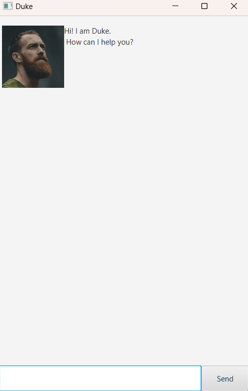
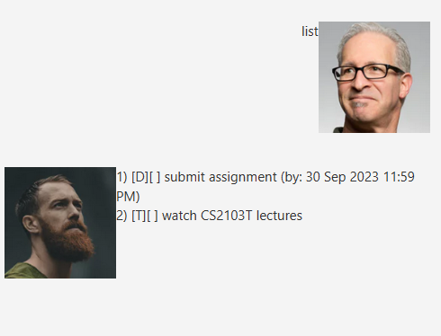

# Duke User Guide
Duke is a task management application which helps to keep track of your tasks,  
optimised for use via a Command Line Interface while still having the benefits   
of a Graphical User Interface.

## Quick Start

1) Ensure you have Java `11` or above installed in your computer.  
2) Download the latest `duke.jar` from [here](https://github.com/timetraveller-123/ip).,  
3) Copy the file to the folder you want to use as the home folder for your application.  
4) Open a command terminal, `cd` into the folder you put the jar file in, and use  
   `java -jar duke.jar`     
   command to run the application.
   A GUI similar to below should appear in a few seconds.

## Features

> &#8505;   
> Words in `UPPER_CASE` are the parameters to be supplied by user  
> e.g. in `todo NAME`, `NAME` is a parameter which can be used as `todo read book`

### Listing all the tasks in the list. `list`
Lists all the tasks in the list currently.

Format: `list`

### Adding a task to do. `todo` `T`
Adds a task to do in the list.  

Formats: `todo NAME` `T task`  
+ `NAME` is the name of task.     

Examples:  
+ `todo Watch Lecture`  
+ `T wash clothes`  

### Adding a task with deadline. `deadline` `D`
Adds a task with deadline in the list.  
Formats: `deadline NAME /by DATE` `D NAME /by DATE`
+ `NAME` is the name of task.
+ `DATE` is the deadline of task in `dd-MM-yyyy HHmm` format.

Examples:
+ `deadline submit homework /by 30-09-2023 2359`
+ `D revise /by 30-09-2023 2359`

### Adding an event. `event` `E`
Adds an event with start and end time in the list.  
Formats: `event NAME /from START_DATE /to END_DATE` `E NAME /from START_DATE /to END_DATE`
+ `NAME` is the name of event.
+ `START_DATE` is the start time of event in `dd-MM-yyyy HHmm` format.
+ `END_DATE` is the end time of event in `dd-MM-yyyy HHmm` format.

Examples:
+ `event attend tutorial /from 30-09-2023 0800 /to 30-09-2023 1000`
+ `E submit quiz /from 30-09-2023 0800 /to 30-09-2023 2359`

### Marking a task as done. `mark` `check`
Marks a task as done in the list.

Formats: `mark INDEX` `check INDEX`
+ `INDEX` is index of the task as shown in the list.

Examples:
+ `mark 1`
+ `check 2`

### Unmarking a task as not done. `unmark` `uncheck`
Unmarks a task as not done in the list.

Formats: `unmark INDEX` `uncheck INDEX`
+ `INDEX` is index of the task as shown in the list.

Examples:
+ `unmark 1`
+ `uncheck 2`

### Deleting a task. `delete` `remove`
Deletes a task from the list.

Formats: `delete INDEX` `remove INDEX`
+ `INDEX` is index of the task as shown by `list` command.

Examples:
+ `delete 1`
+ `remove 2`

### Finding a task. `find` `search`
Finds all task from the list whose name contains given keyword.

Formats: `find KEYWORD` `search KEYWORD`
+ `KEYWORD` is the keyword to search for.

Examples:
+ `find submit`
+ `search assignment`

### Undoing a command. `undo`
Undoes the most recent undoable task since starting the application.  
Undoable commands are marking, unmarking, deleting and adding of tasks.

Format: `undo`

### Exiting the application. `bye`
Exits the application.

### Saving the data
The data in the application are automatically saved to hard disk  
upon the `bye` command.