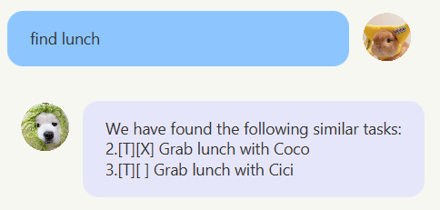

# Jojo Robot
> "She's doing what she can." - Rosie

Jojo also goes by Jo.
It frees your mind of having to remember things you need to do. It's
- text-based
- easy to learn
- ~~FAST~~ *SUPER* FAST to use
---
## Features

### Adding a task (3 types): `todo`, `deadline`, `event`
Add a task to the list.

1. Todo task: A task without a deadline.
   - Format: `todo TASK_DESCRIPTION`

2. Deadline task: A task with a deadline.
   - Format: `deadline TASK_DESCRIPTION /by DEADLINE`
     - `DEADLINE` must be in the format "**YYYY-MM-DD**"

4. Event task: A task with a start and end date.
   - Format: `event TASK_DESCRIPTION /from START_DATE /to END_DATE`
     - `START_DATE` and `END_DATE` must be in the format "**YYYY-MM-DD**"

### Listing all tasks: `list`
Shows a list of all tasks tracked by Jojo Robot.

Format: `list`

### Marking task(s) as done: `mark` 
Marks specified task(s) as done.

Format: `mark INDEX1, INDEX2, ...`
- Marks the task at the specified indices with a "X"
- `INDEX1`, `INDEX2`,... refers to the index number shown in the displayed task list.
- `INDEX1`, `INDEX2`,... **must be positive integers** 1, 2, 3,...

### Undoing the marking of task(s): `unmark`
Removes a mark from the specified task(s). 

Format: `unmark INDEX1, INDEX2, ...`
- Removes the "X" mark from the task(s) at the specified indices.
- `INDEX1`, `INDEX2`,... refers to the index number shown in the displayed task list.
- `INDEX1`, `INDEX2`,... **must be positive integers** 1, 2, 3,...

### Deleting task(s): `delete`
Deletes specified task(s) from the list.

Format: `delete INDEX1, INDEX2,...`
- Deletes the task(s) at the specified indices.
- `INDEX1`, `INDEX2`,... refers to the index number shown in the displayed task list.
- `INDEX1`, `INDEX2`,... **must be positive integers** 1, 2, 3,...

### Locating tasks by date: `check`
Finds:
- Deadline tasks whose deadline matches the given date
- Event tasks whose start/end date matches the given date

Format: `check DATE`
- `DATE` must be in the format "**YYYY-MM-DD**"

### Locating tasks by keyword: `find`
Finds tasks whose task descriptions matches any of the given keywords.

Format: `find KEYWORD1 KEYWORD2 ...`
- The search is case-insensitive. e.g `hans` will match `Hans`
- Only the task description is searched.
- Each keyword should be separated by a space.
- Tasks that contain any of the given keywords will be returned.

Examples:
- `find s e` returns `sleep` and `Eat`
- `find Read` returns `read book`
- `find a` returns `Eat` and `Andy's event`

### Exiting the program: `bye`
Exits the program.

Format: `bye`

### Saving the data
Task data are saved in the hard disk automatically after any command that changes the data. There is no need to save manually.

### Editing the data file
Task data are saved automatically as a Text file `[JAR file location]/data/jo.txt`. Advanced users are welcome to update data directly by editing that data file.
> [!NOTE]
> If your changes to the data file makes its format invalid, the program may not be able to run smoothly. Hence, please ensure that all changes follow the format closely. 
