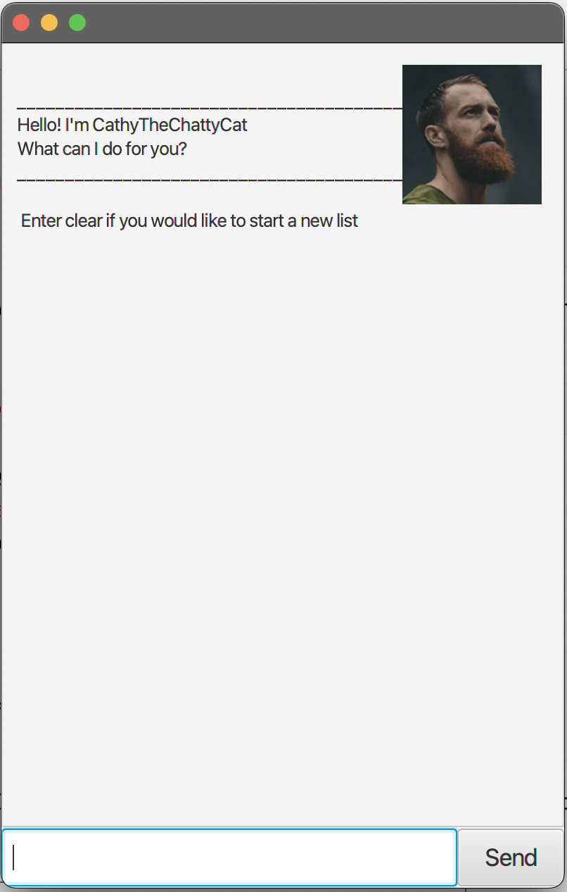

# User Guide
**CathyTheChattycat** is all you will ever need as an all in one task manager application.
--------------------------------------------------------------------------------------------------------------------

## Quick start

1. Ensure you have Java `11` or above installed in your Computer.

1. Download the latest `CathyTheChattyCat.jar` from [here](https://github.com/LinWanLeii/ip/releases/tag/A-Release).

1. Copy the file to the folder you want to use as the _home folder_ for your AddressBook.

1. Open a command terminal, `cd` into the folder you put the jar file in, and use the `java -jar duke.jar` command to run the application.<br>
   A GUI similar to the below should appear in a few seconds. Note how the app contains some sample data.<br>
   

1. Type the command in the command box and press Enter to execute it.

    * `list` : Lists all Tasks.

    * `todo study` : Adds a todo task named `study` to the task list.

    * `deadline study /by 2023-10-09` : Adds a deadline task named `study` to the task list by 2023-10-09 YYYY-MM-DD.

    * `event study with jody /from 2023-10-09 /to 2023-10-20` : 
       Adds a event task named `study study with jody` to the task list from 2023-10-09 YYYY-MM-DD to 2023-10-20.
   
    * `delete 3` : Deletes the 3rd contact shown in the current list. 
    * `mark/unamrk 3` : Marks/Unmarks the 3rd Task in the current list
    * `mark 1,2,3` : Multiple commands can be done for delete/mark/unmark by listing indexes such way.
    * `clear` : Deletes all tasks.

    * `bye` : Exits the app.

1. Refer to the [Features](##features) below for details of each command.

--------------------------------------------------------------------------------------------------------------------

## Features 

<div>

**Notes about the command format:**

   * Dates should be written in this format YYYY-MM-DD
   * Tasks would be written into the same file, make sure to end application with `bye` such that no data will be lost.

</div>

### Adding tasks
* You can add either a todo, deadline or event type task into your tasklist.

### Delete tasks
* You can also delete any task base on indexes.

### Mark or UnMark tasks
* When you are done with a task you can mark it as done, if you decide to Unmark it, it can be done as well.

### Finding task
* If you want to find a task base on keywords, you can use the find function which returns tasks with the same keyword.

### Clear
* You can clear the whole task list with a simple command.

### List
* You can also view your entire list.

### Saves the data in your task list
* All the task you have input will be saved into the text file within the system, so don't worry about closing and 
reopening the application.

## Usage

### `Todo` - Adds a todo task into the task list.

A todo task simply requires a task that needs to be done.

Example of usage: 

`Ttodo shower`

Expected outcome:

```
Got it. I've added this task:
 [T][] shower
Now you have 5 task in the list.
```

### `Deadline` - Adds a deadline task into the task list.

A deadline task simply requires a task that needs to be done and a time to do **/by**.

Example of usage:

`deadline dry off /by 2023-09-22`

Expected outcome:

```
Got it. I've added this task:
 [D][] dry off (by: Sep 22 2023)
Now you have 6 task in the list.
```

### `Event` - Adds a event task into the task list.

An event task requires a task name that needs to be done **/from** a timing **/to** another.

Example of usage:

`event change clothes /from 2023-09-23 /to 2024-09-23`

Expected outcome:

```
Got it. I've added this task:
 [E][] change clothes (from: Sep 23 2023 to: Sep 23 2024)
Now you have 7 task in the list.
```

### `List` - list out all the task in your task list.

Shows all the tasks added in sequential order.

Example of usage:

`list`

Expected outcome:

```
Here are the tasks in your list:
1. [T][X] work on ip
2. [D][X] work more on ip (by: Sep 22 2023)
3. [E][ ] sleepppppp (from: Sep 22 2023 to: Sep 22 3023)
4. [T][ ] workout
5. [T][ ] shower
6. [D][ ] dry off (by: Sep 22 2023)
7. [E][ ] change clothes (from: Sep 23 2023 to: Sep 23 2024)
```

### `Delete` - Deletes a task base on your input index.

Deletes a task.

Example of usage:

`delete 1`

Expected outcome:

```
Noted. I've removed this task:
 [T][X] work on ip
Now you have 6 tasks in the list
```

### `Mark` - Shows a task being marked as done.

An X will be placed beside the task type.

Example of usage:

`mark 1`

Expected outcome:

```
Noted. I've marked this task as done:
  [D][X] work more on ip (by: Sep 22 2023)
```

### `Unmark` - Shows a task being Unmarked as done.

An X will be removed beside the task type.

Example of usage:

`unmark 1`

Expected outcome:

```
OK, I've unmarked this task as not done yet:
  [D][] work more on ip (by: Sep 22 2023)
```

### `delete/mark/unmark` - Doing commands on multiple tasks.

You can either delete, mark or unmark a few task at once.

Example of usage:

`unmark 1, 2`

Expected outcome:

```
OK, I've unmarked this task as not done yet:
1. [D][] work more on ip (by: Sep 22 2023)
2. [E][ ] sleepppppp (from: Sep 22 2023 to: Sep 22 3023)
Now you have 6 tasks in the list.
```

### `Find` - Finds tasks that has the input words.

You just have to input a specific word and it will find you any tasks with the same word.

Example of usage:

`find work`

Expected outcome:

```
Here are the matching tasks in your list:
1. [D][] work more on ip (by: Sep 22 2023)
2. [E][] workout (from: Sep 22 2023 to: Sep 22 3023)
3. [T][X] workout
```

### `Clear` - Clears all the task in your task list.

You can just simply type clear.

Example of usage:

`clear`

Expected outcome:

```
Noted. I've removed all the tasks.
```

### `Bye` - Closes the application.

You can just simply type bye to close the Chat bot.

Example of usage:

`bye`

Expected outcome:

```
Bye! Hope to see you again soon.
```

