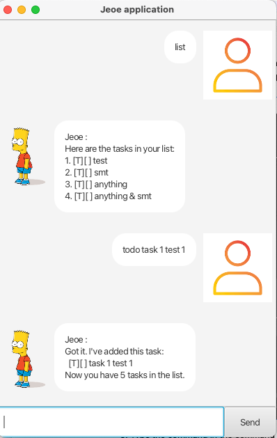

# User Guide

`Bryan` is a **desktop app for managing your tasks, optimised for use via a Command Line Interface** (CLI). Complimented with a simple GUI inspired by the [Everforest](https://github.com/sainnhe/everforest) theme, `Bryan` is an efficient todo list for those who can type fast.

- [Quick Start](#quick-start)
- [Features](#features)
  - [Listing your tasks: `list`](#listing-your-tasks---list)
  - [Creating a Todo:`todo`](#creating-a-todo-task---todo)
  - [Creating a Deadline: `deadline`](#creating-a-deadline-task---deadline)
  - [Creating an Event: `event`](#creating-an-event-task---event)
  - [Marking/Unmarking a task: `mark`/`unmark`](#markingunmarking-a-task---markunmark)
  - [Deleting a task: `delete`](#deleting-a-task---delete)
  - [Finding a task: `find`](#finding-a-task---find)
  - [Exiting the application: `bye`](#exiting-the-application---bye)
- [FAQ](#faq)
- [Command Summary](#command-summary)

## Quick Start
1. Ensure you have Java `11` or above installed on your computer.

2. Download the latest `bryanBot.jar` from [here](https://github.com/McNaBry/ip/releases/tag/A-Release).

3. Copy the `.jar` file to an empty folder where you are able to read and write to existing files.

4. Open a command terminal and navigate to the folder containing your `.jar` file using `cd <file-path>`.

5. Next, run the application using `java -jar bryanBot.jar`. A GUI similar to the below should appear in a few seconds.

6. Type the command into the input field located next to the send button and press Enter to execute it. E.g. Typing `list` and pressing Enter will list all the tasks you have created so far.    Some example commands you can try:

    - `todo read a book` : Adds a Todo task that contains "read a book" as its description.
    - `mark 1` : Marks the 1st task on your list as done.
    - `delete 1` : Deletes the 1st task on your list.
    - `find read` : Finds any tasks whose description contains "read".
    - `bye` : Exits the application.

7. Refer to the [Features](#features) below for details of each command.

## Features

### Listing your tasks - `list`

Lists all the tasks you have created so far (including those you have created in other sessions).

Format: `list`

### Creating a Todo task - `todo`

Creates a Todo task.

Format: `todo DESCRIPTION`

Example: `todo read a book`

#### When should I create a Todo?
A Todo is suitable for simple tasks that are not time dependent and you wish to just keep track of it somewhere.

### Creating a Deadline task - `deadline`

Creates a Deadline task.

Format: `deadline DESCRIPTION /by END_DATE`

- If you do not provide a timing to the dates, `Bryan` will treat it as 12:00am by default. 
- To find what date formats you can use, you can check out the [FAQ](#faq).

Examples:
  - `deadline watch CS2103T lecture /by Oct 20 2023 1800` - The task "watch CS2103T lecture" has to be completed by 20 Oct, 6pm.
  - `deadline watch CS2103T lecture /by 20/10/2023 1800` - Gives the same result as the command above.

#### When should I create a Deadline?
A Deadline is suitable for tasks that have to be completed by a certain date. (E.g. work, one-time items, etc)

### Creating an Event task - `event`

Creates an Event task.

Format: `event DESCRIPTION /from START_DATE /to END_DATE`

- If you do not provide a timing to the dates, `Bryan` will treat it as 12:00am by default. 
- To find what date formats you can use, you can check out the [FAQ](#faq).

Examples:
  - `event career fair /from Oct 20 2023 1800 /to Oct 21 2023 1900` - The career fair takes place from Oct 20, 6pm to Oct 21, 7pm.
  - `event career fair /from 20/10/2023 /to Oct 21/10/2023` - The career fair takes place from Oct 20, 12am to Oct 21, 12am.

#### When should I create an Event?
An Event is suitable for tasks that take place over a range of hours or days.

### Marking/Unmarking a task - `mark`/`unmark`

Marks a task as completed or unmarks a task as not completed.

Format: `mark INDEX` / `unmark INDEX`

- `INDEX` must be a positive number.
- You cannot mark a task with an `INDEX` value greater than the number of tasks in your list. (E.g. `mark 3` when you have 2 tasks will result in an error). 

Examples:
  - `mark 1` - marks the 1st task on your list as completed
  - `unmark 1` - unmarks the 1st task on your list as not completed

### Deleting a task - `delete`

Deletes a task.

Format: `delete INDEX`

- `INDEX` must be a positive number.
- You cannot delete a task with an `INDEX` value greater than the number of tasks in your list. (E.g. `delete 3` when you have 2 tasks will result in an error). 

Example: `delete 1` - deletes the 1st task on your list

### Finding a task - `find`

Finds one or more tasks containing a given keyword.

Format: `find KEYWORD`

- `KEYWORD` can consists of multiple words separated by space or any delimiter (E.g. "read a book" will be treated as **one** keyword).
- `find` will match words that contain the keyword (E.g. Using the keyword "read" will match "reading").

Examples:
  - `find read` - Will list out all tasks that contain the keyword "read".
  - `find read a` - Will list out all tasks that contain the keyword "read a".

### Exiting the application - `bye`

Exits the application.

Format: `bye`

## FAQ

#### Q: What are the date formats I can use to create my tasks?
The valid date formats are: 
- `yyyy-M-d` (E.g. `2023-01-02` or `2023-1-2`)
- `d-M-yyyy` (E.g. `02-01-2023` or `1-2-2023`)
- `yyyy/M/d` (E.g. `2023/01/02` or `2023/1/2`)
- `d/M/yyyy` (E.g. `01/02/2023` or `1/2/2023`)
- `MMM d yyyy` (E.g. `Feb 1 2023`)
- `d MMM yyyy` (E.g. `1 Feb 2023`)

`yyyy` refers to the year in 4 digits  
`M` refers to the month in 1 or 2 digits  
`MMM` refers to the month in shortform  
`d` refers to the day in 1 or 2 digits

You can also include a timing after the date (24h format):
- `800` or `0800` for 8am
- `1800` for 6pm

E.g. `1 Feb 2023 0800`

## Command Summary

| Action              | Format |
| ------------------- | ------------- |
| [List](#listing-your-tasks---list) | `list`  |
| [Create Todo](#creating-a-todo-task---todo) | `todo DESCRIPTION`  |
| [Create Deadline](#creating-a-deadline-task---deadline) | `deadline DESCRIPTION /by END_DATE`  |
| [Create Event](#creating-an-event-task---event) | `event DESCRIPTION /from START_DATE /to END_DATE`  |
| [Mark/Unmark](#markingunmarking-a-task---markunmark) | `mark INDEX` / `unmark INDEX`  |
| [Delete](#deleting-a-task---delete) | `delete INDEX`  |
| [Find](#finding-a-task---find) | `find KEYWORD`  |
| [Exit](#exiting-the-application---bye) | `bye` |