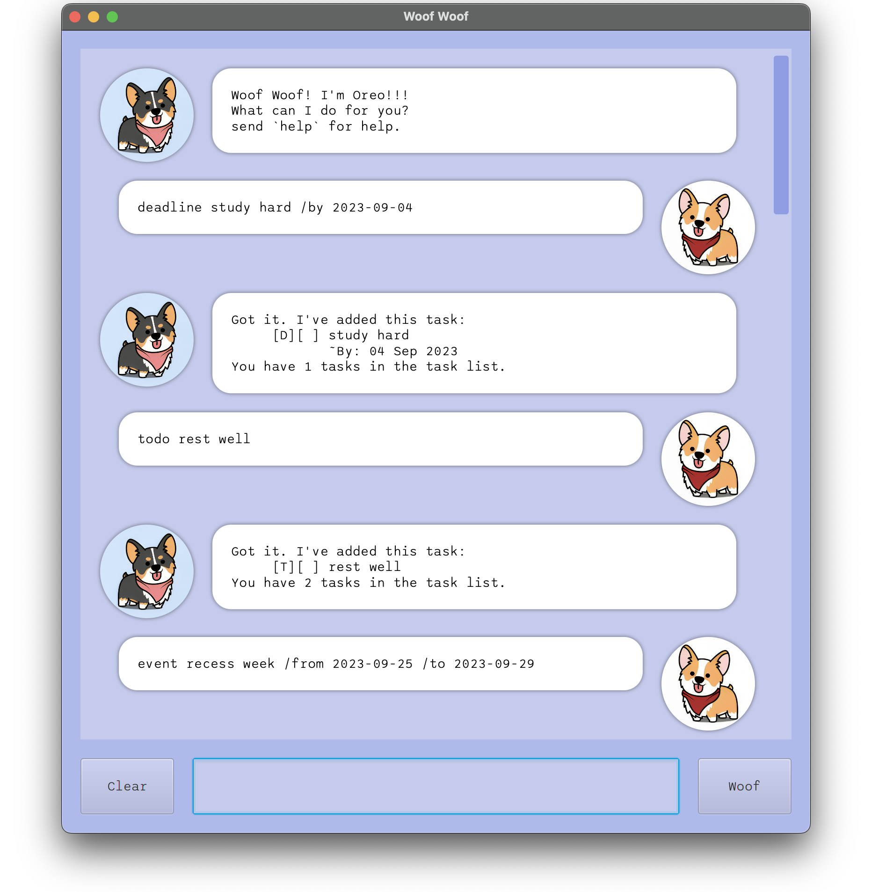
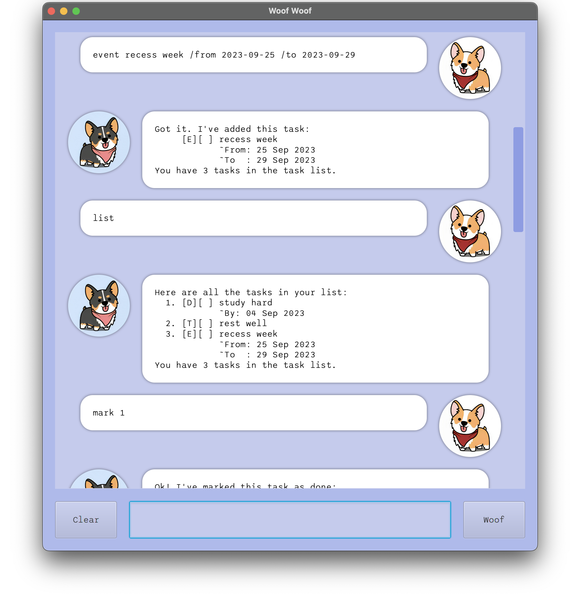
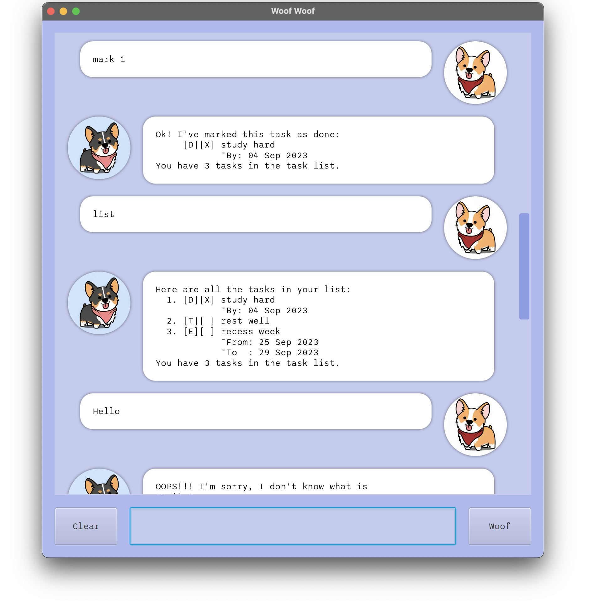
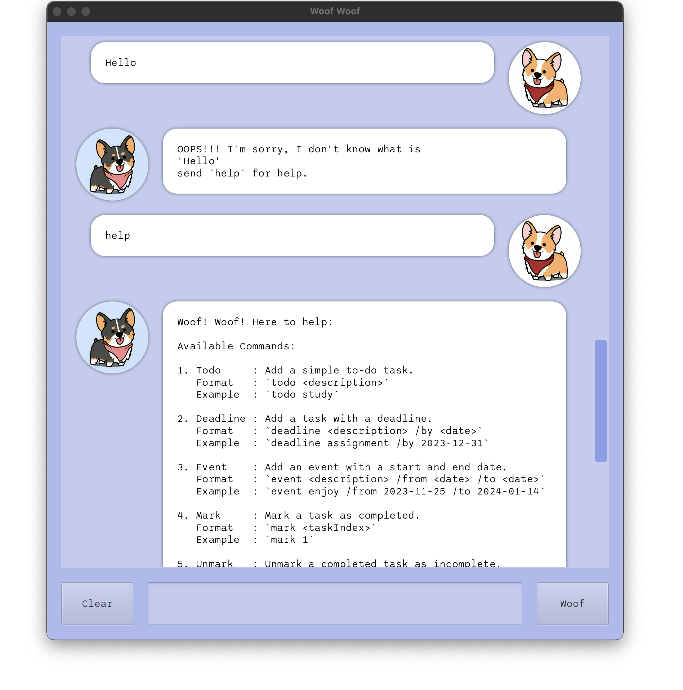

# Woof Woof Bot User Guide

Welcome to WoofWoof Bot, your personal task manager! This bot can help you keep track of your to-do tasks, deadlines, events, and more.






## Table of Contents
- [Purpose of the User Guide](#purpose-of-the-user-guide)
- [Getting Started](#getting-started)
   - [Installation Option 1](#installation-option-1)
   - [Installation Option 2](#installation-option-2)
- [Quick Start Commands](#quick-start-commands)
   - [Todo](#1-todo)
   - [Deadline](#2-deadline)
   - [Event](#3-event)
   - [Mark](#4-mark)
   - [Unmark](#5-unmark)
   - [Delete](#6-delete)
   - [List](#7-list)
   - [Find](#8-find)
   - [Sort](#9-sort)
   - [Bye](#10-bye)
   - [Help](#11-help)
- [Notes](#notes)

## Purpose of the User Guide

This User Guide serves as your go-to resource for understanding and effectively using WoofWoof Bot. Whether you're new to the bot or just need a quick refresher, you'll find everything you need right here.

## Getting Started

Before you dive into the nitty-gritty of task management, it's essential to set up WoofWoof Bot correctly. You have two installation options to choose from:

### Installation Option 1

1. **Go to** tjingsheng ip [releases](https://github.com/tjingsheng/ip/releases)
2. **Get Java**: Ensure you have a functioning version of Java.
3. **Copy the JAR File**: Copy the JAR file you want to run into an empty folder.
4. **Open a Command Window**: Open a command prompt (Windows) or terminal (macOS/Linux) in the same folder where you copied the JAR file.
5. **Run the Command**: Use the following command to run the JAR file:\
    Run the GUI version: ```java -jar woofwoof```\
    Run the CLI version: ```java -jar woofwoof cli```
6. **Enjoy**: WoofWoof is very fun.

### Installation Option 2

1. Clone the tjingsheng ip [repository](https://github.com/tjingsheng/ip) to your local machine.
2. Open the project in your preferred Java development environment.
3. Go to the target main directory:\
   GUI version: ```\main\java\WoofWoof\Launcher```\
   CLI version: ```\main\java\Woof```
5. Run the main class
4. Enjoy

## Quick Start Commands

### 1. Todo
Add a simple to-do task.
>Format: `todo <description>`\
>Example: `todo study`

Expected Output:
```
Got it. I've added this task:
     [T][ ] study
You have 1 tasks in the task list.
```

### 2. Deadline
Add a task with a deadline.
>Format: `deadline <description> /by <date>`\
>Example: `deadline assignment /by 2023-12-31`

Expected Output:
```
Doggo: 
Got it. I've added this task:
     [D][ ] assignment
            ~By: 31 Dec 2023
You have 2 tasks in the task list.
```

### 3. Event
Add an event with a start and end date.
>Format: `event <description> /from <date> /to <date>`\
>Example: `event enjoy /from 2023-11-25 /to 2024-01-14`

Expected Output:
```
Got it. I've added this task:
     [E][ ] enjoy
            ~From: 25 Nov 2023
            ~To  : 14 Jan 2024
You have 3 tasks in the task list.
```

### 4. Mark
Mark a task as completed.
>Format: `mark <taskIndex>`\
>Example: `mark 2`

Expected Output:
```
Ok! I've marked this task as done:
     [D][X] assignment
            ~By: 31 Dec 2023
You have 3 tasks in the task list.
```


### 5. Unmark
Unmark a completed task as incomplete.
>Format: `unmark <taskIndex>`\
>Example: `unmark 2`

Expected Output:
```
Ok! I've marked this task as undone:
     [D][ ] assignment
            ~By: 31 Dec 2023
You have 3 tasks in the task list.
```

### 6. Delete
Delete a task.
>Format: `delete <taskIndex>`\
>Example: `delete 2`

Expected Output:
```
Ok! I've deleted this task:
     [D][ ] assignment
            ~By: 31 Dec 2023
You have 1 tasks in the task list.
```

### 7. List
View all your tasks.
>Format: `list`
>Example: `list`

Expected Output:
```
Here are all the tasks in your list:
  1. [T][ ] study
  2. [E][ ] enjoy
            ~From: 25 Nov 2023
            ~To  : 14 Jan 2024
You have 2 tasks in the task list.
```

### 8. Find
Search for tasks containing n keywords.
>Format: `find <keyword1> ... <keyword n>`\
>Example: `find study`

Expected Output:
```
Here are your matching tasks in your list:
  1. [T][ ] study
You have 2 tasks in the task list.
```

### 9. Sort
Sort tasks by date and time.
>Format: `sort`
>Example: `sort`

Expected Output
```
Your tasks have been sorted:
  1. [E][ ] enjoy
            ~From: 25 Nov 2023
            ~To  : 14 Jan 2024
  2. [T][ ] study
You have 2 tasks in the task list.
```

### 10. Bye
Say goodbye to WoofWoof Bot.
>Format: `bye`
>Example: `bye`

Expected Output
```
Bye. Hope to see you again soon!
Offing myself... woof :(
```

### 11. Help
Request help on how to use the bot.
>Format: `help`
>Example: `help`

Expected Output
```
Woof! Woof! Here to help:

Available Commands:

1. Todo     : Add a simple to-do task.
   Format   : `todo <description>`
   Example  : `todo study`

2. Deadline : Add a task with a deadline.
   Format   : `deadline <description> /by <date>`
   Example  : `deadline assignment /by 2023-12-31`

3. Event    : Add an event with a start and end date.
   Format   : `event <description> /from <date> /to <date>`
   Example  : `event enjoy /from 2023-11-25 /to 2024-01-14`

4. Mark     : Mark a task as completed.
   Format   : `mark <taskIndex>`
   Example  : `mark 1`

5. Unmark   : Unmark a completed task as incomplete.
   Format   : `unmark <taskIndex>`
   Example  : `unmark 1`

6. Delete   : Delete a task.
   Format   : `delete <taskIndex>`
   Example  : `delete 2`

7. List     : View all your tasks.
   Format   : `list`

8. Find     : Search for tasks containing n keywords.
   Format   : `find <keyword1> ... <keyword n>`
   Example  : `find meeting project`

9. Sort     : Sort tasks by date and time.
   Format   : `sort`

10. Bye     : Say goodbye to WoofWoof Bot.
    Format : `bye`

11. Help    : Request help on how to use the bot.
    Format : `help`

Notes:
- Replace `<description>` with a task description.
- `<date>` should follow the yyyy-mm-dd date format.
           e.g. 2023-12-31
- `<taskIndex>` should be the index of the task in the list
                you want to manage.

Feel free to ask for help using the `help` command if you
have any questions or encounter issues.
Woof Woof is here to make your life easier!
```

### Notes
- Replace `<description>` with a brief task description.
- `<date>` should follow the yyyy-mm-dd date format (e.g., 2023-12-31).
- `<taskIndex>` is the index of the task in the list you want to manage.

That's it! You're now ready to start using WoofWoof Bot to stay organised and manage your tasks efficiently.

