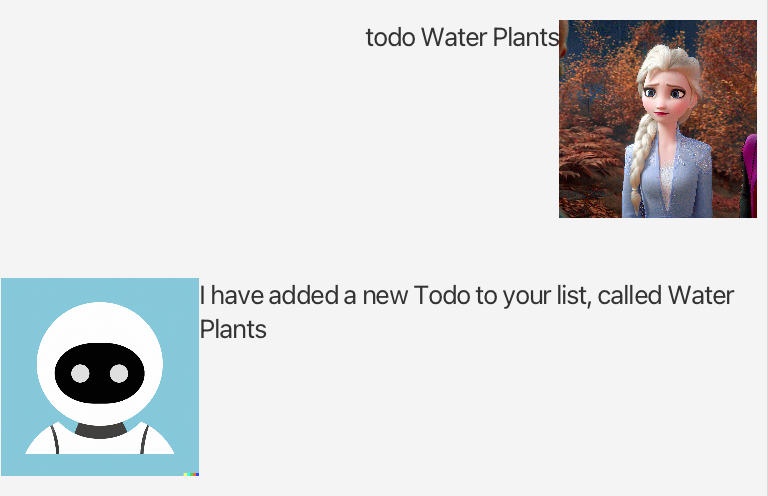
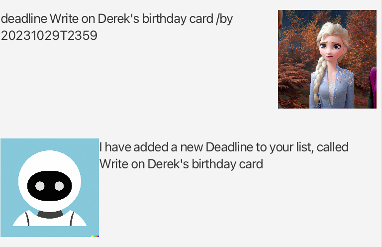
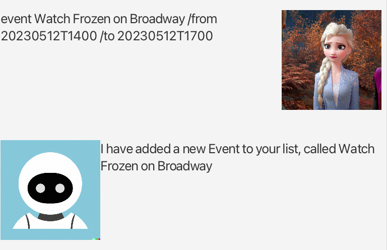
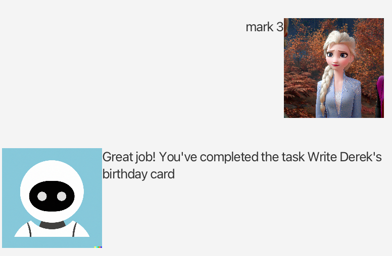
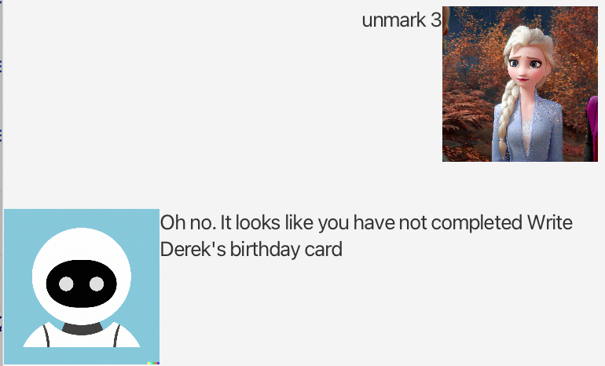
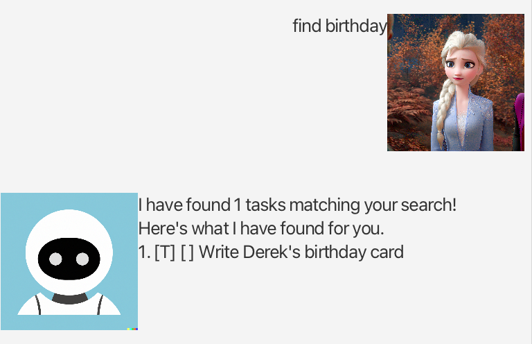
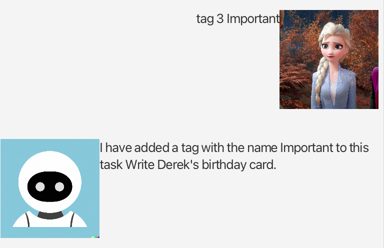
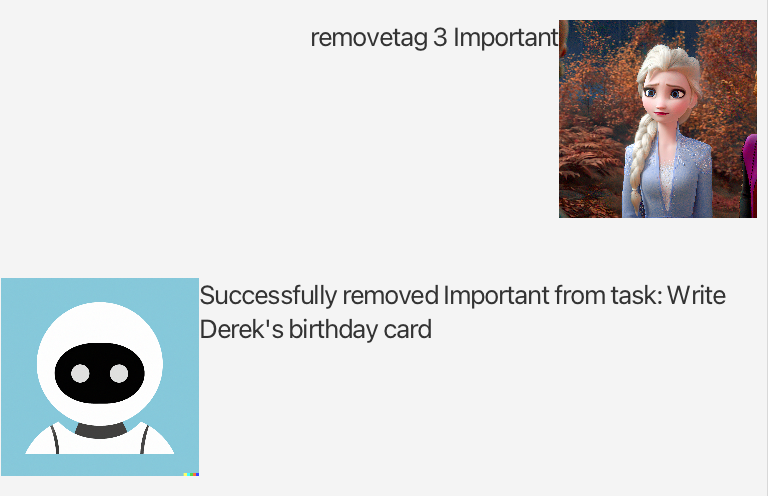
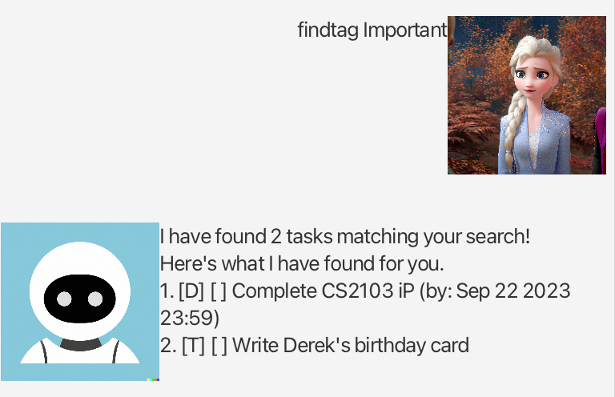

# User Guide for MattBot


## Features
### Adding Todos, Deadlines and Events
MattBot is able to add Todos, Deadlines and Events to your calendar.
MattBot is also able to delete tasks.
### Marking and Unmarking
MattBot is able to keep track of which tasks are done and not done.
### Listing
MattBot can list all your tasks for you.
### Finding
MattBot can find a specific task matching a keyword!
### Tags
MattBot can tag your tasks, untag them, and find tasks matching your tags!
### Storage
MattBot remembers your tasks even after closing and re-opening it!
Bonus: All tasks are saved onto a human-readable flat file, ensuring your tasks never get lost.


## Usage 
### Adding a Todo, Deadline or Event

Easily add tasks to your calendar by using the following commands!
#### Todo
A Todo is a type of Task that has no due date.
Creating a Todo:
```
todo [Task Name]
```
Example:
```
todo Water Plants
```
Outcome:



Confirmation of Todo creation.
#### Deadline
A Deadline is an item with a singular due date.
Creating a Deadline:
```
deadline [Task Name] /by [Due Date, in YYYYMMDDTHHMM] 
```
Example:
```
deadline Write on Derek's birthday card /by 20231029T2359
```
Outcome:



Confirmation of Deadline creation.

#### Event
An Event is a Task with a start date and an end date.
Creating a Deadline:
```
event [Event Name] /from [Start Date, in YYYYMMDDTHHMM] /to [End Date, in YYYYMMDDTHHMM]
```
Example:
```
event Watch Frozen on Broadway /from 20230512T1400 /to 20230512T1700
```
Outcome:



Confirmation of Event creation.

### Listing
Used to show all your tasks.
```
list
```
Outcome:


List of your current tasks.

### Marking and Unmarking Tasks
Tasks can be marked as done, as well as unmarked (undone!).
#### Mark
First use list to find out which task you are attempting to mark, then use `mark` to mark it as done!
```
mark [Task Index]
```
Example:
```
mark 3
```
Outcome:



Confirmation of marking.

#### Unmark
First use list to find out which task you are attempting to unmark, then use `unmark` to mark it as done!
```
unmark [Task Index]
```
Example:
```
unmark 3
```
Outcome:



Confirmation of unmarking.

### Finding a Task
Finding a task has never been simpler. `find` is able to locate a keyword in any part of the task.
```
find [keyword]
```
Example:
```
find Birthday
```
Outcome:



List of events with "Birthday" inside them.

### Tagging
#### Tagging
Add a tag to a Task.
```
tag [Task index] [Tag Name]
```
Example:
```
tag 3 Important
```
Outcome:



Confirmation of tag.

#### Untagging
Removes a tag from a Task.
```
removetag [Task index] [Tag Name]
```
Example:
```
tag 3 Important
```
Outcome:



Confirmation of tag removal.

#### Finding Tags
Finds Tasks with the tag.
```
findtag [Tag Name]
```
Example:
```
findtag Important
```
Outcome:



Tasks with found tag.
