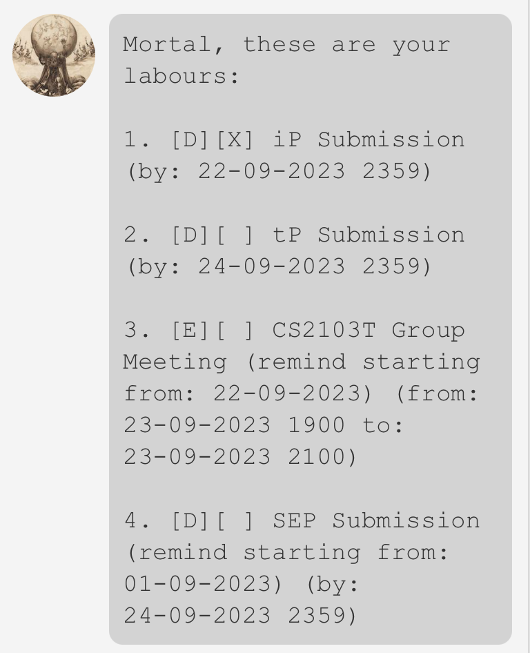
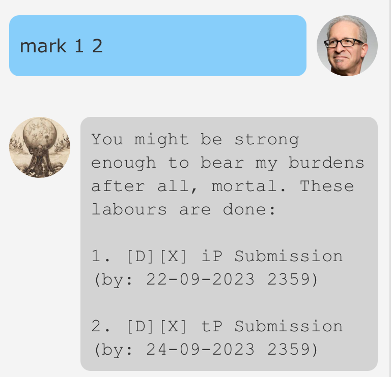
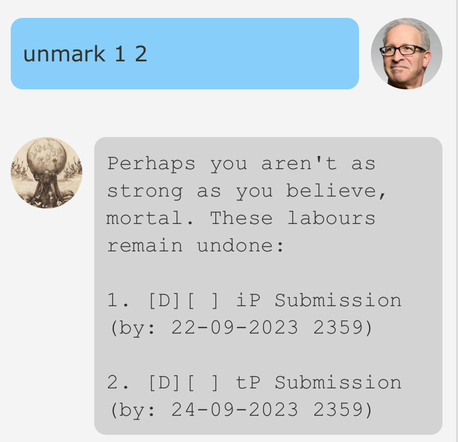
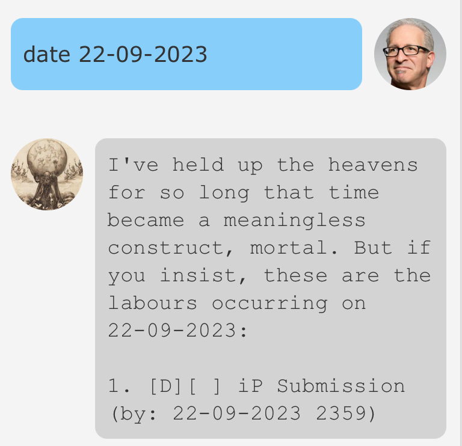
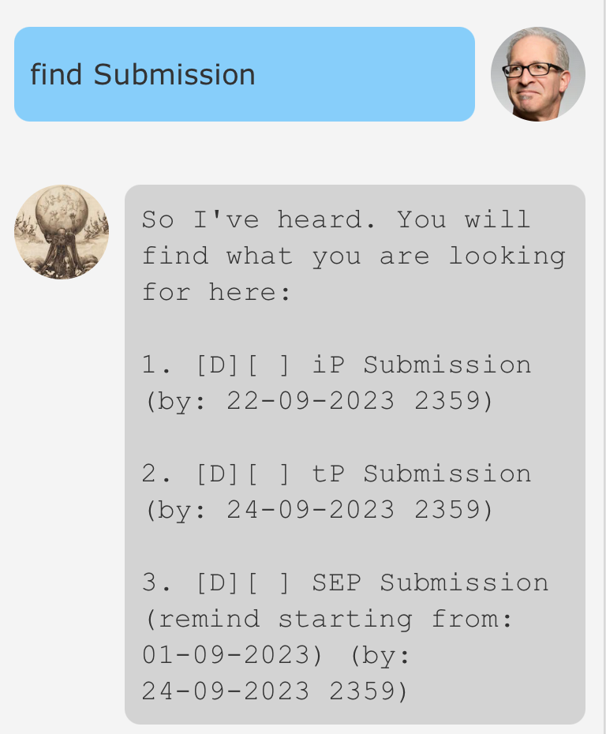
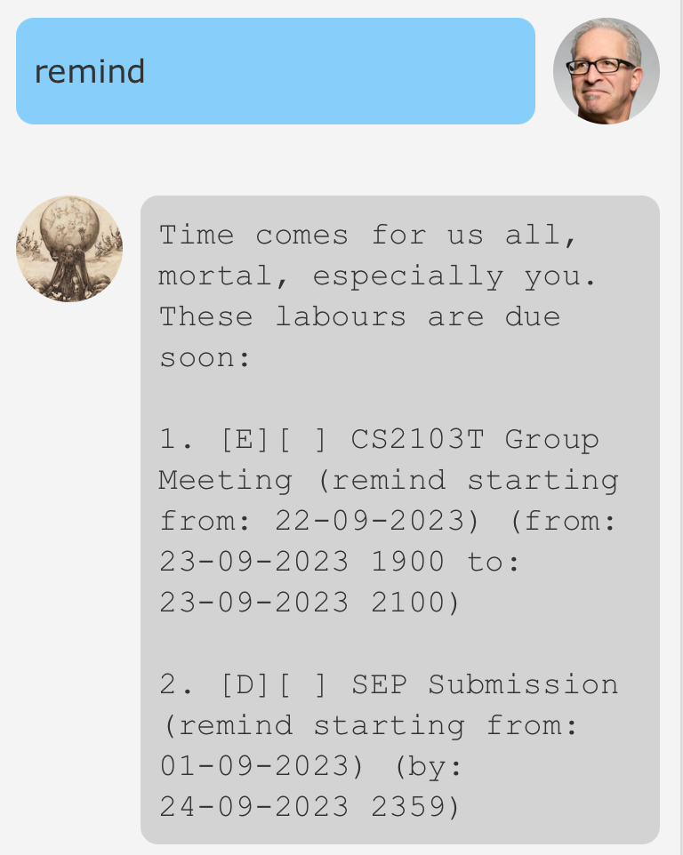

# Atlas User Guide

Atlas is a **desktop app for managing tasks, optimised for use via a 
Command Line Interface (CLI)** while retaining the benefits of a
Graphical User Interface (GUI). If you can type fast, Atlas will
manage your task list much faster than traditional GUI apps.

## Features
- Add different types of tasks - Todos, Deadlines, and Events
- Displays the list of task by order of creation
- Set reminders for each task
- View the current list of reminders
- Mark tasks complete and incomplete
- Search tasks by name
- Search tasks that occur on a particular date
- Save and restore task list from file

## Usage 
> **Notes about the command format:**
> - Words in `UPPER_CASE` are parameters to be supplied by the user.
> e.g. in `todo NAME`, `NAME` is a parameter which can be used as 
> `todo iP Submission`
> - Items in square brackets are optional.
> e.g. `todo NAME [/remind REMINDER_START_DATE]` can be used as 
> `todo iP Submission` or `todo iP Submission /remind 22-09-2023 2359`
> - Items with `...` after them can be used multiple times including zero
> times.
> e.g. `[INDEX]...` can be used as ` ` (i.e. 0 times), `1`, `1 2`, etc.
> - Dates are specified in `DD-MM-YYYY` format, while datetimes are
> specified in `DD-MM-YYYY HHmm` (24-hour format)

### Adding a To-Do: `todo`

Adds a To-Do item to the list. To-do items are the most basic kind of tasks,
with no dates associated with it under than an optional reminder start date. 

#### Format 
`todo NAME [/remind REMINDER_START_DATE]`
- `NAME` must be a non-empty string, as tasks must be named
- `REMINDER_START_DATE` must be in `DD-MM-YYYY` format, and represents the
date starting from which you will be reminded about this task

#### Examples
- `todo iP A-BetterGUI`
- `todo iP A-BetterGUI /remind 15-09-2023`

### Adding a Deadline: `deadline`

Adds a Deadline item to the list. Deadlines contain an end datetime (the deadline), as
well as an optional reminder start date.

#### Format
`deadline NAME /by DEADLINE_DATETIME [/remind REMINDER_START_DATE]`
- `NAME` must be a non-empty string, as tasks must be named
- `DEADLINE_DATETIME` must be in `DD-MM-YYYY HHmm` format
- `REMINDER_START_DATE` must be in `DD-MM-YYYY` format, and represents the
  date starting from which you will be reminded about this task
- `REMINDER_START_DATE` must be before `DEADLINE_DATETIME` chronologically e.g.
it cannot be the day after the deadline

#### Examples
- `deadline iP Submission /by 22-09-2023 2359`
- `deadline iP Submission /by 22-09-2023 2359 /remind 15-09-2023`

### Adding an Event: `event`

Adds an Event item to the list. Deadlines contain an start datetime and an end 
datetime, as well as an optional reminder start date.

#### Format 
`event NAME /from START_DATETIME /to END_DATETIME [/remind REMINDER_START_DATE]`
- `NAME` must be a non-empty string, as tasks must be named
- `START_DATETIME` and `END_DATETIME` must be in `DD-MM-YYYY HHmm` format
- `START_DATETIME` must be before `END_DATETIME` chronologically
- `REMINDER_START_DATE`, if provided, must be before `END_DATETIME` chronologically
e.g. it cannot be the day after the end date
- `REMINDER_START_DATE` must be in `DD-MM-YYYY` format, and represents the
  date starting from which you will be reminded about this task

#### Examples
- `event CS2103T Lecture /from 22-09-2023 1600 /to 22-09-2023 1800`
- `event CS2103T Lecture /from 22-09-2023 1600 /to 22-09-2023 1800 /remind 15-09-2023`

### Displaying a list of tasks: `list`

Shows a list containing all tasks, completed or not. These tasks are arranged in ascending
order of creation.

#### Format 
`list`

#### Expected outcome
A list of all tasks is displayed

#### Example outcome

### Mark task as done: `mark`

Marks one or more tasks as completed, if they are currently not done.

#### Format 
`mark [TASK_INDEX]...`
- `TASK_INDEX` **must be a positive integer** corresponding to the index assigned to
  the task by the `list` command. For instance, using the image in the `list` section
  as reference, `mark 2` will mark the task "tP Submission" as complete
- If more than one `TASK_INDEX` is provided and some of them are out of range (i.e
  does not correspond to any task in the list), only the tasks corresponding to valid
  indices will be marked as done
- If a task is already marked as done, calling `mark` on it has no effect

#### Expected outcome 
A list of tasks that were marked done by the command will have an `X` next to 
it, indicating that it is done

#### Example outcome

### Mark task as not done: `unmark`

Marks one or more tasks as not completed, if they are currently marked as done.

#### Format
`unmark [TASK_INDEX]...`
- `TASK_INDEX` **must be a positive integer** corresponding to the index assigned to
  the task by the `list` command. For instance, using the image in the `list` section 
  as reference, `unmark 2` will mark the task "tP Submission" as incomplete
- If more than one `TASK_INDEX` is provided and some of them are out of range (i.e
  does not correspond to any task in the list), only the tasks corresponding to valid
  indices will be marked as incomplete
- If a task is already marked as incomplete, calling `unmark` on it has no effect

#### Expected outcome
A list of tasks that were marked not done by the command will have a `[ ]` next to
it, indicating that it is not done

#### Example outcome

### Delete a task: `delete`

Deletes a task from the task list.

#### Format
`delete TASK_INDEX`
- `TASK_INDEX` **must be a positive integer** corresponding to the index assigned to
  the task by the `list` command. For instance, using the image in the `list` section
  as reference, `delete 2` will delete the task "tP Submission"
- If the `TASK_INDEX` is not valid i.e. it does not refer to a task in the task list,
  an error is returned

#### Examples
- `delete 1`
- `delete 2`

### Find all tasks occurring on a particular date: `date`

Shows a list containing all Deadlines and Events occurring on a particular date.

#### Format
`date DATE_QUERY`
- `DATE_QUERY` must be in `DD-MM-YYYY` format, and refers to the date we would like
to query for

#### Examples
- `date 22-09-2023`
- `date 01-01-2024`

#### Expected outcome
A list of deadlines and events that are taking place on the queried date - deadlines
that are due on that day and events for which the queried date lies between the event's
start and end times

#### Example outcome

### Find all tasks containing a search phrase: `find`

Shows a list containing all tasks whose names contain the search phrase (case-sensitive)

#### Format
`find SEARCH_QUERY`
- `SEARCH_QUERY` is case-sensitive
- If the query string is empty i.e. `find` is followed by a space, it will match all 
tasks in the list 

#### Examples
- `find Submission`
- `find HW`

#### Expected outcome
A list of tasks that match the case-sensitive search query

#### Example outcome

### Get list of all current reminders: `remind`

Shows a list containing all tasks that are
1. Incomplete
2. Has reminders set
3. The reminder start day is either today or has already passed

#### Format
`remind`

#### Expected outcome
A list of incomplete tasks with active reminders

#### Example outcome

### Get help: `help`

Shows a list of all commands available

#### Format
`help`

## References
Atlas Profile Picture - https://commons.wikimedia.org/wiki/File:Andr%C3%B3meda3.JPG
