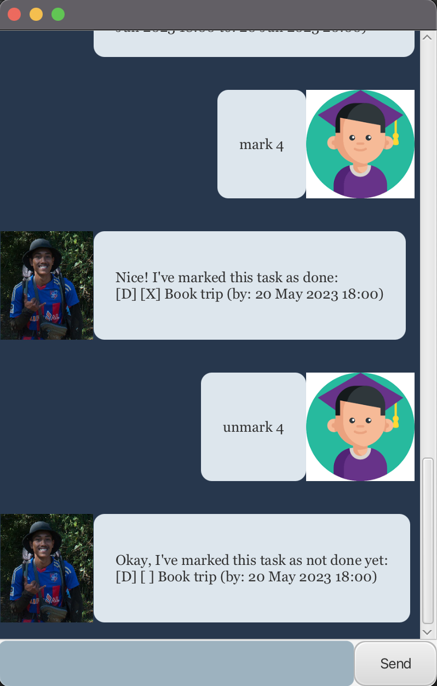

# Dog User Guide

Dog is a GUI task manager with support for unix-like syntax commands.

## Features

### Keep track of your tasks!

Add todos, events, and deadlines with support for date input!

### Mark your tasks as done

Mark each task as done to keep track of your undone tasks.

### Search through your task list

Using the find command, you will be able to quickly find all the tasks with content
that match your search keyword.

### Tag your tasks

Using the tag command, you can tag your tasks, allowing your to categorize your tasks easily.

## Usage

### `todo` - Adds a todo to your task list

A new todo with the specified content will be added to your tasks list.

**Usage:**

`todo <task-name>`

**Parameters:**

`task-name`: The content of the task to be added.

**Expected outcome:**

```
Got it. I've added this task:
[T][] <task-name>
Now you have 1 task in the list.
```


<br />

### `deadline` - Adds a deadline with date to your task list

A new deadline with the specified content and date will be added to your tasks list.

**Usage:**

`deadline <task-name> /by <date>`

**Parameters:**

`task-name`: The content of the task to be added.

`date`: The deadline in `yyyy-MM-dd HHmm` format

**Expected outcome:**

```
Got it. I've added this task:
[D][] <task-name> (by: <formatted-date>)
Now you have 1 task in the list.
```
`formatted-date`: The deadline in `MMM dd yyyy hh:mm am/pm` format


<br />

### `event` - Adds an event with date to your task list

A new event with the specified content and date will be added to your tasks list.

**Usage:**

`event <task-name> /from <date> /to <date>`

**Parameters:**

`task-name`: The content of the task to be added.

`date`: The date of event in `yyyy-MM-dd HHmm` format

**Expected outcome:**

```
Got it. I've added this task:
[E][] <task-name> (from: <formatted-date> to <formatted-date>)
Now you have 1 task in the list.
```
`formatted-date`: The deadline in `MMM dd yyyy hh:mm am/pm` format


<br />

### `list` - List out all tasks in the list

Displays the full list of all tasks in the list.

**Usage:**

`list`

**Expected outcome:**

```
Here are the tasks in your list:
    1. [T][] Read book
    2. [D][] Return book (by: Dec 22 2022 05:30pm)
```


<br />

### `mark` - Mark task as done

The specified task will be marked as completed

**Usage:**

`mark <task-index>`

**Parameters:**

`task-index`: The index of the task to be marked.

**Expected sample outcome:**

```
Nice! I've marked this task as done:
[D][X] Return book (by: Dec 22 2022 05:30pm)
```


<br />

### `unmark` - Unmark task as uncompleted

The specified task will be marked as not completed

**Usage:**

`unmark <task-index>`

**Parameters:**

`task-index`: The index of the task to be unmarked.

**Expected sample outcome:**

```
OK, I've unmarked this task as not done yet:
[D][] Return book (by: Dec 22 2022 05:30pm)
```



<br />

### `delete` - Delete task

The specified task will be deleted

**Usage:**

`delete <task-index>`

**Parameters:**

`task-index`: The index of the task to be deleted

**Expected sample outcome:**

```
Noted. I've removed this task:
[T][] Read book
Now you have 1 task in the list.
```


<br />

### `find` - Find task

Tasks with the specified keyword will be displayed.

**Usage:**

`find <keywords>`

**Parameters:**

`keywords`: The keywords of the tasks to be found

**Expected sample outcome:**

```
Here are the matching tasks in your list:
    1. [T][] Read book
    2. [D][] Return book (by: Dec 22 2022 05:30pm)
```


<br />

### `bye` - Exits the `Dog` Program

Terminates the program

**Usage:**

`bye`

**Expected outcome:**

```
Bye. Hope to see you again soon! 🔙🔛🔝
```
The program will terminate after 500ms.
