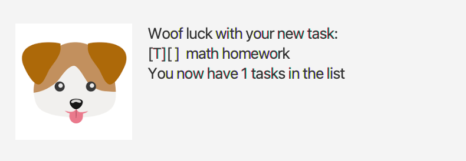
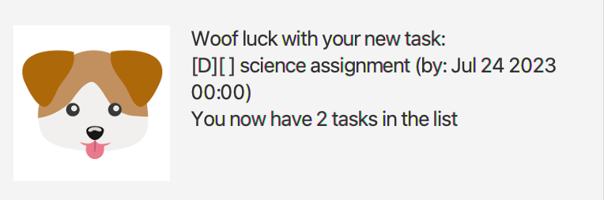
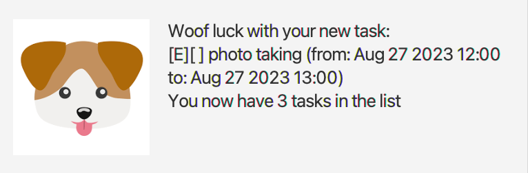
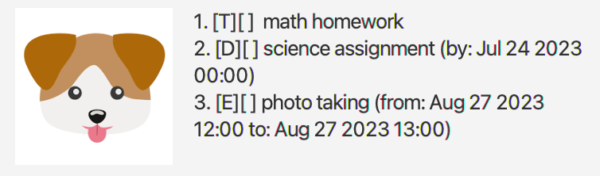
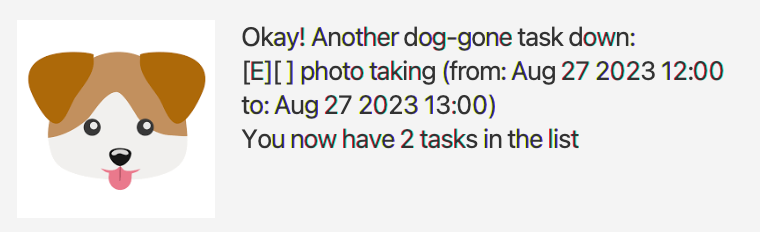
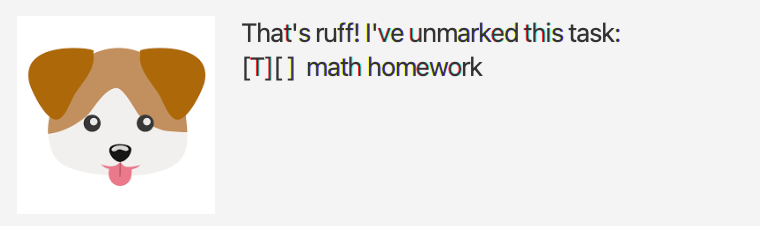
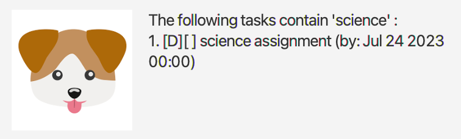
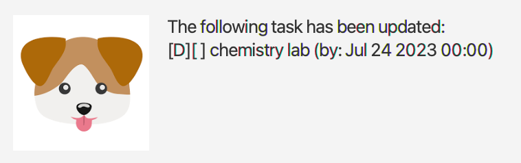
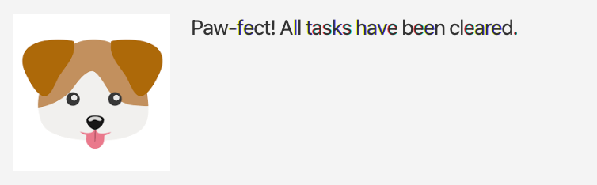
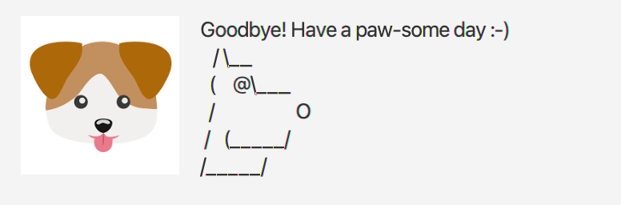

# Barkley 🐶 User Guide
The Barkley 🐶 chatbot helps you manage you tasks, deadlines and events efficiently.

## Getting started

1. Ensure you have Java 11 or above installed in your computer.

2. Download the jar file from [here](https://github.com/nabonitasen/ip/releases).

3. Run the jar file using the `java -jar duke.jar` command.

## Features

### `todo` - Adds a new To Do task.

Format: `todo <TASK_DESCRIPTION>`

Example of usage: 
`todo math homework`

### `deadline` - Adds a new Deadline task.

Format: `deadline <TASK_DESCRIPTION> /by <DEADLINE_DATE>`
* `DEADLINE_DATE` should be in dd-mm-yy hh:mm format.

Example of usage:
`deadline science assignment /by 24-07-2023 00:00`

### `event` - Adds a new Event task.

Format: `event <TASK_DESCRIPTION> /from <EVENT_FROM_DATE> /to <EVENT_TO_DATE>`
* `EVENT_FROM_DATE`  and `EVENT_TO_DATE` should be in dd-mm-yy hh:mm format.

Example of usage:
`event photo taking /from 27-08-2023 12:00 /to 27-08-2023 13:00`

### `list` - Lists all tasks.

Format: `list`

Example of usage:
`list`

### `delete` - Deletes a given task.

Format: `dalate <TASK_INDEX>`

Example of usage:
`delete 3`

### `mark` - Marks a given task.

Format: `mark <TASK_INDEX>`

Example of usage:
`mark 1`

### `unmark` - Unmarks a given task.

Format: `unmark <TASK_INDEX>`

Example of usage:
`unmark 1`

### `find` - Finds all tasks with description matching a given keyword.

Format: `find <KEYWORD>`

Example of usage:
`find science`

### `update` - Updates a given task.

Format: `update <TASK_INDEX> /<FIELD_TO_UPDATE> is <UPDATE>`
* `FIELD_TO_UPDATE` can be "description" for all 3 types of tasks OR "by" for deadline OR "from" or "to" for event.
* `UPDATE` should be in dd-mm-yy hh:mm format if field is "by", "from" or "to".

Example of usage:
`update 2 /description is chemistry lab`

### `clear` - Deletes all existing tasks.

Format: `clear`

Example of usage:
`clear`

### `bye` - Exits application.

Format: `bye`

Example of usage:
`bye`

## Saving data
Application automatically saves all data on a file called duke.txt in the hard disk of your computer.