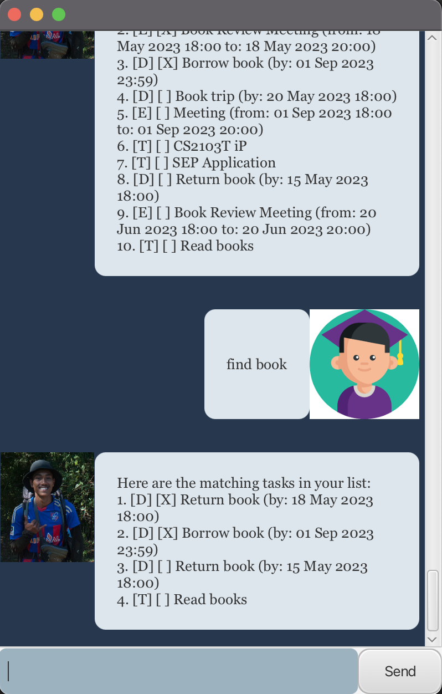

# chatBob User Guide
chatBob is a desktop application for managing your tasks. While it has a GUI, most of the user interactions happen using
a CLI (Command Line Interface.)

## Quick Start

1. Ensure you have Java `11` or above installed in your computer.
2. Download the latest `duke.jar` from [here](https://github.com/rayyan35p/ip/releases).
3. Copy the file to the folder you want to use as the home folder for your application.
4. Open a command terminal, `cd` into the folder you put the jar file in, and use    
   `java -jar duke.jar`     
   command to run the application.    
   A GUI similar to the one below should appear in a few seconds.    
   
5. 
## Features 

> Important Notes
> + Words in `UPPER_CASE` are the parameters to be supplied by user  
    > e.g. in `deadline NAME /by DATE TIME`, `NAME`, `DATE` and `TIME` are parameters which can be used as
    >`deadline submit homework /by 30/09/2023 2359`
> + Parameters must be in the order specified, or the command will not work.
> + All commands must be keyed in exactly as specified with no extra parameters.

### Adding a task to do: 'todo'

Adds a task to do to your list.

Format: 'todo DESCRIPTION'
+ 'DESCRIPTION' is the description of the task.

### Adding a task with a deadline: 'deadline'

Adds a task that has a deadline to your list.

Format: 'deadline DESCRIPTION /by DATE TIME'
+ 'DESCRIPTION' is the description of the task.
+ 'DATE' is the date of the deadline. It is in the format 'dd/MM/yyyy'.
+ 'TIME' is the time of the deadline. It is in the format 'HH mm'.

### Adding a task to do: 'event'

Adds an event that has a start and end date time to do to your list.

Format: 'event DESCRIPTION /from STARTDATE STARTTIME /to ENDDATE ENDTIME'
+ 'DESCRIPTION' is the description of the task.
+ 'STARTDATE' is the starting date of the event. It is in the format 'dd/MM/yyyy'.
+ 'STARTTIME' is the starting time of the event. It is in the format 'HH mm'.
+ 'ENDDATE' is the ending date of the event. It is in the format 'dd/MM/yyyy'.
+ 'ENDTIME' is the ending time of the event. It is in the format 'dd/MM/yyyy'.

### Listing all tasks: list

Shows a list of all tasks stored by Bob.

Format: `list`

### Mark a task as done: 'mark'

Set a task in the list as done.

Format: 'mark TASKNUMBER'
+ 'TASKNUMBER' is the index of the task in the list that you want to mark as done.

### Mark a task as not done: 'unmark'

Set a task in the list as not done.

Format: 'unmark TASKNUMBER'
+ 'TASKNUMBER' is the index of the task in the list that you want to mark as not done.

### Delete a task: 'delete'

Remove a task from the list.

Format: 'delete TASKNUMBER'
+ 'TASKNUMBER' is the index of the task in the list that you want to remove.

### Find a task: 'find'

Find tasks that contain a given description.

Format: 'find STRINGTOFIND'
+ 'STRINGTOFIND' is a string of words that should be contained in the description of tasks that you are looking for.

Examples:
+ 'find buy' returns tasks containing 'buy' in their descriptions.
  

### Update a task: 'update'

Update a given task in the list with new details. By using update, you do not need to delete tasks to change them.

Format: 'update TASKNUMBER NEWTASK'
+ 'TASKNUMBER' is the index of the task in the list that you want to update.
+ 'NEWTASK' is a command that you would use to create a task with the newer details.

Examples:
+ 'update 2 todo do final papers' updates the second task in the list to become a new task with the specified details.

### Tell you that you can fix it: 'canWeFixIt()'

If you need some motivation to do your tasks, just ask Bob 'canWeFixIt' because he will always return 'true'.

### Exiting the program: 'bye'

Exits the program.

### Saving to a local file

Bob instantaneously saves all your tasks in a file in data/duke.txt everytime a command is entered, so you don't 
have to worry about losing all the tasks you just added!

### Acknowledgements

README inspired by [aslam341](https://github.com/aslam341/ip/tree/master/docs)
