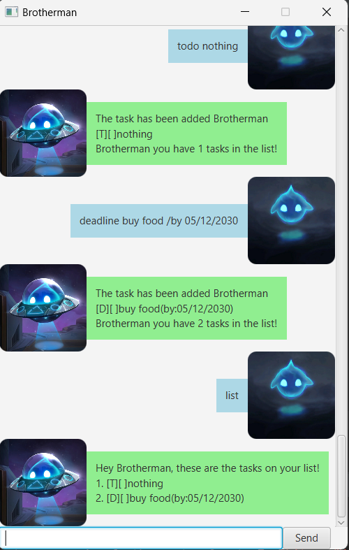

# Duke User Guide
Duke is a task management application designed to help users organize and keep track of their tasks, to-do items, events, and deadlines.
It provides features for adding, deleting, listing, marking tasks as complete or incomplete, and finding tasks based on keywords. 
Duke simplifies task management, making it easier to stay organized and on top of your responsibilities.
## Features 

### Sexy GUI
Duke has a gorgeous GUI for you to use


### Add Tasks

The "Add Tasks" feature allows you to add new tasks to your task list in Duke. 
You can use this feature to keep track of various tasks, such as to-do items, events, or deadlines.

* **To-do** are tasks without start or deadlines
* **Deadlines** are tasks with a deadline
* **Events** are tasks with both a start and deadline

### Delete Tasks

The "Delete Tasks" feature enables you to remove tasks from your task list in Duke. 
This is useful when you want to clean up your list or if you've completed a task and want to remove it.

### List Tasks

The "List Tasks" feature provides you with a way to view all the tasks currently in your Duke task list. 
This feature helps you get an overview of all your tasks at once.

### Mark tasks as complete

With the "Mark tasks as complete" feature, you can indicate that a specific task on your list has been completed. 
This feature is handy for keeping track of your progress and ensuring that you don't miss any completed tasks.

### Mark tasks as incomplete

The "Mark tasks as incomplete" feature allows you to change the status of a previously marked completed task back to incomplete. 
This is useful if you accidentally marked a task as complete or if you need to revisit a task.

### Find Tasks

The "Find Tasks" feature helps you search for specific tasks in your Duke task list. 
You can use keywords to filter and locate tasks that match your search criteria.

## Usage

### todo - Add a to-do task

To add a to-do task, use the following command:

`todo <task_description>`

Expected outcome:

Duke will acknowledge the addition of the to-do task and display the updated task list.

```
Got it. I've added this task:
[T][ ] <task_description>
Now you have X tasks in the list.
```

### deadline - Add a deadline task

To add a deadline task, use the following command:

`deadline <task_description> /by <deadline_date>`

`deadline_date` should be formatted `YYYY-MM-DD HH:MM`

Expected outcome:

Duke will acknowledge the addition of the deadline task and display the updated task list.

```
Got it. I've added this task:
[D][ ] <task_description> (by: <deadline_date>)
Now you have X tasks in the list.
```

### event - Add an event task

To add an event task, use the following command:

`event <task_description> /by <start_date> /to <end_date>`
`start_date` should be formatted `YYYY-MM-DD HH:MM`
`end_date` should be formatted `YYYY-MM-DD HH:MM`

Expected outcome:

Duke will acknowledge the addition of the event task and display the updated task list.

```
Got it. I've added this task:
[E][ ] <task_description> (from: <start_date> to: <end_date>)
Now you have X tasks in the list.
```

### delete - Delete a task

To delete a task, use the following command:

`delete <task_index>`

Expected outcome:

Duke will remove the specified task from the task list and display the updated list of tasks.

```
Noted. I've removed this task:
[T][ ] <task_description>
Now you have X tasks in the list.
```

### list - List all tasks

To list all tasks, simply enter:

`list`

Expected outcome:

Duke will display a numbered list of all the tasks in your task list.

```
Here are the tasks in your list:
1. [T][X] <task_description_1>
2. [D][ ] <task_description_2> (by: <deadline>)
```

### mark - Mark a task as complete

To mark a task as complete, use the following command:

`mark <task_index>`

Expected outcome:

Duke will mark the specified task as complete and display the updated task list.

```
Got it! I've marked this task as complete!
[T][X] <task_description>
```

### unmark - Mark a task as complete

To mark a task as incomplete, use the following command:

`unmark <task_index>`

Expected outcome:

Duke will mark the specified task as incomplete and display the updated task list.

```
Got it! I've marked this task as incomplete!
[T][ ] <task_description>
```

### find - Find tasks by keyword

To find tasks that contain a specific keyword, use the following command:

`find <keyword>`

Expected outcome:

Duke will display a list of tasks that match the specified keyword.

```
Here are the matching tasks in your list:
1. [T][ ] <task_description_1>
2. [D][X] <task_description_2> (by: <deadline>)
```