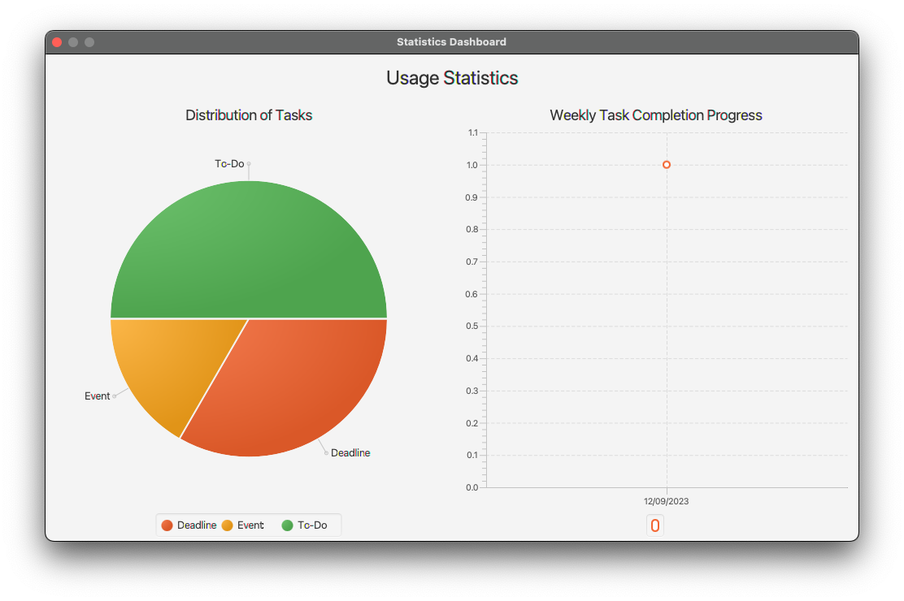

# User Guide

## Features

### Intuitive GUI

Cyrus comes with an intuitive and simple GUI, including a helpful getting started message and a statistics dashboard!

### Add events

Create events and when they start and end.

### Add deadlines

Create deadlines and when they are due.

### Add todos

Create todos to complete.

### Mark tasks

Mark tasks you have completed as done.

### Unmark tasks

Unmark tasks that you have accidentally marked as done.

### Delete tasks

Remove todos/deadlines/events from the task list.

### Save & load tasks on file

Cyrus automatically saves your tasks locally so that you have access the same task list even after closing Cyrus.

### Statistics dashboard

View the usage of Cyrus for task management by viewing the distribution of types of tasks (todo, deadline, and event) and
the number of tasks completed every day within a week.

## Usage

### `list` - List current tasks

Displays a list of tasks, loaded from disk (if any).

Example of usage:

`list`

Expected outcome:

### `todo` - Create a todo task

Creates a todo task and saves to disk.

Example of usage:

`todo <task name>`

Expected outcome:

### `deadline` - Create a deadline task

Creates a deadline task and saves to disk.

Example of usage:

`deadline <task name> /by {dd/MM/yyyy}`

Expected outcome:

### `event` - Create an event task

Creates an event task and saves to disk.

Example of usage:

`event <task name> /from {dd/MM/yyyy} /to {dd/MM/yyyy}`

Expected outcome:

### `mark` - Mark task as completed

Marks task as completed and saves to disk. If task was previously incomplete, updates completion date.

Example of usage:

`mark 1`

Expected outcome:

### `unmark` - Unmark completed task

Unmarks completed task and saves to disk.

Example of usage:

`unmark 6`

Expected outcome:

### `delete` - Deletes a task

Deletes a task and saves to disk.

Example of usage:

`delete 2`

Expected outcome:

### `find` - Finds tasks that contain given keyword

Finds tasks that contain the given word.

Example of usage:

`find do`

Expected outcome:

### `statistics` - Display statistics dashboard

Provide statistics dashboard to view Cyrus usage in terms of distribution of task by
type and weekly completion rate.

Example of usage:

`statistics`

Expected outcome:

