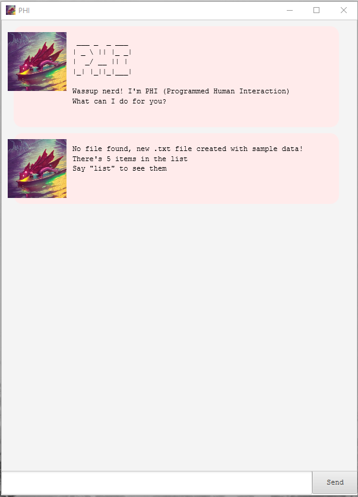

# User Guide
   ```java
   /* Welcome to
    ___ _  _ ___
   | _ \ || |_ _|
   |  _/ __ || | 
   |_| |_||_|___|
   PHI (Programmable Human Interface) */
```

PHI (short for Programmed Human Interaction is a **desktop to-do app**,
optimised for use via chatbot-like interface

- [Quick start](#quick-start)
- [Features](#features)
  - [Viewing task list: `list`](#viewing-task-list-list)
  - [Viewing in-app user guide: `help`](#viewing-in-app-user-guide-help)
  - [Creating a new task](#creating-a-new-task)
    - [Adding a To-do task: `todo`](#adding-a-to-do-task-todo)
    - [Adding a Deadline task: `deadline`](#adding-a-deadline-task-deadline)
    - [Adding an Event task: `event`](#adding-an-event-task-event)
  - [Mark / unmark tasks as complete: `mark` / `unmark`](#mark--unmark-tasks-as-complete-mark--unmark)
  - [Delete tasks: `delete`](#delete-tasks-delete)
  - [Search for tasks using keyword: `find`](#search-for-tasks-using-keyword-find)
  - [Exit the program: `bye`](#exit-the-program-bye)
- [Feature summary](#feature-summary)

## Quick Start
1. Ensure you have Java 8 or above installed in your Computer
   - To check, open your computer's terminal and enter `java-version`
   - If installed, the version number will be displayed 
2. Download the latest `phi.jar` from [here](https://github.com/phiphi-tan/ip/releases)
3. Copy the file to the folder you want to use as the *home folder* for your tasklist
4. Double-click on the .jar file to run it. A GUI similar to the below should appear in a few seconds.
   - If this is your first time running the program, the app will come preloaded with sample data
   - If not, the app will load previously the previously saved tasklist from the same directory
####Sample View  
   
5. Type the command in the command box and press Enter to execute it.  
    e.g. typing `list` and pressing Enter will display the list of all tasks  
    Some example commands you can try:
   - `list`: lists all currently stored tasks
   - `todo complete examples`: Adds a task titled `complete examples` to the task list
   - `mark 3`: Marks the 3rd task in the list as complete
   - `find coding`: Finds all tasks that have to keyword `coding` and displays them
   - `bye`: Exits the app
6. Refer to the Features list below for specific details/implementations of each command
   
   

## Features

> ! ___Notes about the command format:___  
> - Words in `UPPER_CASE` / `X` are the parameters to be supplied by the user  
>  - e.g. in `todo TASK_NAME`, `TASKNAME` is a parameter to be given by the user
>  - e.g. in `mark X`, `X` is the item number of the task that the user wishes to mark complete
> 
>- Items in square brackets are dates in DD-MM-YYYY format
>  - e.g. in `deadline TASK_NAME /by [deadline]`, entering `01-01-2001` will be stored as 1 Jan 2001
>  - any other dates that do not fit this format (e.g. `tomorrow`) will be stored as a String
>
> - Parameters need to be in a fixed order
>  - e.g. in `event TASK_NAME /from [start-date] /to [end-date]`, note how the `/from` flag must be before the `/to` flag

 
### Viewing task list: `list`
Format: `list`
- Shows the list of all current tasks in the tasklist

### Viewing in-app user guide: `help`
Format: `help`
- Shows a short in-app user guide to the available commands

### Creating a new task
#### Adding a To-do task: `todo`  
Format: `todo TASK_NAME`
- Creates a new task with `TASK_NAME` as its title

#### Adding a Deadline task: `deadline`
Format: `deadline TASK_NAME /by [deadline]`
- Creates a new deadline with `TASK_NAME` as its title and `[deadline]` as its due date
> *Reminder*: Dates can be stored as DD-MM-YYYY format or as plain text (String)  

#### Adding an Event task: `event` 
Format: `event TASK_NAME /from [start-date] /to [end-date]`
- Creates a new event with `TASK_NAME` as its title, and
`[start-date]` and `[end-date]` as its start and end date respectively
> *Reminder*: Dates can be stored as DD-MM-YYYY format or as plain text (String)


### Mark / unmark tasks as complete: `mark` / `unmark`
Format: `mark X` / `unmark X`  
- Marks / unmarks the corresponding task `X` in the tasklist as complete
- The index refers to the index number shown in the task list (`list` command)


### Delete tasks: `delete`
Format: `delete X`  
- Deletes the corresponding task `X` in the tasklist
- The index refers to the index number shown in the task list (`list` command)


### Search for tasks using keyword: `find`
Format: `find KEYWORD`
- Finds all matching entries in the task list that contain `KEYWORD` in their name


### Exit the program: `bye`
Format: `bye`  
- Exits the program


### Saving data
- PHI automatically saves all tasklist items after every command, so there is no need to save manually  
Saved items (if found) will be loaded up upon loading the program
> **!!! Caution**: If your changes to the data file makes its format invalid,
> PHI will discard all data and start with an empty data file at the next run.
> Hence, it is recommended to take a backup of the file before editing it.

##Feature Summary  
|Action|Format|
|---|---|
[Viewing task list: `list`](#viewing-task-list-list)|`list`
[Viewing in-app user guide: `help`](#viewing-in-app-user-guide-help)|`help`
[Adding a To-do task: `todo`](#adding-a-to-do-task-todo)|`todo TASK_NAME`
[Adding a Deadline task: `deadline`](#adding-a-deadline-task-deadline)|`deadline TASK_NAME /by [deadline]`
[Adding an Event task: `event`](#adding-an-event-task-event)|`event TASK_NAME /from [start-date] /to [end-date]`
[Mark / unmark tasks as complete: `mark` / `unmark`](#mark--unmark-tasks-as-complete-mark--unmark)|`mark X` / `unmark X`
[Delete tasks: `delete`](#delete-tasks-delete)|`delete X`
[Search for tasks using keyword: `find`](#search-for-tasks-using-keyword-find)|`find KEYWORD`
[Exit the program: `bye`](#exit-the-program-bye)|`bye` 
