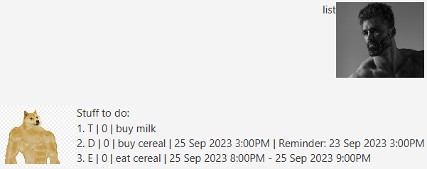
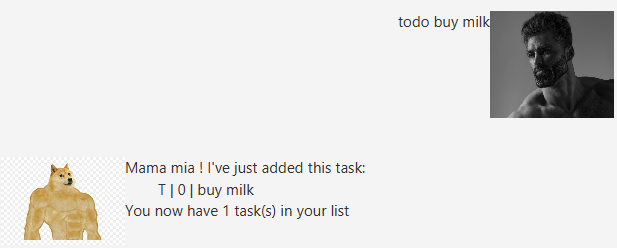
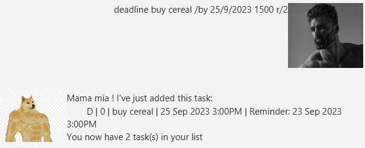

# DogeBot :dog2: - User Guide

## Features & Usage

### Listing all tasks: `list`

Shows a list of all the tasks added.

Format: `list`

Example:
- `list`

### Adding a todo task: `todo`

Adds a todo task.

Format: `todo <task description>`

Examples:
- `todo buy milk`
- `todo buy cereal`

Todo task successfully created

### Adding a deadline task: `deadline`

Adds a deadline task.

> [!NOTE]
> Parameters in square brackets are optional

Format: `deadline <task description> /by <deadline date and time> [r/numberOfDays]`
- `r/` sets the reminder `numberOfDays` days in advance
- `r/` is an optional parameter, it may be omitted if no reminders are required

Examples:
- `deadline buy cereal /by 25/9/2023 1500`
- `deadline buy milk /by 25/9/2023 1500 r/2`

Deadline task successfully created

### Adding an event task: `event`

Adds an event task.

> [!NOTE]
> Parameters in square brackets are optional

Format: `event <task description> /from <deadline date and time> /to <deadline date and time> [r/numberOfDays]`
- `/from <deadline date and time>` sets the **start** date and time of the event
- `/to <deadline date and time>` sets the **end** date and time of the event
- `r/` sets the reminder `numberOfDays` days in advance of the **start** date of the event
- `r/` is an optional parameter, it may be omitted if no reminders are required

Examples:
- `event eat cereal /from 25/9/2023 1500 /to 25/9/2023 1600`
- `event project meeting /from 25/9/2023 2000 /to 25/9/2023 2100 r/2`

Event task successfully created

### Marking a task: `mark`

Marks a task as done.

Format: `mark <task index>`
- `<task index>` is an index of a task after using the `list` command

Examples:
- `mark 1`

Task successfully marked

### Unmarking a task: `unmark`

Unmarks a task as undone.

Format: `unmark <task index>`
- `<task index>` is an index of a task after using the `list` command

Examples:
- `unmark 1`

Task successfully unmarked

### Deleting a task: `delete`

Deletes a task.

Format: `delete <task index>`
- `<task index>` is an index of a task after using the `list` command

Examples:
- `delete 1`

Task successfully deleted

### Finding tasks with a keyword: `find`

Finds tasks with the given keyword.

Format: `find <keyword>`

Examples:
- `find milk`
- `find cereal`

Tasks with the given keyword found

### Viewing upcoming reminders: `reminder`

Views tasks with upcoming reminders.

Format: `reminder`
- upcoming reminders are set reminder dates that have passed today's date
- only `deadline` and `event` tasks are able to set reminder dates

Example:
- `reminder`

Tasks with upcoming reminders displayed

### Saving task(s) data: `bye`

Saves current task(s) data.

Format: `bye`

Example:
- `bye`

Current tasks successfully saved.
