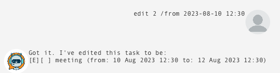

# User Guide

## Bot

## Features

### Todo Command

Adds a new Todo task.

### Event Command

Adds a new Event task.

### Deadline Command

Adds a new Deadline task.

### List Command

Displays a list of all tasks.

### Edit Command

Edits details of a specified task.

### Delete Command

Deletes a specified task.

### Mark Command

Marks a specified task as done.

### Unmark Command

Unmarks as specified task as undone.

### Find Command

Displays a list of tasks matching a specified keyword.

### Bye Command

Exits the application.

## Usage

### `todo` - Adds a new Todo task.

Adds a new Todo task.

Example of usage:

`todo read book`

Expected outcome:

### `event` - Adds a new Event task.

Adds a new Event task.

Example of usage:

`event meeting /from 2023-08-12 10:30 /to 2023-08-12 12:30`

Expected outcome:

### `deadline` - Adds a new Deadline task.

Adds a new Deadline task.

Example of usage:

`deadline return book /by 2023-08-12 12:30`

Expected outcome:

### `list` - Lists tasks.

Displays a list of all tasks.

Example of usage:

`list`

Expected outcome:

### `edit` - Edits task.

Edits details of a specified task.

Example of usage:

- `edit 2 /desc buy book `
- `edit 2 /from 2023-08-10 12:30 `
- `edit 2 /to 2023-08-14 12:30 `
- `edit 3 /by 2023-08-10 12:30 `

Expected outcome:

### `delete` - Deletes task.

Deletes a specified task.

Example of usage:

`delete 1`

Expected outcome:

### `mark` - Marks task.

Marks a specified task as done.

Example of usage:

`mark 1`

Expected outcome:

### `unmark` - Unmarks task.

Unmarks as specified task as undone.

Example of usage:

`unmark 1`

Expected outcome:

### `find` - Finds task.

Displays a list of tasks matching a specified keyword.

Example of usage:

`find book`

Expected outcome:

### `bye` - Exits.

Exits the application.

Example of usage:

`bye`

Expected outcome:

