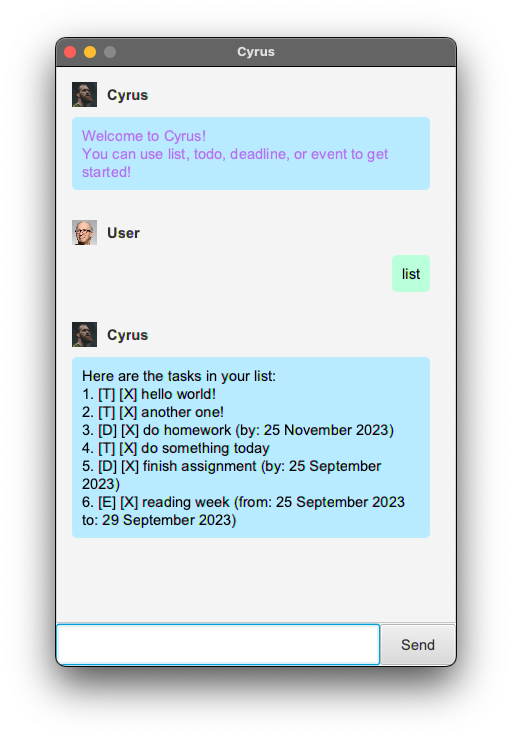

# User Guide

## Features

### Intuitive GUI

Cyrus comes with an intuitive and simple GUI, including a helpful getting started message and a statistics dashboard!

### Add events

Create events and when they start and end.

### Add deadlines

Create deadlines and when they are due.

### Add todos

Create todos to complete.

### Mark tasks

Mark tasks you have completed as done.

### Unmark tasks

Unmark tasks that you have accidentally marked as done.

### Delete tasks

Remove todos/deadlines/events from the task list.

### Save & load tasks on file

Cyrus automatically saves your tasks locally so that you have access the same task list even after closing Cyrus.

### Statistics dashboard

View the usage of Cyrus for task management by viewing the distribution of types of tasks (todo, deadline, and event)
and
the number of tasks completed every day within the past week week.

## Usage

### `list` - List current tasks

Displays a list of tasks, loaded from disk (if any).

Example of usage:

`list`

Expected outcome:

Alternate cases:

1. No tasks yet: message displayed will be "You do not have any tasks, use todo, deadline, or event to add new
ones!".

### `todo` - Create a todo task

Creates a todo task and saves to disk.

Example of usage:

`todo <task name>`

Expected outcome:

Alternate cases:

1. Missing todo body `todo`: will display error saying "ToDo is missing a body!".
2. Including options `todo contains options /like this`: ignores the options and creates todo.

### `deadline` - Create a deadline task

Creates a deadline task and saves to disk.

Example of usage:

`deadline <task name> /by {dd/MM/yyyy}`

Expected outcome:

Alternate cases:

1. Missing deadline body `deadline`: will display error saying "Deadline is missing a body!".
2. Missing `/by` option `deadline do this thing`: will display error saying "Invalid deadline format: missing /by".
3. `/by` option does not follow `dd/MM/yyyy` format `deadline do this /by tomorrow`: will display error saying "Invalid
   deadline format: invalid by string, must be format dd/MM/yyyy".
4. Including options other than `/by` `deadline do this /by 22/09/2023 /another option`: ignores the other options and
   creates deadline.

### `event` - Create an event task

Creates an event task and saves to disk.

Example of usage:

`event <task name> /from {dd/MM/yyyy} /to {dd/MM/yyyy}`

Expected outcome:

Alternate cases:

1. Missing event body `event`: will display error saying "Event is missing a body!".
2. Missing `/from` option `event carnival`: will display error saying "Invalid deadline format: missing /from".
3. Missing `/to` option `event carnival /from 23/09/2023`: will display error saying "Invalid deadline format: missing
   /to".
4. `/from` option does not follow `dd/MM/yyyy` format `event carnival /from tomorrow /to 23/09/2023`: will display error
   saying "Invalid event format: invalid from string, must be format dd/MM/yyyy".
5. `/to` option does not follow `dd/MM/yyyy` format `event carnival /from 23/09/2023 /to Monday`: will display error
   saying "Invalid event format: invalid to string, must be format dd/MM/yyyy".
6. `/to` option comes before `/from` option `event carnival /to 23/09/2023 /from 22/09/2023`: event created without any
   issues.
7. Including options other than `/to` and `/from` `event carnival /from 22/09/2023 /to 23/09/2023 /another option`:
   ignores the other options and creates the event.

### `mark` - Mark task as completed

Marks task as completed and saves to disk. If task was previously incomplete, updates completion date.

Example of usage:

`mark 1`

Expected outcome:

Alternate cases:

1. No index provided `mark`: will display error saying "Missing task index".
2. Index provided is not integer `mark hi`: will display error saying "Invalid task index: must be integer".
3. Index provided does not correspond to any task index `mark 100`: will display error saying "Invalid task index: index out of bounds".
4. Including options `mark 1 /like this`: ignores options and marks task as completed.

### `unmark` - Unmark completed task

Unmarks completed task and saves to disk.

Example of usage:

`unmark 6`

Expected outcome:

Alternate cases: see alternate cases of `mark`.

### `delete` - Deletes a task

Deletes a task and saves to disk.

Example of usage:

`delete 2`

Expected outcome:

Alternate cases: see alternate cases of `mark`.

### `find` - Finds tasks that contain given keyword

Finds tasks that contain the given word.

Example of usage:

`find do`

Expected outcome:

Alternate cases:

1. Missing search term `find`: will display error saying "Missing search term".
2. Search yields no results `find weofiweq`: will display message "No tasks found.".
3. Including options `find hello /like this`: ignores options and performs `find` as per usual.

### `statistics` - Display statistics dashboard

Provide statistics dashboard to view Cyrus usage in terms of distribution of task by
type and weekly completion rate.

Example of usage:

`statistics`

Expected outcome:

Alternate cases:

1. No tasks in list `statistics`: will display error saying "You do not have any tasks to view the statistics of!".
2. Including argument `statistics hi`: ignores argument and performs `statistics` as per usual.
3. Including options `statistics /test this`: ignores the options and performs `statistics` as per usual.
