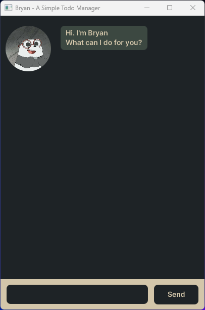

# Jeoe Chatbot

# User Guide

Jeoe is a desktop chat app for adding tasks and sorting them lexicographically
via a graphical interface.
- [Quick start](#quick-start-anchor)
- [Features](#features-anchor)
  - [Adding a todo task: `todo`](#feature-todo-anchor)
  - [Adding a deadline task: `deadline`](#feature-deadline-anchor)
  - [Adding an event task: `event`](#feature-event-anchor)
  - [Listing all tasks: `list`](#feature-list-anchor)
  - [Marking a task as done: `mark`](#feature-mark-anchor)
  - [Un-marking a task: `unmark`](#feature-unmark-anchor)
  - [Deleting a task: `delete`](#feature-delete-anchor)
  - [Finding a task: `find`](#feature-find-anchor)
  - [Sorting the tasks: `sort`](#feature-sort-anchor)
  - [Ending the Jeoe chat bot: `bye`](#feature-bye-anchor)
  - [Saving the data](#feature-save-anchor)
- [FAQ](#faq-anchor)
- [Known issues](#known-issues-anchor)
- [Command summary](#command-summary-anchor)

## Quick start 
1. Ensure you have Java `11` or above installed in your Computer.

2. Download the latest `Jeoe.jar` from [here](https://github.com/wasjoe1/ip/releases/tag/v0.1).

3. Copy the file to the folder you want to use as the home folder for your Jeoe chatbot.

4. Open a command terminal, `cd` into the folder you put the jar file in, and use the `java -jar Jeoe.jar` command to run the application.
A GUI similar to the below should appear in a few seconds.

5. Type the command in the chat box and click send to execute it. e.g. typing list and
pressing enter will list out the current list of tasks you have in the list.
Some example commands you can try:

   - `list` : list all tasks. 
   - `todo task 1 test 1` : Adds a todo task that is called task 1 test 1.
   - `delete 1` : Deletes the 1st task in the current list.
   - `bye` : Exits the program.
     

Refer to the Features below for details of each command.

## Features 

>ℹ️ Notes about the command format:
>- words in upper `UPPER_CASE` are the parameters to be supplied by the user. 
e.g. in delete NUMBER, NUMBER is a parameter which can be used as delete 1.
>- Items in square brackets are optional.
   e.g todo [TODO] can be used as todo anything or as todo.
>- Extraneous parameters for commands (such as list, bye & sort) are allowed
e.g. if the command specifies list 123, it will still execute the commands.
>- If you are using a PDF version of this document, be careful when copying and
pasting commands that span multiple lines as space characters surrounding line-breaks
>may be omitted when copied over to the application.

####  Adding a todo task: `todo` 
Adds an todo task to the task list. 

Format: `todo [TODO]`

Tip: An empty todo is still a todo

Examples:
- `todo task 1`
- `todo I need to brush my teetch`

#### Adding a deadline task: `deadline`
Adds a task with a deadline to the task list.

Format: `deadline TASK /by DATE&TIME`
>Take Note : The Date and Time formate has to be yyyy-mm-dd HH:mm

Examples:
- `deadline my deadline task /by 2023-06-01 15:00`
- `deadline I need to brush my teetch /by 2023-08-01 09:00`

#### Adding an event task: `event`
Adds an event task that has a start and end time to the task list.

Format: `event TASK /from START /to END`
>Take Note : For events, the start and end has no fixed formats.

Examples:
- `event birthday /from yesterday /to tomorrow`
- `event lecture /from 13:00 /to 15:00`

#### Listing all tasks: `list`
Shows your current list of tasks.

Format: `list`

#### Marking a task as done: `mark`
Marks the task you specified as done.

Format: `mark INDEX`

- Marks the task at the stated INDEX with a cross. The index refers to the index number shown in the displayed person list. The index must be a positive integer 1, 2, 3, …​
  (e.g. [T][X] test)
- Does not matter whether the task was marked or not previously; it just marks the task NOW

Examples:
- `mark 1 ` returns [T][X] test 1

#### Un-marking a task: `unmark`
Un-marks the task you specified as not done.

Format: `unmark INDEX`

- Un-marks the task at the stated INDEX (removing the cross). The index refers to the index number shown in the displayed person list. The index must be a positive integer 1, 2, 3, …​
  (e.g. [T][] test)
- Does not matter whether the task was un-marked or not previously; it just un-marks the task NOW

Examples:
- `unmark 1` returns [T][] test 1

#### Deleting a task: `delete`
Deletes the task at that specified index for the current list.

Format: `delete INDEX`

- Deletes the task at the specified INDEX.
- The index refers to the index number shown in the displayed task list.
- The index must be a positive integer 1, 2, 3, …​

Examples:
- `list` followed by `delete 2` deletes the 2nd task in the task list displayed by Jeoe chatbot. 
- `sort` followed by delete 1 deletes the 1st task in the results of the sort command.

#### Finding a task: `find`
Finds tasks whose description contain any of the given words.

Format: `find [KEYWORDS]`
- The search is case-sensitive. e.g `hans` will match `Hans`
- The order of the keywords does matter. e.g. `Hans Bo` will NOT match `Bo Hans`
- As long as the task contains the words in the correct order, they will be matched e.g. find `tas` returns `task`
- Words matching at least one keyword will NOT be returned (i.e. OR search). e.g. `Hans Bo` will NOT return `Hans Gruber`, `Bo Yang`

Examples:
- `find smt` returns `smt` and `anything & smt`
- `find test` returns `test` 

#### Sorting the tasks: `sort`
Sorts the tasks in the list lexicographically.

Format: `sort`

>Note: The type of the task has to be considered in the sorting as well e.g. deadline tasks are always sorted to be "smaller" than todo tasks as d < t

#### Ending the Jeoe chat bot: `bye`
Exits the program.

Format: `bye`

#### Saving the data
Jeoe chat bot data is saved in the hard disk automatically after any command that changes the data.
There is no need to save manually.

#### Editing the data
Jeoe data are saved automatically as a txt file 
[JAR file location]/storage/taskListData.txt.
Advanced users are welcome to update data directly by editing that data file.
>❗️Caution: If your changes to the data file makes its format invalid, Jeoe 
> will discard all data and start with an empty data file at the next run. 
> Hence, it is recommended to take a backup of the file before editing it.

## FAQ 
Q: How do I transfer my data to another Computer?
A: Install the app in the other computer and overwrite the empty data
file it creates with the file that contains the data of your previous 
Jeoe chatbot home folder.

## Known issues 
1. when executing the bye command, the GUI seems to abruptly close without printing anything as a reply. This is perfectly normal and the closing of the window signifies the end of the program

## Command summary 
- Add todo      `todo [TODO]`  e.g. `todo task 1`                                                   
- Add event     `event TASK /from START /to END` e.g. `event birthday /from yesterday /to tomorrow` 
- Add deadline  `deadline TASK /by DATE&TIME` e.g.`deadline my deadline task /by 2023-06-01 15:00`  
- list          `list`                                                                                  
- mark          `mark INDEX` e.g.`mark 1 `                                                          
- unmark        `unmark INDEX` e.g.`unmark 1 `                                                      
- delete        `delete INDEX` e.g.`delete 1 `                                                      
- find          `find [KEYWORDS]` e.g.`find smt`                                                    
- sort          `sort`                                                                                  
- bye           `bye`                                                                                   