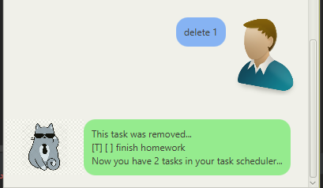
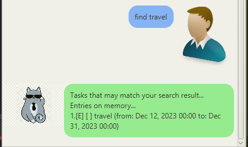
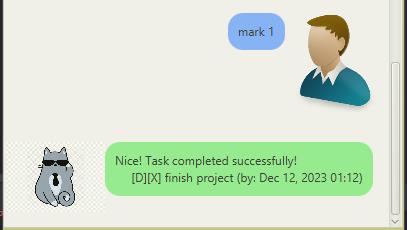

# MeowBot
# User Guide 
I hope you like cats when you are using the Bot

## Features 

### Adding of Tasks

Choosing from `todo`,`event`,`deadline` and adding them to your own cat personal assistant!

### Deleting of tasks

Deleting tasks away from MeowBot

### Listing tasks with date marked

Shows the tasks as well as the deadlines you set for them 

### Finding tasks from keyword

MeowBot can also find tasks from a specified keyword!

## Usage

### `todo <event name>` - creates a todo task

Creates a todo task to be tracked

Example of usage: 

`todo start meowing`

Expected outcome:


Description of the outcome:

```
Generation of todo and informing of number of tasks being tracked
```

### `deadline <deadline name> /by <date>` - creates a deadline task

Creates a todo task to be tracked

Example of usage:

`deadline mug for midterms /by 2023-09-20`

Expected outcome:


Description of the outcome.

```
Generation of deadline and informing of number of tasks being tracked
```

### `event <event name> /from <start date> /to <end date>` - creates an event task

Creates a event task to be tracked

Example of usage:

`event loml birthday party /from 2023-09-20 /to 2023-09-21`

Expected outcome:


Description of the outcome.

```
Generation of event and informing of number of tasks being tracked
```

### `delete <index>` - deletes the specified task

deletes the task specified at the index

Example of usage:

`delete 1`

Expected outcome:




Description of the outcome.

```
deletes the task and informs remaining number of tasks
```

### `find <keyword>` - finds all tasks with matching keywords

Given a keyword, finds the tasks which contains matching keywords

Example of usage:

`find br`

Expected outcome:




Description of the outcome.

```
Finds all tasks given with the specified keyword
```


### `list` - lists all tasks

lists all tasks in the stored in MeowBot

Example of usage:

`list`

Expected outcome:


Description of the outcome.

```
returns all the tasks stored in meowbot
```

### `mark <index>` - marks a specified task as done

Marks a specified task with its index as done

Example of usage:

`mark 2`

Expected outcome:




Description of the outcome.

```
Marks the task as completed
```

### `unmark <index>` - marks a specified task as done

Unmarks a specified task with its index as not complete

Example of usage:

`unmark 2`

Expected outcome:


Description of the outcome.

```
Unmarks the completed task as not completed
```


### `bye` - ends the conversation with MeowBot

Ends the conversation with MeowBot

Example of usage:

`bye`

Expected outcome:


```
Ends the coversation with MeowBot
```

