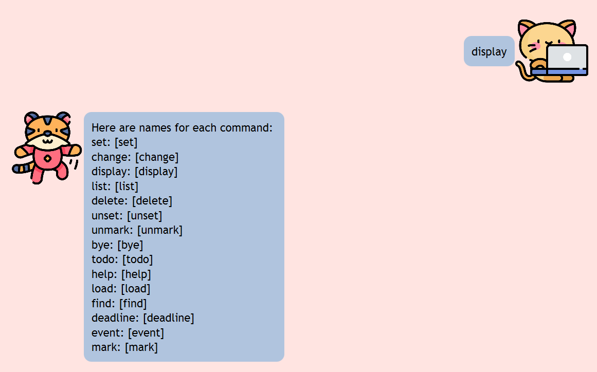

# Kora User Guide
> Kora is an English speaking Korean bot in Singapore!
> It can help you keep track of todos, deadlines, events and many more!
## Table of Content
1. Getting Started
2. Commands
    - Task Related Command
      - ToDo
      - Deadline
      - Event
      - Mark
      - Unmark
      - Delete
      - Find
    - File Related Command
      - Load
      - Change
    - Command Related Command
      - Display
      - Set
      - Unset
    - General Command
      - Help
      - Bye
3. FAQ
4. Command Summary
## Getting Started
1. Download Kora from [this page](https://github.com/dlathyun/ip)
2. Start using!
## Commands
### Task Related Command
#### Adding ToDo: `todo`
Adds a todo task.

Format: `todo [description]`

Example: `todo assignment`

#### Adding Deadline: `deadline`
Adds a deadline task.

Format: `deadline [description] /by [due date YYYY-MM-DD HH:mm]`

Example: `deadline ip /by 2023-09-22 23:59`

#### Adding Event: `event`
Adds an event task.

Format: `event [description] /from [start YYYY-MM-DD HH:mm] /to [start YYYY-MM-DD HH:mm]`

Example: `event cs2103t exam /from 2023-12-01 09:00 /to 2023-12-01 11:00`

#### Marking task: `mark`
Marks a task to be done.

Format: `mark [task index]`

Example: `mark 2`

#### Unmarking task: `unmark`
Unmarks a task to be undone.

Format: `unmark [task index]`

Example: `unmark 2`

#### Deleting task: `delete`
Deletes a task.

Format: `delete [task index]`

Example: `delete 1`

#### Listing task: `list`
Lists all tasks from task list.

Format: `list`

Example: `list`

#### Finding task: `find`
Finds tasks by keyword.

Format: `find [keyword]`

Example: `find cs`

### File Related Command
#### Loading file: `load`
Loads content from specified file.

Format: `load [file name]`

Example: `load y2s1`

#### Changing file: `change`
Changes current working file.

Format: `change [file name]`

Example: `change y2`

### Command Related Command
#### Displaying command list: `display`
Displays all commands from command list.

Format: `display`

Example: `display`

#### Setting command name: `set`
Set new command name for specified command type.

Format: `set [command type] [command name]`

Example: `set todo td`

#### Unsetting command name: `unset`
Deletes specified command name for specified command type.

Format: `unset [command type] [command name]`

Example: `unset todo td`

### General Command
#### Viewing help: `help`
Shows all available commands.

Format: `help`

Example: `help`

#### Exiting: `bye`
Exits the KoraBot.

Format: `bye`

Example: `bye`

## FAQ
## Command Summary

