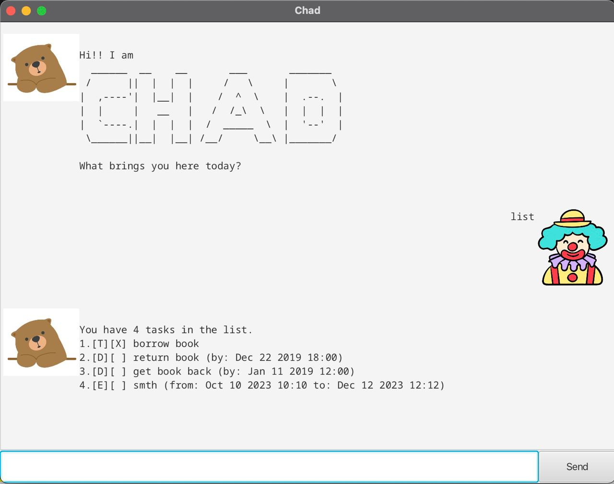

# User Guide
NoN ChatBot is a **desktop app for managing tasks, optimized for use via a Command-Line Interface** (CLI) while still 
having the benefits of a Graphical User Interface (GUI).
## Table of Contents

- [Quick Start / Setting Up](#quick-start--setting-up)
- [Features](#features)
    - [Open the list of commands `help`](#to-open-the-list-of-commands--help--h)
    - [Adding a ToDo Task `todo`](#adding-a-todo-task--todo--t)
    - [Adding a Deadline Task `deadline`](#adding-a-deadline-task--deadline--d)
    - [Adding an Event `event`](#adding-an-event--event--e)
    - [View the list of tasks `list`](#view-the-list-of-tasks--list--l)
    - [Mark a task as done `mark`](#mark-a-task-as-done--mark--m)
    - [Unmark a task `unmark`](#unmark-a-task--unmark--um)
    - [Delete a task `delete`](#delete-a-task--delete--del)
    - [Finding tasks `find`](#finding-tasks--find--f)
    - [Close the ChatBot GUI `bye`](#close-the-chatbot-gui--bye)
- [Command Summary](#command-summary)

<br>

## Quick Start / Setting up
1. Ensure that you have Java `11` or higher installed on your computer.
2. Download the latest `NoN.jar` from [here](https://github.com/jovkusuma/ip/releases).
3. Double-click the file to start the application. The GUI similar to the image below should appear in a few seconds.
<div style ="text-align: center">
    
</div>

> **Note:** The list is filled with placeholder data.

<br>

## Features 


### To open the list of commands: `help` / `h`

**Format:** `help` `h`

**Expected Output:**
````
Hi! I'm here to help!

Here are the list of commands you can do: 

* H / Help - to open up the commands

* T / Todo {task description} - To add a new Todo Task

* D / Deadline <EVENT_NAME> /by <YYYY-MM-DD> - To add a Deadline Task

* E / Event <TASK_NAME> /from <YYYY-MM-DD> /to <YYYY-MM-DD - To add an Event Task

* L / List - To show the list of tasks

* M / Mark <INDEX> - To mark a task as done

* Um / Unmark <INDEX> - To un-mark a task

* F / Find <KEYWORD> - To find a task with the specific keyword

* Del / Delete <INDEX> - To delete a specific task

* Bye - To exit the ChatBot
````
<br>

### Adding a todo task: `todo` / `t`
Adds a todo task into the task list.

**Format:** `todo <TASK_NAME>` `t <TASK_NAME>`

**Examples:**
- `todo Clean bedroom`
- `t CS2100 Tutorial sheets`
- `todo Catch-up on lectures`

<br>

### Adding a deadline task: `deadline` / `d`
Adds a deadline task into the task list.

**Format:** `deadline <TASK_NAME> /by <YYYY-MM-DD>` `d <TASK_NAME> /by <YYYY_MM_DD>`

**Examples:**
- `deadline iP Final Submission /by 2023-09-22`
- `d CS2100 Assignment 1 /by 2023-09-18`
- `deadline SEP Application /by 2023-09-24`

<br>

### Adding an event: `event` / `e`
Adds an event into the task list. 

**Format:** `event <EVENT_NAME> /from <YYYY-MM-DD> /to <YYYY-MM-DD>`

**Examples:**
- `event Coachella Festival /from 2024-04-12 /to 2024-04-21`
- `e NUS Inter-Faculty Games /from 2023-08-18 /to 2023-09-22`
- `event SoC Career Fair /from 2023-08-29 /to 2023-08-30`

<br>

### View the list of tasks: `list` / `l`
Shows a list of all tasks in the task list.

**Format:** `list` `l`

**Expected Output:**
````
Here are the tasks in your list:
[T][ ] something
[E][ ] something (from: Feb 08 2020 to: Apr 05 2025)
[D][ ] something (by: Oct 06 2029)
[D][ ] CS2100 Assignment 1 (by: Sep 18 2023)
````

<br>

### Mark a task as done: `mark` /`m`
Marks a task as done. Tasks that have been marked will be denoted with an "X".

**Format:** `mark <INDEX>` `m <index>`

**Example:**
- `list` followed by `mark 1` marks the first task in the task list.
- `list` followed by `m 2` marks the second task in the task list.

<br>

### Unmark a task: `unmark` / `um`
Unmarks a task. Marked tasks will have the `X` dropped.

**Format:** `unmark <INDEX>` `um <INDEX>`

**Example:**
- `list` followed by `unmark 1` marks the first task in the task list.
- `list` followed by `um 2` marks the second task in the task list.

<br>

### Delete a task: `delete` / `del`
Deletes a task. Tasks that have been deleted will no longer be in the task list.

**Format:** `delete <INDEX>` `del <INDEX>`

**Example:**
- `list` followed by `delete 1` deletes the first task in the task list.
- `list` followed by `del 2` deletes the second task in the task list.

<br>

### Finding tasks: `find` / `f`
Finds a task with the given `keyword`.

**Format:** `find <KEYWORD>` `f <KEYWORD>`
- Keywords can have one or more words.
- Keywords must be **task names** and not date or any other fields.
- This feature is case-sensitive.

**Example:**
- `find CS2103T`
- `find CS2100`

**Expected Output:**

````
Here are the matching tasks in your list:
1.[D][ ] CS2100 Assignment 1 (by: Sep 18 2023)
````

<br>

### Close the ChatBot GUI: `bye`
Exits the GUI of the NoN ChatBot.

**Format:** `bye`

**Expected Output:**
````
Bye. Hope to see you again soon!
````

<br>
<br>

## Command Summary

| Action                                                              |                                                      Format                                                       | Example                                                 | Output                                                                                                                                                                                                                      | 
|---------------------------------------------------------------------|:-----------------------------------------------------------------------------------------------------------------:|---------------------------------------------------------|-----------------------------------------------------------------------------------------------------------------------------------------------------------------------------------------------------------------------------|
| [Open the list of commands](#to-open-the-list-of-commands--help--h) |                                                     `help``h`                                                     | `help`                                                  | Refer to the output [here](#to-open-the-list-of-commands--help--h)                                                                                                                                                          |
| [Adding a ToDo Task](#adding-a-todo-task--todo--t)                  |                                      `todo <TASK_NAME>`<br/>`t <TASK_NAME>`                                       | `todo Clean bedroom`                                    | Got it. I've added this task: <br>[T][ ] Clean Bedroom <br> Now you have 5 tasks in this list.                                                                                                                              |
| [Adding a Deadline Task](#adding-a-deadline-task--deadline--d)      |                   `deadline <TASK_NAME> /by <YYYY-MM-DD>`<br/>`d <TASK_NAME> /by <YYYY-MM-DD>`                    | `deadline iP Final Submission /by 2023-09-22`           | Got it. I've added this task: <br>[D][ ] iP Final Submission (by: Sep 22 2023) <br> Now you have 5 tasks in thi list.                                                                                                       |
| [Adding an Event](#adding-an-event--event--e)                       | `event <EVENT_NAME> /from <YYYY-MM-DD> /to <YYYY-MM-DD>`<br/>`e <EVENT_NAME> /from <YYYY-MM-DD> /to <YYYY-MM-DD>` | `event SoC Career Fair /from 2023-08-29 /to 2023-08-30` | Got it. I've added this task: <br>[E][ ] SoC Career Fair (from: Sep 29 2023 to: Sep 30 2023) <br> Now you have 5 tasks in this list.                                                                                        |
| [View the list of tasks](#view-the-list-of-tasks--list--l)          |                                                    `list` `l`                                                     | `list` `l`                                              | Here are the tasks in your list: <br>1. [T][ ] something <br> 2. [D][ ] [E][ ] something (from: Feb 08 2020 to: Apr 05 2025) <br> 3. [D][ ] something (by: Oct 06 2029) <br>4. [D][ ] CS2100 Assignment 1 (by: Sep 18 2023) |
| [Mark a task as done](#mark-a-task-as-done--mark--m)                |                                     `mark <TASK_INDEX>`<br/>`m <TASK_INDEX>`                                      | `mark 1`                                                | Nice! I've marked this task as done: <br> 1. [D][X] CS2100 Assignment 1 (by: Sep 18 2023)                                                                                                                                   |
| [Unmark a task](#unmark-a-task--unmark--um)                         |                                    `unmark <TASK_INDEX>`<br/>`um <TASK_INDEX>`                                    | `unmark 1`                                              | OK, I've marked this task as not done yet: <br> 1. [D][ ] CS2100 Assignment 1 (by: Sep 18 2023)                                                                                                                             |
| [Delete a task](#delete-a-task--delete--del)                        |                                     `delete <TASK_INDEX>`<br/>`d <TASK_INDEX`                                     | `delete 1`                                              | Noted. I've removed this task: <br>[T][ ] something <br> Now you have 4 tasks in thi list.                                                                                                                                  |
| [Finding tasks](#finding-tasks--find--f)                            |                                        `find <KEYWORD>`<br/>`f <KEYWORD>`                                         | `find CS2100`                                           | Here are the matching tasks in your list: <br>1. [D][ ] CS2100 Assignment 1 (by: Sep 18 2023)                                                                                                                               |
| [Close the ChatBot GUI](#close-the-chatbot-gui--bye)                |                                                       `bye`                                                       | `bye`                                                   | Bye. Hope to see you again soon!                                                                                                                                                                                            |