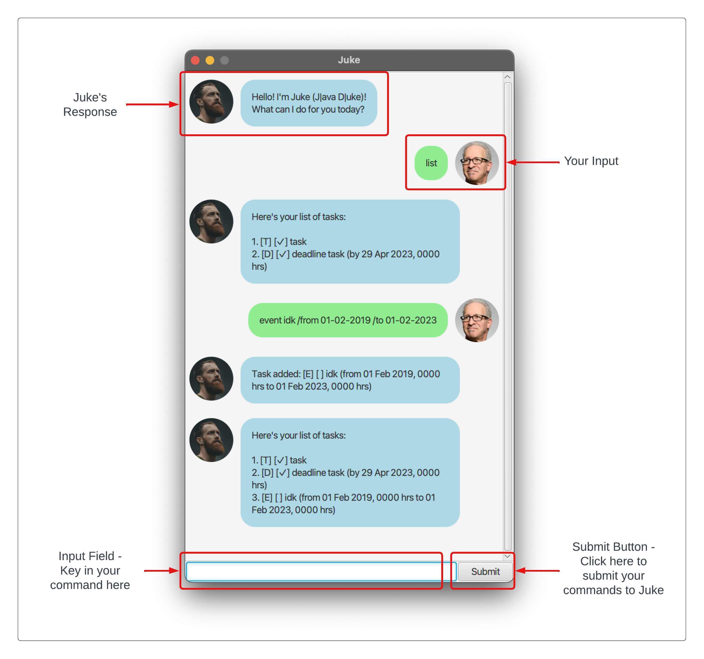

# Juke User Guide

Welcome to the `Juke` User Guide! Through this user guide, you will:

* Learn what is `Juke` and how it can help you to track your tasks
* Learn the features of `Juke`
* Learn the commands that `Juke` can understand

Let's get started!

## Getting Started

As `Juke` is a GUI application, you will need to install the relevant Java GUI libraries on 
your machine.

### Setting Up

To use `Juke`, you will need to install `Java 11` on your machine. You can find out more on 
how you can install `Java 11` on your 
[Windows machine](https://docs.azul.com/core/zulu-openjdk/install/windows), 
[MacOS machine](https://docs.azul.com/core/zulu-openjdk/install/macos) or
[Linux machine](https://docs.azul.com/core/zulu-openjdk/install/debian) by clicking on the hyperlinked
text.

Ensure that you are downloading the latest version of `Java 11` from the websites which contain
the `JavaFX` library prepackaged in it.



Next, head to [this website](https://github.com/asdfghjkxd/ip/releases) and download the latest JAR file 
attached in the latest release of `Juke`.

### Running `Juke`

Open up your device's terminal or command prompt. Navigate to the location where the JAR file is 
downloaded into using the `cd` command. Click [here](https://www.educative.io/answers/what-is-cd-in-linux) 
to learn more about the `cd` command.

Finally, run the command `java -jar juke.jar` to start `Juke`!

## GUI

The following image highlights some important aspect of the GUI:



## Notations

Before delving into the different commands that `Juke` can understand, here are some notations used in this User 
Guide which you should take note of:

| Notation/Symbols                                          | Description                                                                                      |
|-----------------------------------------------------------|--------------------------------------------------------------------------------------------------|
| [...]                                                     | Square brackets describe mandatory inputs that, <br>if omitted, will cause errors to appear      |
| <...>                                                     | Angular brackets represents parameters which you need to <br> substitute with your own inputs    |
| ( ... OR ... ) **or** [ ... OR ... ] **or** ... OR ...    | The "OR" word is used to denote one mandatory <br>input from the two inputs (represented by ...) |
| ( ... AND ... ) **or** [ ... AND ... ] **or** ... AND ... | The "OR" word is used to denote two mandatory <br>input from the two inputs (represented by ...) |

## Features 

`Juke` is packed full of features to help you track your tasks!

### Add a `Todo` Task

You can add a `Todo` Task to help you track the tasks that you need to do! `Todo` tasks have 
no deadlines, and are represented only by its completion status!

#### Usage

`todo [task name]`



#### Examples

* `todo task`
* `todo this is also a valid task`
* `todo task 1 is also a valid task`

#### Expected Outcome

If successful, `Juke` will respond with:

```
Task added: [T] [ ] <YOUR TASK NAME>
```

#### Possible Errors

The following are examples of errors that could happen to the `todo` command:

* `todo`: When the argument is ommitted, an error will occur

---

### Add a `Deadline` Task

Create a `Deadline` Task to track completable tasks with a deadline!

#### Usage

`deadline [task name] /by [(DD(- OR /)MM(- OR /)YYYY HH(: or -)MM) OR (DD(- OR /)MM(- OR /)YYYY)]`

* Note the following
    * `DD`: 2-digit number representing the day
    * `MM`: 2-digit number representing the month
    * `YYYY`: 4-digit number representing the year
    * `HH`: 2-digit number representing the hour in 24 hours
    * `MM`: 2-digit number representing the minutes



#### Examples

* `deadline task /by 01/01/2023 23:59`
* `deadline other valid task /by 01/01/2023`

#### Expected Outcome

If successful, `Juke` will respond with:

```
Task added: [D] [ ] <YOUR TASK NAME> (by <TASK DEADLINE>)
```

#### Possible Errors

The following are examples of errors that could happen to the `deadline` command:

* `deadline`, `deadline /by`: When the arguments are ommitted, an error will occur
* `deadline error task /by gibberish`: When the date argument is invalid, an error will occur

---

### Create an `Event` Task

Create `Event` Tasks to track completable tasks with start and end dates!

#### Usage

```
event [task name] /from [(DD(- OR /)MM(- OR /)YYYY HH(: or -)MM) OR (DD(- OR /)MM(- OR /)YYYY)]
/to [(DD(- OR /)MM(- OR /)YYYY HH(: or -)MM) OR (DD(- OR /)MM(- OR /)YYYY)]
```

* Note the following
    * `DD`: 2-digit number representing the day
    * `MM`: 2-digit number representing the month
    * `YYYY`: 4-digit number representing the year
    * `HH`: 2-digit number representing the hour in 24 hours
    * `MM`: 2-digit number representing the minutes





#### Examples

* `event task /from 01/01/2023 23:59 /to 01/01/2024 23:59`
* `deadline other valid task /from 01/01/2023 /to 01/01/2024 23:59`

#### Expected Outcome

If successful, `Juke` will respond with:

```
Task added: [E] [ ] <YOUR TASK NAME> (from <TASK START DATE> to <TASK END DATE>)
```

#### Possible Errors

The following are examples of errors that could happen to the `event` command:

* `event`, `event /from`, `event /from /to`: When the arguments are ommitted, an error will occur
* `event error task /from gibberish /to gibberish 2`: When the date argument is invalid, an error will occur
* `event error task 2 /from 01/01/2023 /to 01/01/2000`: When the start date is before the end date, an error will occur

---

### List all Tasks

You may also view all Tasks that you have added so far to your task list!

#### Usage

```
list
```

#### Examples

* `list`

#### Expected Outcome

If successful, `Juke` will respond with:

```
Here's your list of tasks:

1. ...
2. ...
3. ...
```

#### Possible Errors

The following are examples of errors that could happen to the `list` command:

* `ls`: Using shortened spellings will result in errors
* 'list all my tasks`: Adding extra parameters will result in errors

---

### Delete a Task

You can also delete a Task from `Juke` to remove any unwanted task from your task list!

#### Usage

```
delete [TASK INDEX]
```



#### Examples

* `delete 1`

#### Expected Outcome

If successful, `Juke` will respond with:

```
Task deleted: <TASK>
```

#### Possible Errors

The following are examples of errors that could happen to the `mark` command:

* `delete 10000000`, `delete -1`: When attempting to delete a task that don't exist, an error will occur
* `delete 1` and then `delete 1` again: When attempting to delete a task that is already deleted, an error will occur

---

### Mark a Task as Done

You can mark a Task as complete to help you track your incomplete tasks!

#### Usage

```
mark [TASK INDEX]
```



#### Examples

* `mark 1`

#### Expected Outcome

If successful, `Juke` will respond with:

```
Task marked as done: <TASK>
```



#### Possible Errors

The following are examples of errors that could happen to the `mark` command:

* `mark 10000000`, `mark -1`: When attempting to mark a task that don't exist, an error will occur
* `mark 1` and then `mark 1` again: When attempting to mark a task that is already marked, an error will occur

---

### Mark a Task as Undone

Conversely, you can also mark a Task as incomplete to help you track your completed tasks!

#### Usage

```
unmark [TASK INDEX]
```



#### Examples

* `unmark 1`

#### Expected Outcome

If successful, `Juke` will respond with:

```
Task marked as undone: <TASK>
```



#### Possible Errors

The following are examples of errors that could happen to the `mark` command:

* `unmark 10000000`, `unmark -1`: When attempting to unmark a task that don't exist, an error will occur
* `unmark 1` and then `unmark 1` again: When attempting to unmark a task that is not marked, an error will occur

---

### Find your Tasks

Need help searching for a Task in your Task list? Use the Find feature to help you search 
for the Task that you are looking for!

#### Usage

```
find [QUERY]
```





#### Examples

* `find my task`

#### Expected Outcome

If successful, `Juke` will respond with:

```
Found them! Here are some of the tasks in your task list that contain the word 
"<QUERY>":

<TASK>
<TASK>
<TASK>
...
```

#### Possible Errors

The following are examples of errors that could happen to the `mark` command:

* `find`: If the argument is omitted, an error will occur

---

### Sort your Tasks

You can sort your tasks by their description, start date, end date and deadline in ascending 
or descending order to help you be on task!

#### Usage

```
sort [SORT ORDER] [SORT BY]
```



{% include note.html content="The values that <pre>[SORT BY]</pre> can take are:
<ul>
  <li><pre>d</pre> OR <pre>des</pre> OR <pre>descript</pre> OR <pre>description</pre>: Sorts the list by task description</li>
  <li><pre>s</pre> OR <pre>st</pre> OR <pre>start</pre> OR <pre>start date</pre>: Sorts the list by start date</li>
  <li><pre>e</pre> OR <pre>en</pre> OR <pre>end</pre> OR <pre>end date</pre>: Sorts the list by end date</li>
  <li><pre>d</pre> OR <pre>dead</pre> OR <pre>deadln</pre> OR <pre>deadline</pre>: Sorts the list by deadline</li>
</ul>
" %}

#### Examples

* `sort d d`
* `sort asc start date`
* `sort ascend description`

#### Expected Outcome

If successful, `Juke` will respond with:

```
Your task list is now sorted!

Here's your list of tasks:

1. ...
2. ...
3. ...
...
```

#### Possible Errors

The following are examples of errors that could happen to the `sort` command:

* `sort`, `sort d`: If the argument is omitted, an error will occur
* `sort ddescending ddeadline`: If the argument is not in any one of the permitted arguments above,
  an error will occur

---

### Exit Juke

Leaving so soon? Exit Juke with ease!

#### Usage

```
bye
```

#### Examples

* `bye`

#### Expected Outcome

If successful, `Juke` will exit.

#### Possible Errors

The following are examples of errors that could happen to the `bye` command:

* `bye Juke`: If arguments are given, an error will occur

## Quick Summary

Congrats for reaching the end of the User Guide!

Need a refresher? The following table provides a quick summary of the commands that Juke can understand:

| Command    | Description                                           |
|------------|-------------------------------------------------------|
| `todo`     | Creates a `Todo` Task                                 |
| `deadline` | Creates a `Deadline` Task                             |
| `event`    | Creates an `Event` Task                               |
| `list`     | Lists all the Tasks that are present in the task list |
| `mark`     | Marks a Task as complete                              |
| `unmark`   | Marks a Task as incomplete                            |
| `delete`   | Deletes a Task from the task list                     |
| `find`     | Searches for a Task based on the task description     |
| `sort`     | Sorts the task list                                   |

## Glossary

* **Command**: The possible inputs that you enter into the input box to tell Juke what you
  want Juke to do
* **GUI**: Graphical User Interface, an interactive interface that permits users to interact with graphical
  elements on the screen to perform tasks
* **Java**: General-purpose Programming Language that Juke is written in
* **JavaFX**: A Java GUI library which Juke relies on to generate the graphical interface for users
  to interact with
