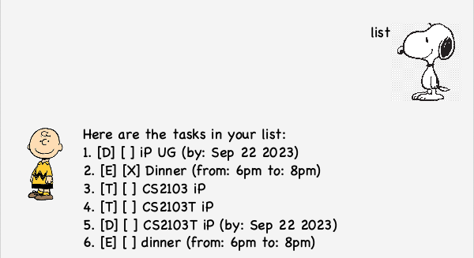
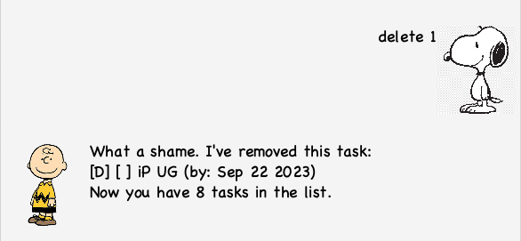

# User Guide

Charlie is a desktop app for managing tasks, optimized for use via a Command Line Interface (CLI) 
while still having the benefits of a Graphical User Interface (GUI). 
If you can type fast, AB3 can get your task management done faster than traditional GUI apps.

## Quick Start
1. Ensure you have `Java 11` or above installed in your computer.
2. Download the latest `duke.jar` from [here] ()
3. Copy the file to the folder you want to use as the home folder for your task list
4. Open a command terminal, cd into the folder you put the jar file in, 
   and use the java -jar duke.jar command to run the application.
   A GUI similar to the below should appear in a few seconds.

## Usage
Here's how to use Charlie.

### View Tasks: `list`
Views all tasks currently stored in the list. Format: `list`

### Add ToDo: `todo`
Add a ToDo task into the task list. Format: `todo DESCRIPTION`
- Example: `todo CS2103T iP`

### Add Deadline: `deadline`
Add a Deadline task into the task list. Format: `deadline DESCRIPTION /by DATE`
- Example: `deadline CS2103T iP /by 2023-09-22`
  

### Add Event: `event`
Add an Event task into the task list. Format: `event DESCRIPTION /from DATE /to date`
- Example: `event dinner /from 6pm /to 8pm`
  

### Delete task: `delete`
Deletes a task from the task list. Format: `delete TASKNUMBER`
- Example: `delete 1`
  

### Mark task: `mark`
Marks a task as done. Format: `mark TASKNUMBER`
- Example: `mark 1` 
 

### Unmark task: `unmark`
Marks a task as not done. Format: `unmark TASKNUMBER`
- Example: `unmark 1`
  

### Find task: `find`
Finds specific tasks in the list. Format: `find QUERY`
- Example: `find CS2103T`
  

### View Schedule: `schedule`
Finds specific tasks in the list which occur on specified date. Format: `schedule DATE`
- Example: `schedule 2023-09-22`
  

### Bye: `bye`
Exit the chatbot. Format: `bye`

### Saving the data
Task data is automatically saved after any command that modifies the data. 

### Modifying the data file
Task data is saved automatically as a txt file [JAR file location]/data/tasks.txt. 
Advanced users are welcome to update data directly by editing that data file.
