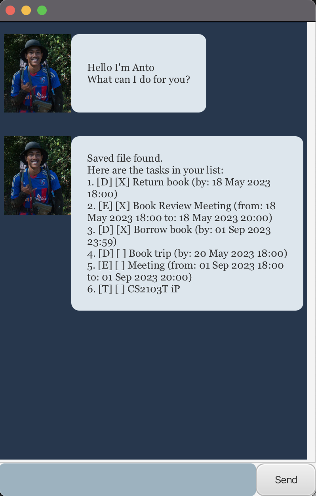
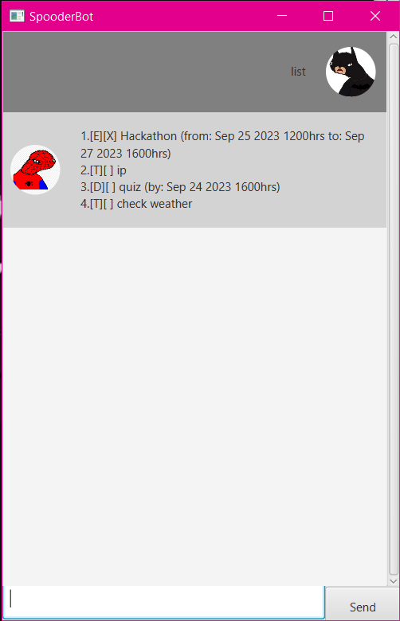
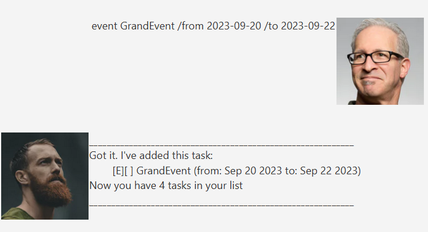
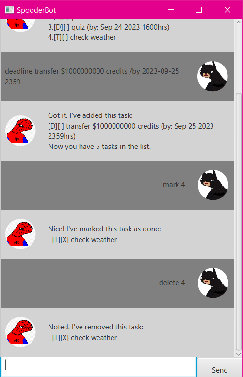

# Anto User Guide
Anto is a desktop chatbot app for managing tasks via a Graphical User Interface (GUI). Anto includes features such as
adding to do tasks, deadlines and events, viewing schedules for the day and finding certain tasks.

- [Quick start](#quick-start)
- [Features](#features)
  - [Listing all tasks: list](#listing-all-tasks--list)
  - [Adding a todo task: todo](#adding-a-todo-task--todo)
  - [Adding a deadline task: deadline](#adding-a-deadline-task--deadline)
  - [Adding an event task: event](#adding-an-event-task--event)
  - [Marking a task: mark](#marking-a-task--mark)
  - [Unmarking a task: unmark](#unmarking-a-task--unmark)
  - [Deleting a task: delete](#deleting-a-task--delete)
  - [Locating tasks by name: find](#locating-tasks-by-name--find)
  - [View schedule on a date: view schedule](#view-schedule-on-a-date--view-schedule)
  - [Exiting the program: bye](#exiting-the-program--bye)
  - [Saving the data](#saving-the-data)
  - [Editing the data file](#editing-the-data-file)
- [FAQ](#faq)

## Quick start
1. Ensure you have `Java 11` or above installed in your Computer.
2. Download the latest `anto.jar`.
3. Copy the file to the folder you want to use as the home folder for your Anto.
4. Open a command terminal, `cd` into the folder you put the jar file in, and use the `java -jar anto.jar` command to run the application.
A GUI similar to the below should appear in a few seconds. Note how the app contains some sample data.
   
5. Type the command in the command box and press Enter to execute it. e.g. typing `list` and pressing Enter will show a list of all tasks.
Some example commands you can try:
   - `list`: Lists all tasks.
   - `todo New Task`: Adds a task named New Task to the Anto list.
   - `delete 3`: Deletes the 3rd task shown in the current list.
   - `bye` : Exits the app.
6. Refer to the Features below for details of each command.

## Features 

> :exclamation:
> Notes about the command format:
> - Words in UPPER_CASE are the parameters to be supplied by the user.
e.g. in todo NAME, NAME is a parameter which can be used as todo Task.
> - If you are using a PDF version of this document, be careful when copying and pasting commands that span multiple lines as space characters surrounding line-breaks may be omitted when copied over to the application.

### Listing all tasks: `list`

Shows a list of all tasks, deadlines and events in the Anto chatbot.

Format: `list`

Example of usage:

`list`

Expected outcome:

A list of all tasks is shown.

### Adding a todo task: `todo`

Adds a todo task to the Anto chatbot.

Format: `todo NAME`

Example of usage:

`todo Borrow book`

Expected outcome:

New todo task is added to the Anto chatbot. Confirmation message showing task and total number of tasks is shown.

### Adding a deadline task: `deadline`

Adds a deadline task to the Anto chatbot.

Format: `deadline NAME /by DATETIME`
> :exclamation:
> DATETIME entered must be in `dd-MM-yyyy HH:mm` format e.g. `15-05-2023 18:00` represents 15 May 2023 6pm.

Example of usage:

`deadline Return book /by 15-05-2023 18:00`

Expected outcome:

New deadline task is added to the Anto chatbot. Confirmation message showing task and total number of tasks is shown.

### Adding an event task: `event`

Adds an event task to the Anto chatbot.

Format: `event NAME /from DATETIME /to DATETIME`
> :exclamation:
> DATETIME entered must be in `dd-MM-yyyy HH:mm` format e.g. `15-05-2023 18:00` represents 15 May 2023 6pm.

Example of usage:

`event Book Review Meeting /from 20-06-2023 18:00 /to 20-06-2023 20:00`

Expected outcome:

New event task is added to the Anto chatbot. Confirmation message showing task and total number of tasks is shown.

### Marking a task: `mark`

Marks the task at the specified index as done in the Anto chatbot.
- The index refers to the index number shown in the displayed task list.
- The index must be a positive integer 1, 2, 3, ... and within the list.

Format: `mark INDEX`

Example of usage:

`mark 4`

Expected outcome:

Task at index is marked as done. Confirmation message showing task is shown.

### Unmarking a task: `unmark`

Unmarks the task at the specified index in the Anto chatbot.
- The index refers to the index number shown in the displayed task list.
- The index must be a positive integer 1, 2, 3, ... and within the list.

Format: `unmark INDEX`

Example of usage:

`unmark 4`

Expected outcome:

Task at index is unmarked. Confirmation message showing task is shown.

### Deleting a task: `delete`

Deletes the task at the specified index from the Anto chatbot.
- The index refers to the index number shown in the displayed task list.
- The index must be a positive integer 1, 2, 3, ... and within the list.

Format: `delete INDEX`

Example of usage:

`delete 4`

Expected outcome:

Task at index is deleted. Confirmation message showing task and remaining number of tasks is shown.

### Locating tasks by name: `find`

Find tasks with names that contain the given keywords in the Anto chatbot.
- The search is case-sensitive. e.g books will NOT match Books

Format: `find KEYWORD`

Example of usage:

`find books`

Expected outcome:

Tasks that contains given keywords in their names will be shown.

### View schedule on a date: `view schedule`

Find and list event tasks on specified date in the Anto chatbot.
> :exclamation:
> DATE entered must be in `dd-MM-yyyy` format e.g. `15-05-2023` represents 15 May 2023.

Format: `view schedule DATE`

Example of usage:

`view schedule 20-06-2023`

Expected outcome:

Event tasks on the specified date will be shown.

### Exiting the program: `bye`
Exits the program.

Format: `bye`

### Saving the data
Anto data are saved in the hard disk automatically after any command that changes the data. There is no need to save manually.

### Editing the data file
Anto data are saved automatically as a txt file `[JAR file location]/data/anto.txt`. Advanced users are welcome to update data directly by editing that data file.

> :exclamation:
> Caution: If your changes to the data file makes its format invalid, Anto will discard all data and start with an empty data file at the next run. Hence, it is recommended to take a backup of the file before editing it.

## FAQ
**Q**: How do I transfer my data to another Computer?
**A**: Install the app in the other computer and overwrite the empty data file it creates with the file that contains the data of your previous Anto home folder.